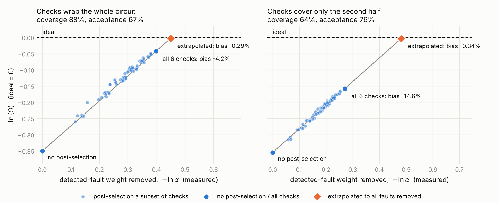
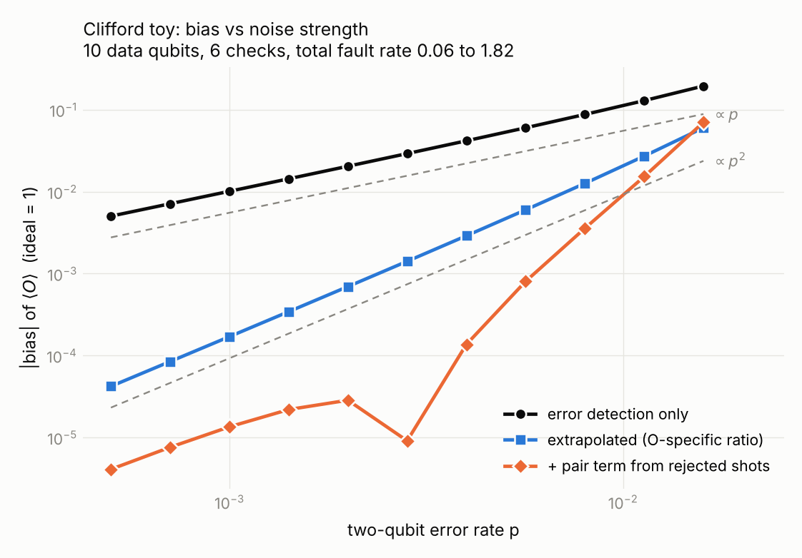
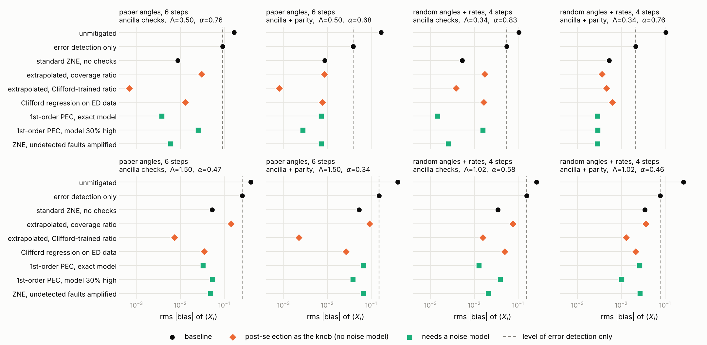
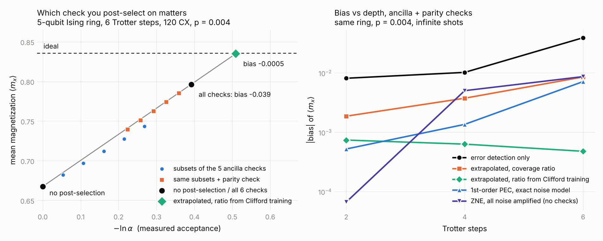

# Detected events as a resource for error mitigation

Exploration notes, 6 October 2026. Working folder: `space_time_check/detected_event_extrapolation`.

Anchor paper: L. E. Fischer, A. Javadi-Abhari, S. Martiel, A. Seif, *Spacetime mitigation of logical errors*, arXiv:2609.13108 (`references/2609.13108v1.pdf`).

This file is generated by `build_report.py` from `report_template.md`, the result files and the source code, so the tables and the code appendix always match what was run.

## Contents

1. [Summary](#1-summary)
2. [Question and setting](#2-question-and-setting)
3. [What syndromes can and cannot tell](#3-what-syndromes-can-and-cannot-tell)
4. [Estimators built on detected events](#4-estimators-built-on-detected-events)
5. [Clifford test](#5-clifford-test)
6. [Placing checks around non-Clifford gates](#6-placing-checks-around-non-clifford-gates)
7. [Non-Clifford test](#7-non-clifford-test)
8. [Relation to prior work](#8-relation-to-prior-work)
9. [Caveats and open questions](#9-caveats-and-open-questions)
10. [Files and how to reproduce](#10-files-and-how-to-reproduce)
11. [Appendix: code](#appendix-code)

---

## 1. Summary

The question was whether detected error events can do more than reject shots, starting with a zero-noise-extrapolation-type mitigation driven by them.

- **Syndromes carry no per-shot information about the leading residual error.** After post-selection the first-order logical error comes from individually undetected faults, and under independent Pauli noise these are statistically independent of the syndrome (Eq. B14 of the paper).
- **Everything else is visible.** For a Clifford circuit with a Pauli observable, all rates of detected fault classes can be learned from (syndrome, outcome) data without knowing the ideal value. Exactly one number cannot: the undetected rate that flips the observable. Any scheme needs an assumption for that one number.
- **Post-selection is a noise de-amplifier, which gives an extrapolation.** Two points from the same shots, "no post-selection" and "post-selected", extrapolate to zero noise once a ratio r (undetected over detected sensitivity) is supplied: $\hat O = O_{PS} + r\,(O_{PS} - O_{all})$, or its exponential form.
- **Clifford test:** with the correct ratio the error-detection bias dropped from about 5% to 0.35% at total fault rate 0.45, and to 0.01% after adding a second-order term estimated from the rejected shots. A plain coverage ratio left 0.7–2.5%.
- **Non-Clifford test (Ising ring, the paper's check construction):** a first-order ratio is no longer enough. A ratio fitted on Clifford training circuits works without any noise model and cut the error-detection bias by 5 to over 100×. At the lower noise level it ranges from 5× better to 2.7× worse than exact-model first-order PEC; at 3× noise it matches or beats it.
- **Syndrome-cancelling pairs limit every first-order method**, and a global symmetry check (parity) makes them worse because all its detected weight sits on one syndrome bit.

Everything here is small-scale and at infinite shots. Section 9 lists what that leaves open.

---

## 2. Question and setting

### 2.1 Motivation

In an early fault-tolerant regime the logical error per operation may sit around $10^{-5}$–$10^{-6}$, which still gives order-one error over $10^5$–$10^6$ operations. Detection events are abundant there. The idea is to use them as data, in the same spirit as extracting a detector error model from syndrome statistics instead of from separately measured gate fidelities.

### 2.2 What the anchor paper does

- **Setup.** $n$ data and $k$ check qubits, terminal check measurement, keep the trivial syndrome. Noise is a sparse Pauli-Lindblad model with elementary faults $\nu$ at rates $\lambda_\nu$.
- **Classification.** Each fault has a deterministic syndrome $s_\nu$, found by back-propagating the check operators. Faults split into individually undetected $V_u$ ($s_\nu = 0$) and detected $V_d$.
- **Logical generator.** The post-selected logical noise is $\mathcal L_L = \mathcal L_u + \mathcal L_d$. $\mathcal L_u$ is the original generator restricted to $V_u$, exactly. $\mathcal L_d$ starts at second order and comes from sets of detected faults whose syndromes cancel.
- **Protocol.** Invert $\mathcal L_L$ by PEC; in the experiment only the first-order part. Cost $\Gamma = \gamma_L^2/\alpha$ with $\gamma_L \approx e^{2\Lambda_u}$ and acceptance $\alpha$.
- **Numbers.** Clifford validation with 65% of faults detected and $\alpha = 0.296$. Ising dynamics on 22 data + 27 check qubits up to 648 CZ, with a 63× lower sampling overhead than plain PEC at depth 6. Their bound on the neglected second-order bias is 0.0014 / 0.013 / 0.036 at depth 2 / 4 / 6, from up to 2.46 million pair terms.

### 2.3 Notation used below

| Symbol | Meaning |
|---|---|
| $\lambda_\nu$, $p_\nu = (1 - e^{-2\lambda_\nu})/2$ | generator rate and probability of fault $\nu$ |
| $s_\nu \in \mathbb F_2^k$ | syndrome of fault $\nu$ |
| $o_\nu \in \{0,1\}$ | whether fault $\nu$ flips the observable $O$ (Clifford circuit, Pauli $O$) |
| $\Lambda_{(s,o)}$ | total rate of the class of faults with syndrome $s$ and flip bit $o$ |
| $\Lambda$, $\Lambda^d$, $\Lambda^u$ | total, detected and undetected fault rate |
| $\Lambda_O^d$, $\Lambda_O^u$ | detected and undetected rate of faults that flip $O$ |
| $\alpha$ | acceptance (post-selection) probability |
| $O_{all}$, $O_{PS}$, $O_0$ | unpostselected, post-selected and ideal expectation value |
| coverage | $\Lambda^d/\Lambda$ |

---

## 3. What syndromes can and cannot tell

### 3.1 The joint distribution of syndrome and observable flip

Take a Clifford circuit and a Pauli observable. Each shot has a syndrome $S = \bigoplus_\nu s_\nu x_\nu$ and a flip bit $F = \bigoplus_\nu o_\nu x_\nu$, with independent $x_\nu \sim \mathrm{Bernoulli}(p_\nu)$. The Fourier transform over $\mathbb F_2^{k+1}$ factorizes:

$$
\mathbb E\big[(-1)^{x\cdot S + yF}\big] = \exp\Big[-2\sum_\nu \lambda_\nu\,\big(x\cdot s_\nu \oplus y\,o_\nu\big)\Big].
$$

Two consequences follow directly.

$$
O_{all} = O_0\,e^{-2(\Lambda_O^u + \Lambda_O^d)}, \qquad
O_{PS} = O_0\,e^{-2\Lambda_O^u}\Big(1 - 2\sum_{s\neq 0}\Lambda_{(s,0)}\Lambda_{(s,1)} + O(\lambda^3)\Big).
$$

The second-order term is the rate of pairs with equal syndrome and opposite flip bits.

### 3.2 Identifiability

In a real computation $O_0$ is unknown, so the measured quantities are

$$
Z(x) = \mathbb E[(-1)^{x\cdot S}], \qquad M(x) = \mathbb E[o\,(-1)^{x\cdot S}] = O_0\,\exp\Big[-2\sum_\nu\lambda_\nu\,(x\cdot s_\nu\oplus o_\nu)\Big].
$$

That is $2^{k+1}-1$ numbers for $2^{k+1}$ unknowns ($\ln|O_0|$ and every class rate except the harmless class $(0,0)$). Because the logarithms are linear in the class rates, a Walsh-Hadamard transform inverts them. The result:

- every $\Lambda_{(s,o)}$ with $s \neq 0$ is identifiable, without knowing $O_0$;
- the single unidentifiable combination is $\ln|O_0| - 2\Lambda_O^u$.

So the detected sector can be characterized in situ to all orders, and exactly one number has to come from outside.

### 3.3 What the rejected shots give directly

For a syndrome $s$ explained by one fault, the conditional mean relative to the post-selected one is

$$
R_s \equiv \frac{\langle O\rangle_s}{O_{PS}} = \frac{\Lambda_{(s,0)} - \Lambda_{(s,1)}}{\Lambda_{(s,0)} + \Lambda_{(s,1)}},
\qquad \Lambda_s \approx \frac{N_s}{N_0},
$$

so $\Lambda_{(s,0)}\Lambda_{(s,1)} = \Lambda_s^2(1-R_s^2)/4$ and the second-order attenuation of the accepted shots is

$$
2\sum_{s\neq0}\Lambda_{(s,0)}\Lambda_{(s,1)} \approx \tfrac12\sum_{s\neq 0}\Big(\frac{N_s}{N_0}\Big)^2\big(1 - R_s^2\big).
$$

This is the scalar that the paper's second-order generator produces from a learned model and a pair enumeration. PEC needs the actual Pauli pairs to insert; a rescaling-type correction needs only this scalar.

### 3.4 When syndromes do carry per-shot information

- **Correlated or drifting noise.** If rates fluctuate between shots or batches, syndrome density tracks the instantaneous noise scale. That would allow a regression of the observable on detection rate, using neighbouring shots as the instrument to avoid selection bias. Not tested here.
- **Decoded error correction.** With a distance-$d$ code and a decoder, residual logical errors come from ambiguous syndromes, which are visible. Per-shot posteriors exist there (Section 8).

---

## 4. Estimators built on detected events

### 4.1 Post-selection as the noise knob

Post-selecting removes the detected part of the noise, and $-\ln\alpha \approx \Lambda^d$ measures how much was removed. Post-selecting on any subset of checks gives intermediate points, all from the same shots. Supplying one ratio closes the extrapolation:

$$
\hat O_{lin} = O_{PS} + r\,(O_{PS} - O_{all}), \qquad
\hat O_{exp} = O_{PS}\Big(\frac{O_{PS}}{O_{all}}\Big)^{r}, \qquad r = \frac{\Lambda_O^u}{\Lambda_O^d}.
$$

Only a ratio of rates enters, so a global miscalibration or drift of the noise strength cancels.

Ways to obtain $r$:

| Source of $r$ | Needs | Available for non-Clifford circuits |
|---|---|---|
| coverage ratio $\Lambda^u/\Lambda^d$ | relative fault rates + syndrome classification | yes |
| observable-specific ratio $\Lambda_O^u/\Lambda_O^d$ | the above + propagation of $O$ | Clifford only |
| exact first-order response of the ideal circuit | the ideal circuit | no (oracle) |
| fit on Clifford training circuits | training runs, no noise model | yes |

### 4.2 Pair term from rejected shots

Multiply the estimate by $\exp\big[\tfrac12\sum_{s\ne0}(N_s/N_0)^2(1-R_s^2)\big]$ (Section 3.3). Exact to second order for Clifford circuits; a heuristic otherwise.

### 4.3 Model-based references

- **Model rescaling** (Clifford): $O_{PS}\,e^{2\Lambda_O^u}$ with $\Lambda_O^u$ from the noise model.
- **First-order spacetime PEC**: removes $\mathcal L_u$. In the simulations its expectation value is obtained exactly by setting undetected rates to zero.
- **A model that is 30% too high**: tests sensitivity to the overall noise scale.

### 4.4 Physical amplification

- **All noise, with post-selection.** The exponent of $O_{PS}(G)$ is $-2G\Lambda_O^u - G^2(\text{pairs}) - \dots$, so the ansatz needs a $G^2$ term. $\alpha(G)$ gives a measured gain.
- **Undetected faults only.** Insert Paulis from $V_u$ with gain $G$. They have zero syndrome, so acceptance is unchanged. This is the ZNE analogue of first-order spacetime PEC and needs the same model.

### 4.5 Sampling cost

For a $\pm1$ observable with $\sigma^2 = 1 - O^2$, the two-point linear estimator has

$$
N\,\mathrm{Var} \approx (1+r)^2\frac{\sigma_{PS}^2}{\alpha} + r^2\sigma_{all}^2 - 2r(1+r)\,\sigma_{PS}^2 ,
$$

to be compared with $e^{4\Lambda^u}/\alpha$ for first-order PEC with error detection and $e^{4\Lambda}$ for plain PEC.

---

## 5. Clifford test

### 5.1 Setup

- **Circuit.** Random Clifford brickwork on 10 data qubits (ring, 50 CZ), protected by $k$ two-sided coherent Pauli checks: a random weight-2 Pauli $P_L$ before a window of layers and $P_R = U P_L U^\dagger$ after it, nested so syndromes are deterministic.
- **Noise.** Two-qubit depolarizing with probability $p$ after every two-qubit gate, including the check gates, and readout flips $p$ on the check qubits.
- **Observable.** $O = U Z_A U^\dagger$ with ideal value 1, measured noiselessly.
- **Evaluation.** stim's detector error model merges faults with equal (syndrome, flip) into one mechanism, so it is the table of class rates. The joint distribution then follows exactly from a Walsh-Hadamard transform. All biases are infinite-shot values. `checks.py` confirms the exact evaluation against 4 million sampled shots (acceptance 0.6712 sampled and exact; post-selected value 0.9583 against 0.9582).

### 5.2 Results

Forty random instances per scenario. Bias is relative to the ideal value 1.

| | A: checks wrap whole circuit | B: same, 3× noise | C: only 2 checks | D: checks on 2nd half | E: checks on 1st half |
|---|---|---|---|---|---|
| checks / error rate p | 6 / 0.004 | 6 / 0.012 | 2 / 0.004 | 6 / 0.004 | 6 / 0.004 |
| total fault rate Λ | 0.45 | 1.35 | 0.28 | 0.43 | 0.43 |
| coverage / acceptance | 87% / 68% | 87% / 32% | 65% / 84% | 63% / 77% | 63% / 76% |
| unmitigated | 31.98% | 68.57% | 22.78% | 31.32% | 30.91% |
| error detection only | 5.31% | 17.05% | 9.62% | 13.78% | 13.87% |
| extrapolated, coverage ratio | 0.66% | 4.32% | 1.74% | 2.12% | 2.48% |
| extrapolated, observable-specific ratio | 0.35% | 3.65% | 0.94% | 0.35% | 0.34% |
| + pair term from rejected shots | 0.012% | 1.71% | 0.31% | 0.12% | 0.12% |
| model rescaling, exact model | 0.30% | 3.16% | 0.60% | 0.21% | 0.21% |
| model rescaling, model 30% high | 1.26% | 1.58% | 2.32% | 4.27% | 4.31% |
| extrapolated, model 30% high | 0.35% | 3.65% | 0.94% | 0.35% | 0.34% |
| cost: plain PEC | 6.0 | 221.5 | 3.1 | 5.5 | 5.5 |
| cost: 1st-order PEC + detection | 1.9 | 6.2 | 1.8 | 2.4 | 2.4 |
| cost: two-point extrapolation | 1.7 | 4.9 | 1.6 | 2.1 | 2.1 |

Bias rows are rms over the 40 instances. Cost rows are $N\,\mathrm{Var}$ proxies for a generic $\pm1$ observable (medians).

Reading the table:

- **Coverage ratio.** It removes most of the error-detection bias but leaves 0.7–2.5% rms at the lower noise level, because detected and undetected faults do not flip $O$ at the same rate. This is worst when checks cover only part of the circuit.
- **Observable-specific ratio.** Bias falls to the second-order term, about 0.35% at $\Lambda\approx0.45$.
- **Pair term.** At $\Lambda\approx0.45$ it brings the bias to 0.01% rms. At $\Lambda\approx1.35$ it overshoots: the expansion in the detected rate is no longer small.
- **Noise-scale robustness.** With a model whose rates are all 30% too high, model rescaling is left with 1.3–4.3% bias. The ratio-based extrapolation is unchanged by construction (last bias row).
- **Cost.** The two-point extrapolation costs about the same as first-order PEC with error detection in this toy.



**Figure 1.** $\ln\langle O\rangle$ against the measured $-\ln\alpha$ for all 64 subsets of 6 checks, one instance. Left: checks wrap the whole circuit. Right: checks cover only the second half. The points are close to a line, and the line is extrapolated to the point where all $O$-flipping faults are removed.



**Figure 2.** Bias against the two-qubit error rate for one instance. Error detection alone scales as $p$; the extrapolation scales as $p^2$. The pair term lowers the bias by one to two orders of magnitude up to $p\approx0.004$ and stops helping near $p\approx0.01$.

A note on the pair term as coded: it is applied after the extrapolation, which leaves a second-order remainder of relative size $r$. That is the shallow slope at small $p$ in Figure 2. Applying it before extrapolating gives $p^3$ scaling at small $p$ ($8\times10^{-7}$ instead of $4\times10^{-6}$ at $p = 5\times10^{-4}$) but is not better above $p\approx0.002$.

### 5.3 Physical amplification on post-selected data

One instance at $p = 0.004$, all rates scaled by $G$ (`checks.py`):

| $G$ | $\alpha(G)$ | $-\ln\alpha/G$ | $\ln O_{all}/G$ | $\ln O_{PS}/G$ |
|---|---|---|---|---|
| 0.5 | 0.8186 | 0.4003 | −0.3506 | −0.0413 |
| 1.0 | 0.6712 | 0.3987 | −0.3506 | −0.0427 |
| 1.5 | 0.5513 | 0.3970 | −0.3506 | −0.0441 |
| 2.0 | 0.4536 | 0.3952 | −0.3506 | −0.0457 |
| 3.0 | 0.3093 | 0.3912 | −0.3506 | −0.0493 |

- $-\ln\alpha/G$ is constant to about 2%, so acceptance is a usable in-situ gain meter.
- The post-selected exponent is not linear in $G$. An exponential fit over $G = 1$–$3$ leaves +1.2% bias; allowing a $G^2$ term leaves −0.16%.

---

## 6. Placing checks around non-Clifford gates

Placement never requires propagating anything through a rotation, so it stays polynomial. What does not scale is knowing how an undetected fault changes the observable.

### 6.1 Why placement is scalable

Write the circuit as Clifford gates plus Pauli rotations $R_P(\theta)$. A check is a set of (Pauli, wire) insertions. It is valid if its image, back-propagated through the Clifford gates only, commutes with the axis $P$ at every rotation it crosses. That is one linear GF(2) constraint per rotation, so finding low-weight valid checks is the same syndrome-decoding problem as in the Clifford case with extra columns (Martiel and Javadi-Abhari, SI Section V.A; Fischer et al., Appendix B.3). Fault syndromes stay deterministic, so coverage scoring and the detected/undetected classification are also Clifford-efficient.

### 6.2 What it costs

- Each independent rotation halves the group of valid checks, so checks spanning many generic rotations disappear exponentially.
- A check that passes through $R_P$ on a wire cannot detect a $P$ error on that wire. An error along the rotation axis is indistinguishable from an over-rotation.

### 6.3 Placements that survive

1. **Clifford-segment checks.** Sandwich each Clifford block between rotations with a left/right pair. No constraints, but rotation errors are uncovered and many ancillas or mid-circuit measurements are needed.
2. **Axis-aligned threads.** Run a check through rotations along their axes. The paper's Ising circuit does this: the ZZ rotation is compiled into CX–CX–Rz–CX–CX on an ancilla, and the check $Z_a$ commutes with the Rz. It sees only faults that anticommute with the thread.
3. **Symmetries of the dynamics.** An operator commuting with every rotation generator is a valid check across the whole circuit. For transverse-field Ising this is the parity $\prod_i X_i$, which catches the single Z-type data faults that the ancilla checks miss and is free with X-basis readout.

An invalid check can also be repaired by adding a controlled-$V$ on each side of the offending rotation (SI Section V.B), which amounts to cutting the check there.

### 6.4 Where the hardness reappears

Not in placement and not in PEC, which only inserts Paulis. It reappears in any method that needs the observable's sensitivity to undetected faults, such as the observable-specific ratio of Section 5. For non-Clifford circuits that ratio has to come from something Clifford-computable, from training circuits, or be replaced by physically amplifying the undetected faults. Section 7 compares these.

### 6.5 A design consequence found in the test

A check's second-order leak scales as the square of the detected weight per syndrome bit. A global symmetry check puts all its detected weight on one bit, so any two of its faults cancel. Local, many-bit checks or repeated symmetry measurements leak less (Section 7.4).

---

## 7. Non-Clifford test

### 7.1 Setup

- **Circuit.** Trotterized transverse-field Ising model on a ring of 5 data qubits with 5 ancillas (10 qubits), data in $|+\rangle$. One step: for each bond, `CX(j,a) CX(k,a) Rz_a(phi) CX(k,a) CX(j,a)`, then `Rx(theta)` on all data. This is the paper's construction on a small ring.
- **Checks.** Each ancilla must read 0 at the end; terminal measurement, no reset. Optional extra check: parity $\prod_i X_i = +1$.
- **Noise.** Pauli-Lindblad noise on the two qubits of every CX with total rate $p$, plus ancilla readout flips $p$. Either uniform over the 15 Paulis (depolarizing) or log-normal ($\sigma = 1$) per Pauli and per CX location.
- **Evaluation.** Exact density-matrix evolution. One run gives $T[s,m] = \mathrm{Tr}[X^m\langle s|\rho|s\rangle]$, every syndrome-resolved X-string expectation.
- **Why a ring.** On an open chain a flipped ancilla, which is a sign flip of one ZZ coupling, is a gauge transformation for X observables and therefore harmless. A ring removes that artefact.
- **Coverage.** 8 of 15 Paulis per CX are detected by the ancilla checks (53%); 12 of 15 with the parity check (80%).

Simulator checks (`test_sim.py`): the noiseless circuit with ancillas reproduces an independent statevector calculation to $10^{-15}$; with only undetected faults switched on, acceptance is exactly 1; with undetected faults removed, the post-selected bias scales as $p^2$.

### 7.2 Scenarios and estimators

- **Paper angles.** $\theta = 3\pi/8$, $\phi = -\pi/4$, 2 / 4 / 6 steps, uniform rates, $p = 0.004$ and $0.012$.
- **Generic ensemble.** 16 instances with random angles and non-uniform rates, 4 steps, same two noise levels.

Estimators, all evaluated for single-site $\langle X_i\rangle$, mean magnetization and nearest-neighbour $\langle X_iX_{i+1}\rangle$:

| Estimator | Definition |
|---|---|
| extrapolated, coverage ratio | $\hat O_{lin}$ with $r = \Lambda^u/\Lambda^d$ |
| extrapolated, exact 1st-order ratio | $\hat O_{lin}$ with $r$ from the first-order response of the ideal circuit (oracle) |
| in-situ pair term | the previous row times the pair factor of Section 4.2 |
| extrapolated, Clifford-trained ratio | $r$ fitted on 30 training circuits: same circuit, every angle a random multiple of $\pi/2$; one ratio pooled over sites |
| Clifford regression on ED data | one slope fitted on the same training set, post-selected data only |
| 1st-order PEC, exact model / 30% high | undetected rates set to 0 / to −0.3× their value |
| ZNE, undetected faults amplified | undetected rates scaled by $G = 1,2,3$, post-selected, exponential fit |
| ZNE on ED, all noise amplified | all rates scaled by $G$, post-selected, exponential fit |
| ZNE, no checks | all rates scaled by $G$, no post-selection, exponential fit |

### 7.3 Results

Rms bias of $\langle X_i\rangle$ over sites and instances.

**Lower noise ($p = 0.004$)**

| | Paper angles, 6 steps | Paper angles + parity | Generic ensemble | Generic + parity |
|---|---|---|---|---|
| total fault rate Λ | 0.50 | 0.50 | 0.34 | 0.34 |
| coverage / acceptance | 55% / 76% | 81% / 68% | 56% / 83% | 81% / 76% |
| mean ideal magnitude | 0.84 | 0.84 | 0.66 | 0.66 |
| unmitigated | 0.1680 | 0.1680 | 0.1034 | 0.1034 |
| error detection only | 0.0922 | 0.0392 | 0.0551 | 0.0212 |
| extrapolated, coverage ratio | 0.0307 | 0.0086 | 0.0174 | 0.0036 |
| extrapolated, exact 1st-order ratio | 0.0172 | 0.0122 | 0.0078 | 0.0061 |
| … + in-situ pair term | 0.0132 | 0.0036 | 0.0064 | 0.0040 |
| **extrapolated, Clifford-trained ratio** | 0.0007 | 0.0008 | 0.0038 | 0.0046 |
| Clifford regression on ED data | 0.0129 | 0.0078 | 0.0165 | 0.0063 |
| 1st-order PEC, exact model | 0.0037 | 0.0071 | 0.0014 | 0.0028 |
| 1st-order PEC, model 30% high | 0.0251 | 0.0027 | 0.0156 | 0.0029 |
| ZNE, undetected faults amplified | 0.0059 | 0.0072 | 0.0026 | 0.0029 |
| ZNE on ED, all noise amplified | 0.0096 | 0.0265 | 0.0040 | 0.0102 |
| ZNE, no checks | 0.0087 | 0.0087 | 0.0053 | 0.0053 |

**Three times the noise ($p = 0.012$)**

| | Paper angles, 6 steps | Paper angles + parity | Generic ensemble | Generic + parity |
|---|---|---|---|---|
| total fault rate Λ | 1.50 | 1.50 | 1.02 | 1.02 |
| coverage / acceptance | 55% / 47% | 81% / 34% | 56% / 58% | 81% / 46% |
| mean ideal magnitude | 0.84 | 0.84 | 0.66 | 0.66 |
| unmitigated | 0.4013 | 0.4013 | 0.2627 | 0.2627 |
| error detection only | 0.2592 | 0.1515 | 0.1577 | 0.0780 |
| extrapolated, coverage ratio | 0.1439 | 0.0922 | 0.0758 | 0.0365 |
| extrapolated, exact 1st-order ratio | 0.1186 | 0.0992 | 0.0567 | 0.0468 |
| … + in-situ pair term | 0.0854 | 0.0104 | 0.0445 | 0.0244 |
| **extrapolated, Clifford-trained ratio** | 0.0073 | 0.0022 | 0.0156 | 0.0129 |
| Clifford regression on ED data | 0.0349 | 0.0266 | 0.0494 | 0.0213 |
| 1st-order PEC, exact model | 0.0327 | 0.0660 | 0.0127 | 0.0262 |
| 1st-order PEC, model 30% high | 0.0538 | 0.0383 | 0.0391 | 0.0102 |
| ZNE, undetected faults amplified | 0.0487 | 0.0667 | 0.0209 | 0.0266 |
| ZNE on ED, all noise amplified | 0.0767 | 0.2472 | 0.0322 | 0.1012 |
| ZNE, no checks | 0.0529 | 0.0529 | 0.0346 | 0.0346 |

**Fitted ratios**

| Scenario | coverage ratio | exact 1st-order (site mean) | Clifford-trained (pooled) |
|---|---|---|---|
| Paper angles, 6 steps, p = 0.004 | 0.81 | 0.99 | 1.22 |
| Paper angles + parity, p = 0.004 | 0.24 | 0.21 | 0.30 |
| Generic ensemble, p = 0.004 | 0.78 | 0.97 | 1.13 |
| Generic + parity, p = 0.004 | 0.23 | 0.38 | 0.29 |
| Paper angles, 6 steps, p = 0.012 | 0.81 | 0.99 | 1.87 |
| Paper angles + parity, p = 0.012 | 0.24 | 0.21 | 0.61 |
| Generic ensemble, p = 0.012 | 0.78 | 0.96 | 1.50 |
| Generic + parity, p = 0.012 | 0.23 | 0.37 | 0.46 |

**Sampling cost**, $N\,\mathrm{Var}$ for one $\pm1$ observable, median over instances. The two-point row is evaluated with the first-order ratio. Shots for the training circuits are not included.

| | Paper angles, 6 steps, p=0.004 | Paper angles + parity, p=0.004 | Generic ensemble, p=0.004 | Generic + parity, p=0.004 | Paper angles, 6 steps, p=0.012 | Paper angles + parity, p=0.012 | Generic ensemble, p=0.012 | Generic + parity, p=0.012 |
|---|---|---|---|---|---|---|---|---|
| plain PEC | 7.4 | 7.4 | 3.9 | 3.9 | 404.6 | 404.6 | 59.3 | 59.3 |
| 1st-order PEC + detection | 3.2 | 2.2 | 2.2 | 1.7 | 31.4 | 9.4 | 10.2 | 4.7 |
| error detection only | 0.6 | 0.5 | 0.5 | 0.5 | 1.4 | 1.6 | 1.0 | 1.0 |
| two-point extrapolation | 1.1 | 0.6 | 0.9 | 0.5 | 3.8 | 2.1 | 2.6 | 1.3 |
| ZNE, undetected amplified | 6.5 | 4.5 | 5.0 | 3.7 | 33.2 | 17.5 | 16.3 | 9.9 |
| ZNE, no checks | 9.0 | 9.0 | 5.9 | 5.9 | 63.2 | 63.2 | 25.4 | 25.4 |
| ZNE on ED, all amplified | 8.7 | 7.2 | 5.9 | 4.7 | 153.3 | 253.0 | 37.8 | 41.4 |



**Figure 3.** Rms bias of $\langle X_i\rangle$ for each estimator in the eight scenarios. Top row $p = 0.004$, bottom row $p = 0.012$.



**Figure 4.** Left: mean magnetization against $-\ln\alpha$ for all subsets of the six checks at 6 steps. Subsets with and without the parity check form two families, so $-\ln\alpha$ alone is not a universal noise axis. Right: bias of the mean magnetization against depth with ancilla and parity checks.

### 7.4 Findings

- **A first-order ratio is not enough.** Even the exact first-order ratio leaves $0.6$–$1.7\times10^{-2}$ at the lower noise level because higher-order terms are no longer small. It is also ill-conditioned for observables that detected faults barely move; in the generic ensemble individual ratios range from −10 to +20.
- **A learned ratio absorbs the higher orders.** The Clifford-trained ratio comes out larger than the first-order one and grows with noise (table of fitted ratios). It beats plain Clifford regression on the same training set by 1.4–18×, so the unpostselected point adds real information.
- **Against exact-model PEC it depends on the case.** On the paper-angle circuit the learned ratio is 5–9× better than first-order PEC with an exact model at the lower noise level. On the generic ensemble it is 1.6–2.7× worse. At 3× noise it matches or beats PEC, by up to 30× on the paper-angle circuit.
- **Against a mis-scaled model.** It beats first-order PEC with a model 30% too high in six of the eight scenarios. In the other two (generic ensemble with the parity check) the over-correction happens to cancel part of the pair residual and the mis-scaled PEC is slightly better.
- **Syndrome-cancelling pairs limit every first-order method.** Adding the parity check halved the error-detection bias but doubled the first-order PEC residual at 6 steps (0.0037 to 0.0071). The single parity bit collects all Z-type faults, so any two cancel.
- **The pair term helps where pairs dominate.** With the parity check it removed about 70% of the residual at $\Lambda = 0.5$ (0.012 to 0.0036) and about 90% at $\Lambda = 1.5$ (0.099 to 0.010). With ancilla checks alone it did little, because flipped ancillas barely move X observables and the remaining error comes from the nonlinearity of the unpostselected point.
- **Amplifying only undetected faults behaves like first-order PEC.** Same residual, acceptance unchanged to $10^{-15}$. Amplifying all noise on post-selected data is worse than either because of the $G^2$ curvature.
- **Standard ZNE without checks is competitive at this size** in bias, with exact amplification assumed, at roughly 7–15× the sampling cost of the two-point extrapolation.

---

## 8. Relation to prior work

| Work | What it does | Relation |
|---|---|---|
| Fischer et al., arXiv:2609.13108 | error detection + PEC through a spacetime Pauli-Lindblad expansion | anchor; model-based inverse of the post-selected noise |
| Yuan, Zhao, Liu, arXiv:2605.12149 | error-detecting codes + PEC, perturbative inverse | same family, Iceberg code |
| Zhou, Pexton, Kubica, Ding, arXiv:2512.09863 | logical ZNE and PEC with rates from decoder soft information | detected-event ZNE in the decoded regime |
| Aharonov et al., arXiv:2512.23810 (SALEM) | mitigation conditioned on the syndrome, per-syndrome weighting | per-shot use of syndromes after decoding |
| Zheng et al., arXiv:2601.22286; Xiao et al., arXiv:2601.21472 | logical noise and fidelity learned from syndrome data | in-situ learning; Section 3.2 is the error-detection analogue |
| *Demonstrating quantum error mitigation on logical qubits*, arXiv:2501.09079 | ZNE on logical qubits by amplifying physical noise | polynomial response set by code distance |
| *Zero noise extrapolation on logical qubits by scaling the error correction code distance*, arXiv:2304.14985 | ZNE with code distance as the noise parameter | another knob without a noise model |
| Martiel and Javadi-Abhari, arXiv:2504.15725 | spacetime checks, including Clifford + rotation circuits | source of the placement rules in Section 6 |
| van den Berg et al., arXiv:2212.03937 | coherent Pauli checks | check construction used in Section 5 |

I did not find a paper that uses post-selection itself as the extrapolation knob in the error-detection regime, or one that fits the extrapolation ratio on Clifford training circuits. The search was not exhaustive.

---

## 9. Caveats and open questions

**Caveats**

- **Size.** 10–16 qubits. Exact evaluation did not reach larger sizes in reasonable time.
- **Infinite shots.** All biases are exact expectation values. Sampling costs are delta-method estimates and exclude training circuits.
- **Noise model.** Independent Pauli faults on two-qubit gates, independent of rotation angles. Angle independence is what makes Clifford training transfer, and it is the assumption to test on hardware.
- **Ratio in the Clifford test** was taken from the true model.
- **Pooling.** The trained ratio is pooled over sites. Per-observable fits were noisy because many training circuits have zero ideal value for a given observable.
- **Pair term.** It used the full $2^k$ syndrome histogram, which is impractical at 27 checks without a sparse fit or collision-type estimator.
- **Standard ZNE baseline** assumes exact noise amplification.

**Open questions**

1. Does the trained ratio stay accurate at larger size, with noise that depends on gate angle, and with finite training shots?
2. How many training circuits are needed, and can biased sampling of Clifford angles improve the signal without biasing the ratio?
3. Can the pair term be estimated from syndrome collisions without resolving all classes?
4. Mid-circuit measurement of checks and of the parity: how much second-order leak does it remove, and what does the added measurement noise cost?
5. Correlated or drifting noise: does binning by neighbouring-shot detection rate give a usable natural noise knob?
6. The decoded regime: thresholding on decoder confidence as the knob, with the mean posterior as the abscissa.

---

## 10. Files and how to reproduce

Requirements: Python 3 with `numpy`, `scipy`, `matplotlib`, `stim`.

**Clifford test** (this folder)

| File | Purpose |
|---|---|
| `edzne.py` | circuit builder, class rates, exact joint distribution, estimators |
| `sweeps.py` | five scenarios × 40 instances, and scaling with $p$ |
| `checks.py` | sampling cross-check; physical amplification on post-selected data |
| `fig_subsets.py`, `fig_scaling.py` | Figures 1 and 2 |
| `results.txt` | output of `sweeps.py` and `checks.py` |

```
python sweeps.py > results.txt; python checks.py >> results.txt
python fig_subsets.py fig_subset_extrapolation.png
python fig_scaling.py fig_bias_vs_noise.png
```

**Non-Clifford test** (`nonclifford/`)

| File | Purpose |
|---|---|
| `ising_ed.py` | density-matrix simulator, fault classification, post-selection tables |
| `study.py` | all estimators for one instance |
| `run_all.py` | drivers for the scenarios |
| `report.py`, `summary.py` | tables |
| `test_sim.py` | simulator checks |
| `fig_nc.py`, `fig_summary.py` | Figures 4 and 3 |
| `flagship.jsonl`, `generic_lo.jsonl`, `generic_hi.jsonl` | raw results |
| `results_nonclifford.txt` | all tables and the simulator checks |

```
python test_sim.py
python run_all.py flagship flagship.jsonl          # about 5 minutes
python run_all.py generic:0.004 generic_lo.jsonl   # about 13 minutes
python run_all.py generic:0.012 generic_hi.jsonl   # about 13 minutes
python summary.py; python report.py flagship.jsonl generic_lo.jsonl generic_hi.jsonl
python fig_nc.py flagship.jsonl fig_nonclifford.png; python fig_summary.py fig_estimator_summary.png
```

**This report**: `python build_report.py` rebuilds `REPORT.md` from `report_template.md`.

---

## Appendix: code

Complete source of every script used, copied from the files at build time.

### `edzne.py`

<details>
<summary>153 lines — click to expand</summary>

```python
"""
Detected-event-driven extrapolation for error-detected circuits: exact toy study.

Circuit   : random Clifford brickwork payload on n data qubits (ring), protected by k two-sided
            coherent Pauli checks (left Pauli P_L before a window of layers, right Pauli
            P_R = U_win P_L U_win^dag after it; windows nested or disjoint so syndromes are
            deterministic).
Noise     : 2q depolarizing(p) after every 2q gate (payload and check gates), readout flip pm
            on each check qubit.
Observable: O = U Z_A U^dag, ideal value exactly +1, measured noiselessly.

stim's detector error model merges all faults with the same (syndrome s, O-flip o) into one
independent mechanism, so the DEM *is* the table of class rates lambda_(s,o).  The exact joint
distribution of (syndrome, O-flip) follows from a Walsh-Hadamard transform, so all estimators
are evaluated at infinite shots (pure bias), and variances come from the delta method.
"""
import numpy as np, stim

C1 = ["I","X","Y","Z","H","H_XY","H_YZ","H_NXY","H_NXZ","H_NYZ","S","S_DAG","SQRT_X","SQRT_X_DAG",
      "SQRT_Y","SQRT_Y_DAG","C_XYZ","C_ZYX","C_NXYZ","C_XNYZ","C_XYNZ","C_NZYX","C_ZNYX","C_ZYNX"]

def rand_pauli(rng, n, w):
    ps = stim.PauliString(n)
    for q in rng.choice(n, size=w, replace=False): ps[int(q)] = int(rng.integers(1, 4))
    return ps

def ctrl_pauli(c, anc, P, p):
    n2 = 0
    for q in range(len(P)):
        g = {1: "CX", 2: "CY", 3: "CZ"}.get(P[q])
        if g:
            c.append(g, [anc, q]); n2 += 1
            if p > 0: c.append("DEPOLARIZE2", [anc, q], p)
    return n2

def build(n, k, reps, p, pm, wL, seed, check_seed=None, windows=None, obs_w=None):
    rng = np.random.default_rng(seed)
    layers = []
    for _ in range(2 * reps):
        par = len(layers) % 2
        layers.append(([C1[i] for i in rng.integers(0, 24, n)], [(q, (q + 1) % n) for q in range(par, n, 2)]))
    M = len(layers)
    def seg(a, b, noise):
        c = stim.Circuit(); n2 = 0
        c.append("I", [n - 1])
        for oneq, pairs in layers[a:b]:
            for q, g in enumerate(oneq): c.append(g, [q])
            for x, y in pairs:
                c.append("CZ", [x, y]); n2 += 1
                if noise > 0: c.append("DEPOLARIZE2", [x, y], noise)
        return c, n2
    tab = lambda a, b: stim.Tableau.from_circuit(seg(a, b, 0)[0])
    windows = windows or [(0, M)] * k
    crng = np.random.default_rng(check_seed if check_seed is not None else seed + 10_000)
    PL = [rand_pauli(crng, n, wL) for _ in range(k)]
    PR = [tab(a, b)(P) for P, (a, b) in zip(PL, windows)]
    orng = np.random.default_rng(seed + 77)
    zs = stim.PauliString(n)
    for q in orng.choice(n, size=obs_w or n // 2, replace=False): zs[int(q)] = 3
    O = tab(0, M)(zs)
    anc = list(range(n, n + k))
    c = stim.Circuit(); n2 = 0
    c.append("R", range(n + k)); c.append("H", anc)
    for t in range(M + 1):
        closing = sorted([j for j in range(k) if windows[j][1] == t], key=lambda j: (-windows[j][0], j))
        opening = sorted([j for j in range(k) if windows[j][0] == t], key=lambda j: (-windows[j][1], -j))
        for j in closing: n2 += ctrl_pauli(c, anc[j], PR[j], p)
        for j in opening: n2 += ctrl_pauli(c, anc[j], PL[j], p)
        if t < M:
            s, m = seg(t, t + 1, p); c += s; n2 += m
    c.append("H", anc)
    if pm > 0: c.append("X_ERROR", anc, pm)
    c.append("M", anc)
    for j in range(k): c.append("DETECTOR", [stim.target_rec(-k + j)])
    tg = []
    for q in range(n):
        if O[q]: tg += [{1: stim.target_x, 2: stim.target_y, 3: stim.target_z}[O[q]](q), stim.target_combiner()]
    c.append("MPP", tg[:-1]); c.append("OBSERVABLE_INCLUDE", [stim.target_rec(-1)], 0)
    return c, n2

def classes(c, k):
    """dict mask -> probability; mask bits 0..k-1 = syndrome, bit k = O flip"""
    out = {}
    for inst in c.detector_error_model().flattened():
        if inst.type != "error": continue
        m = 0
        for t in inst.targets_copy():
            if t.is_relative_detector_id(): m ^= 1 << t.val
            elif t.is_logical_observable_id(): m ^= 1 << k
        pr = inst.args_copy()[0]; q = out.get(m, 0.0); out[m] = q * (1 - pr) + pr * (1 - q)
    return out

def wht(a):
    a = a.copy(); h = 1
    while h < len(a):
        a = a.reshape(-1, 2, h); a = np.stack([a[:, 0] + a[:, 1], a[:, 0] - a[:, 1]], 1).reshape(-1); h *= 2
    return a

PAR = {}
def joint(cls, k, G=1.0):
    """exact P[s + 2^k f]; all class generator rates scaled by G (G != 1: physical amplification)"""
    N = 1 << (k + 1)
    if N not in PAR:
        z = np.arange(N); PAR[N] = np.array([[bin(x & m).count("1") & 1 for x in z] for m in range(N)])
    logc = np.zeros(N)
    for m, pr in cls.items(): logc += np.log(1 - 2 * pr) * G * PAR[N][m]
    return wht(np.exp(logc)) / N

def ps_stats(P, k, mask):
    s = np.arange(1 << k); ok = (s & mask) == 0
    P0, P1 = P[: 1 << k][ok].sum(), P[1 << k:][ok].sum()
    return P0 + P1, (P0 - P1) / (P0 + P1)

lam_of = lambda p: -0.5 * np.log(1 - 2 * p)

def analyse(c, n2, k, p, pm, model_scale=1.3):
    cls = classes(c, k); F = 1 << k; full = F - 1
    Lam = n2 * p + k * pm
    Ld = sum(lam_of(v) for m, v in cls.items() if m & full)
    LdO = sum(lam_of(v) for m, v in cls.items() if (m & full) and (m & F))
    LuO = lam_of(cls.get(F, 0.0)); Lu = Lam - Ld
    P = joint(cls, k)
    _, O_all = ps_stats(P, k, 0); alpha, O_ps = ps_stats(P, k, full)
    r, rO = Lu / Ld, LuO / LdO
    y_all, y_ps = np.log(O_all), np.log(O_ps)
    s = np.arange(1, F); Ps0, Ps1 = P[s], P[s + F]
    Ls = (Ps0 + Ps1) / (P[0] + P[F]); Rs = (Ps0 - Ps1) / (Ps0 + Ps1) / O_ps
    c2 = 0.5 * np.sum(Ls ** 2 * (1 - Rs ** 2))          # in-situ estimate of 2nd-order attenuation
    est = {
        "raw": y_all,
        "ED": y_ps,
        "ED+ext(generic r)": y_ps + r * (y_ps - y_all),
        "ED+ext(O-specific r)": y_ps + rO * (y_ps - y_all),
        "ED+ext(O-spec r)+2nd": y_ps + rO * (y_ps - y_all) + c2,
        "ED+model rescale": y_ps + 2 * LuO,
        "ED+model rescale, scale off": y_ps + 2 * LuO * model_scale,
        "ED+ext(O-spec r), scale off": y_ps + rO * (y_ps - y_all),   # unchanged: only ratios enter
    }
    # delta-method variance x N of the two-point estimator (per-shot influence function)
    def gamma(rr):
        o = np.concatenate([np.ones(F), -np.ones(F)]); A = np.concatenate([np.arange(F) == 0] * 2).astype(float)
        psi = (1 + rr) * A * (o - O_ps) / (alpha * O_ps) - rr * (o - O_all) / O_all
        return float(np.sum(P * psi ** 2) - np.sum(P * psi) ** 2)
    info = dict(n2=n2, Lam=Lam, cov=Ld / Lam, alpha=alpha, fd=LdO / Ld, fu=LuO / Lu, r=r, rO=rO, O_all=O_all, O_ps=O_ps,
                G_pec=np.exp(4 * Lam), G_edpec=np.exp(4 * Lu) / alpha, G_ext=gamma(rO), G_ed=(1 - O_ps ** 2) / alpha / O_ps ** 2)
    return {a: np.exp(b) - 1 for a, b in est.items()}, info, cls, P

if __name__ == "__main__":
    n, k, reps, p, pm, wL = 10, 6, 5, 0.004, 0.004, 2
    c, n2 = build(n, k, reps, p, pm, wL, seed=1)
    b, info, _, _ = analyse(c, n2, k, p, pm)
    print({a: round(float(v), 4) for a, v in info.items()})
    for a, v in b.items(): print(f"  bias[{a:30s}] = {v:+.5f}")
```

</details>

### `sweeps.py`

<details>
<summary>33 lines — click to expand</summary>

```python
import numpy as np, sys
from edzne import *

def gam_generic(info):
    """N x Var of the two-point estimator for a generic +-1 observable (per-shot variance -> 1)"""
    r, a = info["rO"], info["alpha"]; Dps, Dall = info["O_ps"], info["O_all"]
    return (1 + r) ** 2 / (a * Dps ** 2) + r ** 2 / Dall ** 2 - 2 * r * (1 + r) / (Dps * Dall)

def ensemble(label, n, k, reps, p, pm, wL, windows=None, seeds=range(40)):
    B, I = [], []
    for s in seeds:
        c, n2 = build(n, k, reps, p, pm, wL, seed=s, windows=windows)
        b, info, _, _ = analyse(c, n2, k, p, pm); info["G_ext_generic"] = gam_generic(info)
        B.append(b); I.append(info)
    print(f"\n== {label}: n={n} k={k} reps={reps} p={p}  ({len(B)} random instances)")
    for key in ["n2", "Lam", "cov", "alpha", "fd", "fu", "rO", "O_all", "O_ps", "G_pec", "G_edpec", "G_ext_generic"]:
        v = np.array([i[key] for i in I]); print(f"   {key:14s} median={np.median(v):9.4f}  [{v.min():.4f}, {v.max():.4f}]")
    for key in B[0]:
        v = np.array([b[key] for b in B]); print(f"   bias[{key:28s}] mean={v.mean():+.5f}  rms={np.sqrt((v**2).mean()):.5f}  max|.|={np.abs(v).max():.5f}")
    return B, I

n, k, reps, wL = 10, 6, 5, 2
M = 2 * reps
ensemble("A: checks wrap whole circuit, Lam~0.5", n, k, reps, 0.004, 0.004, wL)
ensemble("B: same, 3x noisier, Lam~1.4", n, k, reps, 0.012, 0.012, wL)
ensemble("C: only 2 checks (lower coverage)", n, 2, reps, 0.004, 0.004, wL)
ensemble("D: checks cover only 2nd half of circuit", n, k, reps, 0.004, 0.004, wL, windows=[(M // 2, M)] * k)
ensemble("E: checks cover only 1st half of circuit", n, k, reps, 0.004, 0.004, wL, windows=[(0, M // 2)] * k)

print("\n== scaling of bias with p (single instance, seed 3)")
for p in [0.001, 0.002, 0.004, 0.008, 0.016]:
    c, n2 = build(n, k, reps, p, p, wL, seed=3); b, info, _, _ = analyse(c, n2, k, p, p)
    print(f"  p={p:.3f} Lam={info['Lam']:.2f} alpha={info['alpha']:.3f} | ED {b['ED']:+.2e} | ext(O-spec) {b['ED+ext(O-specific r)']:+.2e} | +2nd {b['ED+ext(O-spec r)+2nd']:+.2e} | generic r {b['ED+ext(generic r)']:+.2e}")
```

</details>

### `checks.py`

<details>
<summary>29 lines — click to expand</summary>

```python
import numpy as np
from edzne import *
n, k, reps, p, wL = 10, 6, 5, 0.004, 2
c, n2 = build(n, k, reps, p, p, wL, seed=3)
b, info, cls, P = analyse(c, n2, k, p, p); F = 1 << k

# (1) Monte Carlo check of the exact DEM/Walsh-Hadamard evaluation
N = 4_000_000
det, obs = c.compile_detector_sampler(seed=5).sample(N, separate_observables=True)
acc = ~det.any(axis=1); o = 1 - 2 * obs[:, 0].astype(float)
print(f"sampled: alpha={acc.mean():.4f} (exact {info['alpha']:.4f})  <O>raw={o.mean():.4f} (exact {info['O_all']:.4f})  <O>ED={o[acc].mean():.4f} (exact {info['O_ps']:.4f})")
est = o[acc].mean() ** (1 + info['rO']) / o.mean() ** info['rO']
# batch std of the two-point estimator
B = 200; e = [o[i::B][acc[i::B]].mean() ** (1 + info['rO']) / o[i::B].mean() ** info['rO'] for i in range(B)]
print(f"two-point estimator on samples: {est:.4f}  (batch std x sqrt(N/B) -> N*Var = {np.var(e) * N / B:.3f})")

# (2) physical noise amplification on post-selected data: exponent is a polynomial in G
print("\nG   alpha(G)   -ln(alpha)/G   ln<O>_raw/G   ln<O>_ED/G")
Gs = np.array([0.5, 1, 1.5, 2, 3]); ya, yp, xa = [], [], []
for G in Gs:
    PG = joint(cls, k, G); a, op = ps_stats(PG, k, F - 1); _, oa = ps_stats(PG, k, 0)
    ya.append(np.log(oa)); yp.append(np.log(op)); xa.append(-np.log(a))
    print(f"{G:3.1f}  {a:7.4f}   {-np.log(a)/G:8.4f}     {np.log(oa)/G:8.4f}     {np.log(op)/G:8.4f}")
ya, yp = np.array(ya), np.array(yp)
sel = Gs >= 1
lin = np.polyfit(Gs[sel], yp[sel], 1)[1]; quad = np.polyfit(Gs[sel], yp[sel], 2)[2]
print(f"ED data, G in {Gs[sel]}: exponential fit intercept bias {np.exp(lin)-1:+.4f}; exponent quadratic in G: {np.exp(quad)-1:+.5f}")
print(f"first-order coefficient 2*Lam_O^u = {2*info['fu']*info['Lam']*(1-info['cov']):.4f}; ED slope at G->0 from fit = {-np.polyfit(Gs, yp, 3)[2]:.4f}")
print(f"relative N*Var at G=3: raw ~ exp(-2 y_raw) = {np.exp(-2*ya[-1]):.1f}; ED ~ exp(-2 y_ED)/alpha = {np.exp(-2*yp[-1]+xa[-1]):.1f}")
```

</details>

### `fig_subsets.py`

<details>
<summary>36 lines — click to expand</summary>

```python
import sys, numpy as np, matplotlib
matplotlib.use("Agg"); import matplotlib.pyplot as plt
from edzne import *
out = sys.argv[1]
BLUE, ORANGE, INK, MUTED, SURF = "#2a78d6", "#eb6834", "#0b0b0b", "#898781", "#fcfcfb"
n, k, reps, p, wL = 10, 6, 5, 0.004, 2; M = 2 * reps
cases = [("Checks wrap the whole circuit", None, 3), ("Checks cover only the second half", [(M // 2, M)] * k, 3)]
fig, axs = plt.subplots(1, 2, figsize=(10.5, 4.3), sharey=True, facecolor=SURF)
for ax, (title, win, seed) in zip(axs, cases):
    c, n2 = build(n, k, reps, p, p, wL, seed=seed, windows=win)
    b, info, cls, P = analyse(c, n2, k, p, p)
    xs, ys = [], []
    for mask in range(1 << k):
        a, o = ps_stats(P, k, mask); xs.append(-np.log(a)); ys.append(np.log(o))
    xs, ys = np.array(xs), np.array(ys); xf, yf, y0 = xs[-1], ys[-1], ys[0]
    xstar = xf * (1 + info["rO"]); ystar = yf + info["rO"] * (yf - y0)
    ax.set_facecolor(SURF)
    ax.axhline(0, color=INK, lw=1, ls=(0, (4, 3)))
    ax.plot([0, xstar], [y0, ystar], color=MUTED, lw=1.2, zorder=1)
    ax.scatter(xs[1:-1], ys[1:-1], s=26, color=BLUE, alpha=.55, edgecolor=SURF, lw=.8, zorder=2, label="post-select on a subset of checks")
    ax.scatter([0, xf], [y0, yf], s=70, color=BLUE, edgecolor=SURF, lw=1.5, zorder=3, label="no post-selection / all checks")
    ax.scatter([xstar], [ystar], s=90, marker="D", color=ORANGE, edgecolor=SURF, lw=1.5, zorder=4, label="extrapolated to all faults removed")
    ax.annotate("no post-selection", (0, y0), xytext=(8, -4), textcoords="offset points", fontsize=9, color=INK, va="top")
    ax.annotate(f"all {k} checks: bias {b['ED']*100:+.1f}%", (xf, yf), xytext=(10, -6), textcoords="offset points", fontsize=9, color=INK, va="top", ha="left")
    ax.annotate(f"extrapolated: bias {b['ED+ext(O-specific r)']*100:+.2f}%", (xstar, ystar), xytext=(10, -6), textcoords="offset points", fontsize=9, color=INK, va="top", ha="left")
    ax.text(0.0, 0.006, "ideal", fontsize=9, color=INK, va="bottom")
    ax.set_title(f"{title}\ncoverage {info['cov']*100:.0f}%, acceptance {info['alpha']*100:.0f}%", fontsize=10.5, loc="left", color=INK)
    ax.set_xlabel(r"detected-fault weight removed,  $-\ln\alpha$  (measured)", fontsize=10, color=INK)
    ax.grid(True, color="#e6e5e0", lw=.6); ax.set_axisbelow(True)
    for s in ax.spines.values(): s.set_visible(False)
    ax.tick_params(colors=MUTED, labelsize=9, length=0)
    ax.set_xlim(-0.02, xstar * 1.55); ax.set_ylim(y0 - 0.035, 0.035)
axs[0].set_ylabel(r"$\ln\langle O\rangle$   (ideal = 0)", fontsize=10, color=INK)
h, l = axs[0].get_legend_handles_labels()
fig.legend(h, l, loc="lower center", ncol=3, frameon=False, fontsize=9, bbox_to_anchor=(0.5, -0.01))
fig.tight_layout(rect=(0, 0.06, 1, 1)); fig.savefig(out, dpi=170, facecolor=SURF)
```

</details>

### `fig_scaling.py`

<details>
<summary>26 lines — click to expand</summary>

```python
"""Figure: |bias| vs physical error rate for the Clifford toy (one instance), with p and p^2 guides"""
import sys, numpy as np, matplotlib
matplotlib.use("Agg"); import matplotlib.pyplot as plt
from edzne import *
out = sys.argv[1]
C = ["#2a78d6", "#eb6834", "#1baf7a"]; INK, MUTED, SURF, GRID = "#0b0b0b", "#898781", "#fcfcfb", "#e6e5e0"
n, k, reps, wL = 10, 6, 5, 2
ps = np.geomspace(5e-4, 1.6e-2, 11); rows = {"ED": [], "ED+ext(O-specific r)": [], "ED+ext(O-spec r)+2nd": []}; lam = []
for p in ps:
    c, n2 = build(n, k, reps, p, p, wL, seed=3); b, info, _, _ = analyse(c, n2, k, p, p); lam.append(info["Lam"])
    for key in rows: rows[key].append(abs(b[key]))
fig, ax = plt.subplots(figsize=(6.6, 4.6), facecolor=SURF); ax.set_facecolor(SURF)
labels = {"ED": "error detection only", "ED+ext(O-specific r)": "extrapolated (O-specific ratio)", "ED+ext(O-spec r)+2nd": "+ pair term from rejected shots"}
for (key, y), col, mk in zip(rows.items(), [INK, C[0], C[1]], ["o", "s", "D"]):
    ax.loglog(ps, y, marker=mk, ms=6.5, lw=2, color=col, markeredgecolor=SURF, markeredgewidth=1.1, label=labels[key])
for e, y0, txt in ((1, rows["ED"][0], r"$\propto p$"), (2, rows["ED+ext(O-specific r)"][0], r"$\propto p^2$")):
    ax.loglog(ps, y0 * 0.55 * (ps / ps[0]) ** e, color=MUTED, lw=1, ls=(0, (4, 3)))
    ax.text(ps[-1] * 1.05, y0 * 0.55 * (ps[-1] / ps[0]) ** e, txt, fontsize=9, color=MUTED, va="center")
ax.set_xlabel("two-qubit error rate p", fontsize=10, color=INK); ax.set_ylabel(r"|bias| of $\langle O\rangle$  (ideal = 1)", fontsize=10, color=INK)
ax.set_title(f"Clifford toy: bias vs noise strength\n10 data qubits, 6 checks, total fault rate {lam[0]:.2f} to {lam[-1]:.2f}", fontsize=10.5, loc="left", color=INK)
ax.set_xlim(ps[0] * 0.85, ps[-1] * 1.6); ax.legend(frameon=False, fontsize=9, loc="lower right")
ax.grid(True, color=GRID, lw=.6, which="major"); ax.set_axisbelow(True)
for s in ax.spines.values(): s.set_visible(False)
ax.tick_params(colors=MUTED, labelsize=9, length=0, which="both")
fig.tight_layout(); fig.savefig(out, dpi=170, facecolor=SURF)
for p, a, b_, c_ in zip(ps, *rows.values()): print(f"p={p:.5f}  ED={a:.2e}  ext={b_:.2e}  +pair={c_:.2e}")
```

</details>

### `nonclifford/ising_ed.py`

<details>
<summary>147 lines — click to expand</summary>

```python
"""
Non-Clifford test: Trotterized transverse-field Ising chain with ancilla-mediated ZZ rotations
that double as error-detecting checks (small ring version of the circuit in arXiv:2609.13108, Fig. 3).

  step:  for each bond (j,k) with ancilla a:  CX(j,a) CX(k,a) Rz_a(phi) CX(k,a) CX(j,a)
         then Rx(theta) on every data qubit.          data start in |+>, ancillas in |0>.
  checks: every ancilla must read 0 at the end (terminal measurement only, no reset);
          optionally the parity prod_i X_i = +1 (a symmetry of the dynamics, free with X readout).
  noise : Pauli-Lindblad two-qubit depolarizing after every CX (15 Paulis, rate p/15 each),
          readout flip pm on each ancilla.  Rates of individually undetected / detected faults
          can be scaled separately by (gu, gd): gu=0 is what first-order spacetime PEC gives in
          expectation, gu=G>1 is amplification of the undetected sector, gu=gd=G is ordinary
          noise amplification.  Negative gu is allowed (linear map; PEC with a wrong model).

Everything is an exact density-matrix evolution (no shots).  Output of run():
  T[s, m] = Tr[ X^m  <s| rho |s> ]   (s = ancilla syndrome, m = bitmask of an X string on data)
"""
import numpy as np, itertools, functools

I2 = np.eye(2); X = np.array([[0, 1], [1, 0.]]); Y = np.array([[0, -1j], [1j, 0]]); Z = np.diag([1., -1])
PAULI = [I2, X, Y, Z]; XB = [0, 1, 1, 0]; ZB = [0, 0, 1, 1]          # x/z bits of I,X,Y,Z
CXM = np.array([[1, 0, 0, 0], [0, 1, 0, 0], [0, 0, 0, 1], [0, 0, 1, 0.]])
P2 = [(a, b) for a in range(4) for b in range(4)]                      # (control Pauli, target Pauli)

def sup(U): return np.kron(U, U.conj())

def apply(rho, S, qs, N):
    m = len(qs); ax = list(qs) + [N + q for q in qs]
    rho = np.moveaxis(rho, ax, range(2 * m)); sh = rho.shape
    return np.moveaxis((S @ rho.reshape(4 ** m, -1)).reshape(sh), range(2 * m), ax)

def anticomm(a, b):      # two-qubit Paulis as (c,t) index pairs
    return (XB[a[0]] * ZB[b[0]] + ZB[a[0]] * XB[b[0]] + XB[a[1]] * ZB[b[1]] + ZB[a[1]] * XB[b[1]]) & 1

@functools.lru_cache(maxsize=None)
def noise_sup(detmask, lams, gu, gd):
    """superoperator of exp(sum_nu g_nu lam_nu (P_nu - 1)) over the 15 two-qubit Paulis (lams[0] unused)"""
    f = np.array([np.exp(-2 * sum(lams[i] * (gd if detmask[i] else gu) * anticomm(P2[i], Q) for i in range(1, 16))) for Q in P2])
    c = np.array([sum(f[q] * (-1) ** anticomm(P2[i], P2[q]) for q in range(16)) for i in range(16)]) / 16
    return sum(c[i] * sup(np.kron(PAULI[P2[i][0]], PAULI[P2[i][1]])) for i in range(16))

def bond_list(n, ring):
    """bonds (j,k) in application order: even bonds, then odd bonds; a ring adds the closing bond"""
    nb = n if ring else n - 1
    return [(b, (b + 1) % n) for b in list(range(0, nb, 2)) + list(range(1, nb, 2))]

class Ising:
    def __init__(self, n, d, theta, phi, parity_check=False, ring=True, noise_seed=None, sigma=1.0):
        self.n, self.d, self.ring = n, d, ring
        self.bonds = bond_list(n, ring)
        self.k = len(self.bonds); self.N = n + self.k; self.parity_check = parity_check
        self.thetas = np.broadcast_to(np.asarray(theta, float), (d * n,)) if np.ndim(theta) == 0 else np.asarray(theta, float)
        self.phis = np.broadcast_to(np.asarray(phi, float), (d * self.k,)) if np.ndim(phi) == 0 else np.asarray(phi, float)
        ops = []
        for _ in range(d):
            for a, (j, kq) in enumerate(self.bonds, start=n):
                ops += [("cx", j, a), ("cx", kq, a), ("rz", a), ("cx", kq, a), ("cx", j, a)]
            ops += [("rx", q) for q in range(n)]
        self.ops = ops
        self.cx = [(i, o[1], o[2]) for i, o in enumerate(ops) if o[0] == "cx"]
        # per-location Pauli weights (sum to 1 at each location): uniform = depolarizing,
        # noise_seed -> log-normal spread of the 15 rates, fixed per CX location
        nl = len(self.cx)
        if noise_seed is None: self.w = np.full((nl, 16), 1 / 15)
        else:
            w = np.random.default_rng(noise_seed).lognormal(0, sigma, (nl, 16)); w[:, 0] = 0
            self.w = w / w.sum(1, keepdims=True)
        self.w[:, 0] = 0
        self.classify()

    def classify(self):
        """syndrome of each of the 15 Paulis after each CX, by propagation through the CX skeleton"""
        n, N = self.n, self.N; self.synd = {}; self.detmask = {}
        for g, (pos, c, t) in enumerate(self.cx):
            masks = [False]
            for (pc, pt) in P2[1:]:
                x = np.zeros(N, int); z = np.zeros(N, int)
                x[c], z[c], x[t], z[t] = XB[pc], ZB[pc], XB[pt], ZB[pt]
                for (pos2, c2, t2) in self.cx[g + 1:]:
                    x[t2] ^= x[c2]; z[c2] ^= z[t2]
                s = tuple(x[n:]); par = int(z[:n].sum() & 1)
                self.synd[(g, pc, pt)] = (s, par)
                masks.append(any(s) or (self.parity_check and par == 1))
            self.detmask[g] = tuple(masks)
        self.n_det = sum(sum(m) for m in self.detmask.values()); self.n_tot = 15 * len(self.cx)
        self.w_det = float(sum(self.w[g][np.array(self.detmask[g])].sum() for g in self.detmask)); self.w_tot = float(len(self.cx))

    def run(self, p, pm, gu=1.0, gd=1.0):
        n, N, k = self.n, self.N, self.k
        psi = np.zeros(2 ** N, complex)
        plus = np.ones(2 ** n) / np.sqrt(2 ** n); zero = np.zeros(2 ** k); zero[0] = 1
        psi = np.kron(plus, zero)
        rho = np.outer(psi, psi.conj()).reshape((2,) * (2 * N))
        RZ = lambda f: sup(np.diag([np.exp(-1j * f / 2), np.exp(1j * f / 2)]))
        RX = lambda t: sup(np.cos(t / 2) * I2 - 1j * np.sin(t / 2) * X)
        SCX = sup(CXM); g = 0; iz = 0; ix = 0
        for o in self.ops:
            if o[0] == "cx":
                S = noise_sup(self.detmask[g], tuple(p * self.w[g]), gu, gd) @ SCX if p > 0 else SCX
                rho = apply(rho, S, [o[1], o[2]], N); g += 1
            elif o[0] == "rz": rho = apply(rho, RZ(self.phis[iz]), [o[1]], N); iz += 1
            else: rho = apply(rho, RX(self.thetas[ix]), [o[1]], N); ix += 1
        # ancilla-diagonal blocks -> T[s, m] = Tr[X^m rho_s]
        r = rho.reshape(2 ** n, 2 ** k, 2 ** n, 2 ** k)
        blocks = np.einsum("asbs->sab", r)
        idx = np.arange(2 ** n)
        T = np.array([[blocks[s][idx, idx ^ m].sum().real for m in range(2 ** n)] for s in range(2 ** k)])
        # ancilla readout flips (detected faults): convolve over syndrome bits
        if pm > 0:
            q = (1 - np.exp(2 * gd * 0.5 * np.log(1 - 2 * pm))) / 2
            T = T.reshape((2,) * k + (2 ** n,))
            for b in range(k): T = (1 - q) * T + q * np.flip(T, axis=b)
            T = T.reshape(2 ** k, 2 ** n)
        return T

    def rates(self, p, pm):
        """total generator weight of detected / undetected faults"""
        Ld = self.w_det * p + self.k * (-0.5 * np.log(1 - 2 * pm) if pm > 0 else 0)
        return Ld, (self.w_tot - self.w_det) * p

def table(T, n, parity_check):
    """-> P[sigma], E[sigma, m]: unnormalised weight and X-string value per extended syndrome"""
    full = 2 ** n - 1; m = np.arange(2 ** n)
    if not parity_check: return T[:, 0].copy(), T.copy()
    Pp, Pm = (T[:, 0] + T[:, full]) / 2, (T[:, 0] - T[:, full]) / 2
    Ep, Em = (T + T[:, m ^ full]) / 2, (T - T[:, m ^ full]) / 2
    return np.concatenate([Pp, Pm]), np.concatenate([Ep, Em])       # sigma = s + 2^k * parity_bit

def post(T, n, parity_check):
    """(alpha, <X^m> post-selected, <X^m> raw) for all X strings m"""
    P, E = table(T, n, parity_check)
    return P[0] / P.sum(), E[0] / P[0], E.sum(0) / P.sum()

def ideal(n, d, theta, phi, ring=True):
    """noiseless <X^m> for all X strings m, from a data-only statevector (independent of run())"""
    thetas = np.broadcast_to(np.asarray(theta, float), (d * n,)) if np.ndim(theta) == 0 else np.asarray(theta, float)
    bonds = bond_list(n, ring)
    phis = np.broadcast_to(np.asarray(phi, float), (d * len(bonds),)) if np.ndim(phi) == 0 else np.asarray(phi, float)
    b = np.arange(2 ** n); bit = lambda q: (b >> (n - 1 - q)) & 1
    psi = np.ones(2 ** n, complex) / np.sqrt(2 ** n); iz = ix = 0
    for _ in range(d):
        for (j, kq) in bonds:
            psi = psi * np.exp(-1j * phis[iz] / 2 * (1 - 2 * (bit(j) ^ bit(kq)))); iz += 1
        for q in range(n):
            t = thetas[ix]; ix += 1
            psi = np.cos(t / 2) * psi - 1j * np.sin(t / 2) * psi[b ^ (1 << (n - 1 - q))]
    return np.array([np.real(np.vdot(psi, psi[b ^ m])) for m in range(2 ** n)])
```

</details>

### `nonclifford/study.py`

<details>
<summary>115 lines — click to expand</summary>

```python
"""One instance (n, d, angles, noise) -> every estimator, for both check configurations."""
import numpy as np, json, sys, time
from ising_ed import *

EPS = 1e-3

def obs_matrix(n):
    """rows: X_i (n), mean X, X_i X_{i+1} (n-1), mean XX  -> weights over X-string masks"""
    W = np.zeros((2 * n + 2, 2 ** n)); names = []
    for i in range(n): W[i, 1 << (n - 1 - i)] = 1; names.append(f"X{i}")
    W[n] = W[:n].mean(0); names.append("mx")
    for i in range(n): W[n + 1 + i, (1 << (n - 1 - i)) | (1 << (n - 1 - (i + 1) % n))] = 1; names.append(f"XX{i}")
    W[2 * n + 1] = W[n + 1:2 * n + 1].mean(0); names.append("mxx")
    return W, names

def expfit(G, Y):
    """intercept at G=0 of a*exp(-bG) (log-linear least squares); linear fit if signs differ"""
    out = np.zeros(Y.shape[1])
    for j in range(Y.shape[1]):
        y = Y[:, j]
        if np.all(y > 0) or np.all(y < 0): out[j] = np.sign(y[0]) * np.exp(np.polyfit(G, np.log(np.abs(y)), 1)[1])
        else: out[j] = np.polyfit(G, y, 1)[1]
    return out

def study(n, d, theta, phi, p, pm, n_train=0, seed=0, noise_seed=None, verbose=False):
    W, names = obs_matrix(n); O0 = W @ ideal(n, d, theta, phi)
    base = Ising(n, d, theta, phi, noise_seed=noise_seed)
    R = {g: base.run(p, pm, g, g) for g in (1.0, 2.0, 3.0, EPS)}          # independent of the check configuration
    # Clifford training circuits: same structure, every angle a random multiple of pi/2
    rng = np.random.default_rng(seed); train = []
    for _ in range(n_train):
        th = rng.integers(0, 4, d * n) * np.pi / 2; ph = rng.integers(0, 4, d * base.k) * np.pi / 2
        train.append((W @ ideal(n, d, th, ph), Ising(n, d, th, ph, noise_seed=noise_seed).run(p, pm)))
    out = {"names": names, "ideal": O0.tolist(), "n": n, "d": d, "p": p, "pm": pm}
    for pc in (False, True):
        M = Ising(n, d, theta, phi, parity_check=pc, noise_seed=noise_seed); Ld, Lu = M.rates(p, pm)
        run = lambda gu, gd=1.0: post(M.run(p, pm, gu, gd), n, pc)
        alpha, ps, al = post(R[1.0], n, pc); Ops, Oall = W @ ps, W @ al
        est = {"raw": Oall, "ED": Ops}
        # --- two-point extrapolation with post-selection as the knob
        r_cov = Lu / Ld
        _, _, al_e = post(R[EPS], n, pc); _, _, al_u = post(M.run(p, pm, EPS, 0.0), n, pc)
        S_tot = (O0 - W @ al_e) / EPS; S_u = (O0 - W @ al_u) / EPS; r1 = S_u / (S_tot - S_u)
        lin = lambda r: Ops + r * (Ops - Oall)
        est["ext, coverage ratio"] = lin(r_cov)
        est["ext, r = 1"] = lin(1.0)
        est["ext, oracle 1st-order ratio"] = lin(r1)
        ratio = np.where(Ops / Oall > 0, Ops / Oall, 1.0)
        est["ext(exp form), oracle ratio"] = np.where(Ops / Oall > 0, Ops * ratio ** r1, lin(r1))
        P, E = table(R[1.0], n, pc); Eo = E @ W.T; ok = P > 1e-14; ok[0] = False
        Rs = (Eo[ok] / P[ok, None]) / Ops
        c2 = 0.5 * np.sum((P[ok, None] / P[0]) ** 2 * (1 - Rs ** 2), axis=0)
        est["ext, oracle ratio + pair term"] = lin(r1) * np.exp(c2)
        if train:
            A = np.array([(W @ post(T, n, pc)[1]) - (W @ post(T, n, pc)[2]) for _, T in train])      # O_ps - O_all
            B = np.array([o0 - (W @ post(T, n, pc)[1]) for o0, T in train])                           # O_0  - O_ps
            r_tr = (A * B).sum(0) / np.maximum((A * A).sum(0), 1e-30)
            est["ext, ratio from Clifford training"] = lin(r_tr)
            pool = lambda sl: (A[:, sl] * B[:, sl]).sum() / (A[:, sl] ** 2).sum()
            r_pool = np.concatenate([np.full(n + 1, pool(slice(0, n))), np.full(n + 1, pool(slice(n + 1, 2 * n + 1)))])
            est["ext, site-pooled training ratio"] = lin(r_pool)
            # plain Clifford data regression baselines on the same training set (one slope through the origin)
            T0 = np.array([o0 for o0, _ in train]); Tps = T0 - B; Tall = Tps - A
            def slope(Xf):
                sl = lambda s_: (Xf[:, s_] * T0[:, s_]).sum() / (Xf[:, s_] ** 2).sum()
                return np.concatenate([np.full(n + 1, sl(slice(0, n))), np.full(n + 1, sl(slice(n + 1, 2 * n + 1)))])
            est["CDR on raw (pooled slope)"] = slope(Tall) * Oall
            est["CDR on ED (pooled slope)"] = slope(Tps) * Ops
        else: r_tr = r_pool = np.full(len(O0), np.nan)
        # --- model-based references
        a0, ps0, _ = run(0.0); est["PEC 1st order (exact model)"] = W @ ps0
        _, psm, _ = run(-0.3); est["PEC 1st order (model 30% high)"] = W @ psm
        # --- amplify only the undetected sector, post-select, extrapolate
        y = {1.0: Ops}; alphas = {1.0: alpha}
        for g in (2.0, 3.0, 2.3, 3.6): a_g, ps_g, _ = run(g); y[g] = W @ ps_g; alphas[g] = a_g
        G = np.array([1., 2., 3.])
        est["u-amp ZNE, linear (G=1,2)"] = 2 * y[1.0] - y[2.0]
        est["u-amp ZNE, exp fit (G=1,2,3)"] = expfit(G, np.array([y[1.0], y[2.0], y[3.0]]))
        est["u-amp ZNE, linear (model 30% high)"] = 2 * y[1.0] - y[2.3]
        # --- ordinary amplification of all noise
        raws = np.array([W @ post(R[g], n, pc)[2] for g in (1.0, 2.0, 3.0)]); pss = np.array([W @ post(R[g], n, pc)[1] for g in (1.0, 2.0, 3.0)])
        est["ZNE raw, exp fit (G=1,2,3)"] = expfit(G, raws)
        est["ZNE on ED, exp fit (G=1,2,3)"] = expfit(G, pss)
        # --- sampling-cost proxies (N x variance) for a +-1 observable; central site
        c = n // 2; s1 = 1 - Ops[c] ** 2; r = r1[c]
        cost = {"PEC full": float(np.exp(4 * (Ld + Lu))), "PEC 1st order + ED": float(np.exp(4 * Lu) / alpha),
                "ED": float(s1 / alpha), "ext two-point": float((1 + r) ** 2 * s1 / alpha + r ** 2 * (1 - Oall[c] ** 2) - 2 * r * (1 + r) * s1),
                "u-amp linear": float((2 * np.sqrt(s1) + np.sqrt(1 - y[2.0][c] ** 2)) ** 2 / alpha)}
        wfit = np.array([4 / 3, 1 / 3, -2 / 3])
        def cost_exp(Y, A):
            yc = np.array([v[c] for v in Y]); return float(3 * np.sum(wfit ** 2 * (1 - yc ** 2) / (np.array(A) * yc ** 2)) * expfit(G, np.array(Y))[c] ** 2)
        cost["u-amp exp fit"] = cost_exp([y[1.0], y[2.0], y[3.0]], [alpha] * 3)
        cost["ZNE raw exp fit"] = cost_exp(list(raws), [1, 1, 1])
        cost["ZNE on ED exp fit"] = cost_exp(list(pss), [post(R[g], n, pc)[0] for g in (1.0, 2.0, 3.0)])
        subs = []
        k = len(P).bit_length() - 1
        for mask in range(len(P)):
            sel = (np.arange(len(P)) & mask) == 0
            subs.append((float(-np.log(P[sel].sum() / P.sum())), (Eo[sel].sum(0) / P[sel].sum()).tolist()))
        out["parity" if pc else "anc"] = dict(est={a: b.tolist() for a, b in est.items()}, cost=cost, alpha=float(alpha), Ld=float(Ld), Lu=float(Lu),
            coverage=float(Ld / (Ld + Lu)), r_cov=float(r_cov), r1=r1.tolist(), r_train=np.asarray(r_tr).tolist(), r_pool=np.asarray(r_pool).tolist(), c2=c2.tolist(),
            alpha_uamp={str(g): float(a) for g, a in alphas.items()}, alpha_gu0=float(a0), subsets=subs,
            alpha_G={str(g): float(post(R[g], n, pc)[0]) for g in (1.0, 2.0, 3.0)})
    return out

if __name__ == "__main__":
    t = time.time(); o = study(4, 3, 3 * np.pi / 8, -np.pi / 4, 0.004, 0.004, n_train=30, seed=1)
    print(f"{time.time()-t:.1f}s")
    for cfg in ("anc", "parity"):
        c = o[cfg]; print(f"\n[{cfg}] coverage={c['coverage']:.3f} alpha={c['alpha']:.3f} Lam={c['Ld']+c['Lu']:.3f} r_cov={c['r_cov']:.3f} r1(X_i)={np.round(c['r1'][:4],3)} r_train={np.round(c['r_train'][:4],3)}")
        print("   alpha under u-amp:", c["alpha_uamp"], " cost:", {a: round(b, 2) for a, b in c["cost"].items()})
        I = np.array(o["ideal"])
        for name, v in c["est"].items():
            b = np.array(v) - I; print(f"   {name:36s} X_i rms {np.sqrt((b[:4]**2).mean()):.5f}   m_x {b[4]:+.5f}   XX rms {np.sqrt((b[5:9]**2).mean()):.5f}")
    print("ideal X_i:", np.round(o["ideal"][:5], 4))
```

</details>

### `nonclifford/run_all.py`

<details>
<summary>20 lines — click to expand</summary>

```python
"""Drivers.  usage: python run_all.py flagship|generic:0.004|generic:0.012|ensemble4  out.jsonl"""
import sys, json, numpy as np, time
from study import study
mode, out = sys.argv[1], sys.argv[2]
TH, PH = 3 * np.pi / 8, -np.pi / 4            # angles used in arXiv:2609.13108
jobs = []
if mode == "flagship":                         # ring of 5, paper angles, depth and noise scans
    jobs = [dict(tag=f"flag d={d} p={p}", n=5, d=d, theta=TH, phi=PH, p=p, pm=p, n_train=30, seed=d) for p in (0.004, 0.012) for d in (2, 4, 6)]
elif mode.startswith("generic"):               # ring of 5, depth 4, random angles AND non-uniform Pauli rates
    p = float(mode.split(":")[1]); rng = np.random.default_rng(2026)
    ang = [(float(rng.uniform(0.2, 1.4)), -float(rng.uniform(0.2, 1.4))) for _ in range(16)]
    jobs = [dict(tag=f"generic p={p}", n=5, d=4, theta=t, phi=f, p=p, pm=p, n_train=30, seed=100 + i, noise_seed=500 + i) for i, (t, f) in enumerate(ang)]
elif mode == "ensemble4":                      # ring of 4, depth 4, random angles (fast)
    rng = np.random.default_rng(7)
    ang = [(float(rng.uniform(0.2, 1.4)), -float(rng.uniform(0.2, 1.4))) for _ in range(40)]
    jobs = [dict(tag=f"ens4 p={p}", n=4, d=4, theta=t, phi=f, p=p, pm=p, n_train=30, seed=100 + i) for p in (0.004, 0.012) for i, (t, f) in enumerate(ang)]
with open(out, "w") as f:
    for j in jobs:
        t = time.time(); tag = j.pop("tag"); r = study(**j); r.update(tag=tag, theta=j["theta"], phi=j["phi"])
        f.write(json.dumps(r) + "\n"); f.flush(); print(tag, f"{time.time()-t:.0f}s", flush=True)
```

</details>

### `nonclifford/report.py`

<details>
<summary>25 lines — click to expand</summary>

```python
"""Tabulate biases from the .jsonl outputs of run_all.py"""
import sys, json, numpy as np
from collections import defaultdict
def load(fn): return [json.loads(l) for l in open(fn)]
def bias(rec, cfg, name):
    return np.array(rec[cfg]["est"][name]) - np.array(rec["ideal"])
def show(recs, title):
    n = recs[0]["n"]; names = list(recs[0]["anc"]["est"])
    for cfg, lab in (("anc", "ancilla checks only"), ("parity", "ancilla checks + parity")):
        c = [r[cfg] for r in recs]
        print(f"\n### {title} | {lab} | {len(recs)} instance(s)")
        print(f"    Lam={np.mean([x['Ld']+x['Lu'] for x in c]):.3f}  coverage={np.mean([x['coverage'] for x in c]):.3f}  alpha={np.mean([x['alpha'] for x in c]):.3f}"
              f"  r_cov={c[0]['r_cov']:.3f}  r1(X_i) mean={np.mean([x['r1'][:n] for x in c]):.3f} [{np.min([x['r1'][:n] for x in c]):.2f},{np.max([x['r1'][:n] for x in c]):.2f}]"
              f"  r_train(pooled)={np.mean([x['r_pool'][0] for x in c]):.3f}")
        print(f"    |ideal <X_i>| mean={np.mean(np.abs([r['ideal'][:n] for r in recs])):.3f}")
        print("    cost (N x Var, central site): " + "  ".join(f"{k}={np.median([x['cost'][k] for x in c]):.1f}" for k in c[0]["cost"]))
        print(f"    {'estimator':38s} {'X_i rms':>9s} {'X_i max':>9s} {'m_x mean':>10s} {'m_x rms':>9s} {'XX rms':>9s}")
        for nm in names:
            B = np.array([bias(r, cfg, nm) for r in recs]); bx, bm, bxx = B[:, :n], B[:, n], B[:, n + 1:2 * n + 1]
            print(f"    {nm:38s} {np.sqrt((bx**2).mean()):9.5f} {np.abs(bx).max():9.5f} {bm.mean():+10.5f} {np.sqrt((bm**2).mean()):9.5f} {np.sqrt((bxx**2).mean()):9.5f}")
if __name__ == "__main__":
    for fn in sys.argv[1:]:
        recs = load(fn); groups = defaultdict(list)
        for r in recs: groups[r["tag"]].append(r)
        for tag, g in groups.items(): show(g, tag)
```

</details>

### `nonclifford/summary.py`

<details>
<summary>30 lines — click to expand</summary>

```python
"""Compact summary table (rms |bias| of single-site <X_i>) from the .jsonl files"""
import json, numpy as np
from collections import defaultdict
recs = [json.loads(l) for fn in ("flagship.jsonl", "generic_lo.jsonl", "generic_hi.jsonl") for l in open(fn)]
G = defaultdict(list)
for r in recs: G[r["tag"]].append(r)
rows = [("raw", "unmitigated"), ("ED", "error detection only"), ("ext, coverage ratio", "extrapolated, coverage ratio"),
        ("ext, oracle 1st-order ratio", "extrapolated, exact 1st-order ratio"), ("ext, oracle ratio + pair term", "  ... + in-situ pair term"),
        ("ext, site-pooled training ratio", "extrapolated, Clifford-trained ratio"), ("CDR on ED (pooled slope)", "Clifford regression on ED data"),
        ("PEC 1st order (exact model)", "1st-order PEC, exact model"), ("PEC 1st order (model 30% high)", "1st-order PEC, model 30% high"),
        ("u-amp ZNE, exp fit (G=1,2,3)", "ZNE, undetected faults amplified"), ("ZNE on ED, exp fit (G=1,2,3)", "ZNE on ED, all noise amplified"),
        ("ZNE raw, exp fit (G=1,2,3)", "ZNE, no checks")]
cols = [("flag d=6 p=0.004", "anc"), ("flag d=6 p=0.004", "parity"), ("generic p=0.004", "anc"), ("generic p=0.004", "parity"),
        ("flag d=6 p=0.012", "anc"), ("flag d=6 p=0.012", "parity"), ("generic p=0.012", "anc"), ("generic p=0.012", "parity")]
def rms(tag, cfg, key):
    n = G[tag][0]["n"]; B = np.array([np.array(r[cfg]["est"][key])[:n] - np.array(r["ideal"])[:n] for r in G[tag]]); return np.sqrt((B ** 2).mean())
print("rms |bias| of <X_i> over sites (and instances)\n")
print(f"{'':40s}" + "".join(f"{t.replace('flag ','paper ').replace(' p=',' p='):>20s}" for t, _ in cols))
print(f"{'':40s}" + "".join(f"{('anc only' if c=='anc' else 'anc+parity'):>20s}" for _, c in cols))
for key, lab in [("Lam", "total fault rate Lambda"), ("coverage", "coverage"), ("alpha", "acceptance")]:
    print(f"{lab:40s}" + "".join(f"{np.mean([(r[c]['Ld']+r[c]['Lu']) if key=='Lam' else r[c][key] for r in G[t]]):20.3f}" for t, c in cols))
print(f"{'mean |ideal <X_i>|':40s}" + "".join(f"{np.mean(np.abs([r['ideal'][:r['n']] for r in G[t]])):20.3f}" for t, c in cols))
for key, lab in rows: print(f"{lab:40s}" + "".join(f"{rms(t, c, key):20.4f}" for t, c in cols))
print("\nsampling cost, N x Var for one +-1 observable (median over instances; training shots not included)")
for key in ("PEC full", "PEC 1st order + ED", "ED", "ext two-point", "u-amp exp fit", "ZNE raw exp fit", "ZNE on ED exp fit"):
    print(f"{key:40s}" + "".join(f"{np.median([r[c]['cost'][key] for r in G[t]]):20.1f}" for t, c in cols))
print("\nfitted ratios: coverage ratio | exact 1st-order (mean over sites) | Clifford-trained (pooled)")
for t, c in cols: print(f"  {t:22s} {c:7s} {np.mean([r[c]['r_cov'] for r in G[t]]):.3f} | {np.mean([np.mean(r[c]['r1'][:r['n']]) for r in G[t]]):.3f} | {np.mean([r[c]['r_pool'][0] for r in G[t]]):.3f}")
a = [abs(v - r[c]["alpha"]) for r in recs for c in ("anc", "parity") for v in r[c]["alpha_uamp"].values()]
print(f"\nacceptance change when only undetected faults are amplified: max {max(a):.1e}")
```

</details>

### `nonclifford/test_sim.py`

<details>
<summary>33 lines — click to expand</summary>

```python
"""Sanity checks of the simulator (run: python test_sim.py)"""
import numpy as np, time
from scipy.linalg import expm
from ising_ed import *
th, ph = 3 * np.pi / 8, -np.pi / 4
def kronall(ms):
    out = np.array([[1.]])
    for m in ms: out = np.kron(out, m)
    return out
# 1) ideal(): data-only statevector vs brute-force matrix exponentials (chain and ring)
for ring in (False, True):
    n, d = 4, 3; psi = np.ones(2 ** n, complex) / np.sqrt(2 ** n)
    for _ in range(d):
        for (j, k) in bond_list(n, ring): psi = expm(-1j * ph / 2 * kronall([Z if q in (j, k) else I2 for q in range(n)])) @ psi
        for q in range(n): psi = expm(-1j * th / 2 * kronall([X if r == q else I2 for r in range(n)])) @ psi
    ref = np.array([np.real(psi.conj() @ kronall([X if r == q else I2 for r in range(n)]) @ psi) for q in range(n)])
    idl = ideal(n, d, th, ph, ring=ring); mine = np.array([idl[1 << (n - 1 - q)] for q in range(n)])
    T0 = Ising(n, d, th, ph, ring=ring).run(0, 0)
    print(f"ring={ring}: |ideal - expm| = {np.abs(mine-ref).max():.1e};  noiseless circuit with ancillas: P(s=0) = {T0[0,0]:.12f}, |run - ideal| over all X strings = {np.abs(T0[0]-idl).max():.1e}")
# 2) fault classification: with only 'undetected' faults switched on, acceptance must be exactly 1
for n, d in ((4, 3), (5, 2)):
    for pc in (False, True):
        for ns in (None, 3):
            M = Ising(n, d, th, ph, parity_check=pc, noise_seed=ns); a = post(M.run(0.01, 0.01, 1, 0), n, pc)[0]
            Ld, Lu = M.rates(0.01, 0); print(f"n={n} d={d} parity={pc} nonuniform={ns is not None}: coverage {Ld/(Ld+Lu):.3f}, acceptance with only undetected faults = {a:.12f}")
# 3) with undetected faults removed (what 1st-order PEC does on average) the ED bias must be O(p^2)
n, d = 4, 3; idl = ideal(n, d, th, ph); M = Ising(n, d, th, ph); m0 = 1 << (n - 1)
for p in (0.002, 0.004, 0.008):
    print(f"p={p}: ED bias X_0 = {post(M.run(p, p), n, False)[1][m0]-idl[m0]:+.2e}   undetected removed: {post(M.run(p, p, 0, 1), n, False)[1][m0]-idl[m0]:+.2e}")
# 4) noise channel at full rate == two-qubit depolarizing with f = exp(-16 p / 15)
p = 0.03; S = noise_sup(tuple([False] + [True] * 15), tuple([0] + [p / 15] * 15), 1.0, 1.0); f = np.exp(-16 * p / 15)
rng = np.random.default_rng(0); A = rng.normal(size=(4, 4)) + 1j * rng.normal(size=(4, 4)); r = A @ A.conj().T; r /= np.trace(r)
print("depolarizing check:", np.abs((S @ r.reshape(-1)).reshape(4, 4) - (f * r + (1 - f) * np.eye(4) / 4)).max())
```

</details>

### `nonclifford/fig_nc.py`

<details>
<summary>43 lines — click to expand</summary>

```python
"""Figure: (a) <m_x> vs -ln(alpha) over all check subsets; (b) |bias| of m_x vs Trotter depth"""
import sys, json, numpy as np, matplotlib
matplotlib.use("Agg"); import matplotlib.pyplot as plt
src, out = sys.argv[1], sys.argv[2]
recs = {r["tag"]: r for r in map(json.loads, open(src))}
C = ["#2a78d6", "#eb6834", "#1baf7a", "#eda100", "#4a3aa7"]; INK, MUTED, SURF, GRID = "#0b0b0b", "#898781", "#fcfcfb", "#e6e5e0"
fig, (a, b) = plt.subplots(1, 2, figsize=(11.2, 4.5), facecolor=SURF)
# ---- (a) subsets
r = recs["flag d=6 p=0.004"]; n = r["n"]; c = r["parity"]; k = n; I = r["ideal"][n]
xs = np.array([s[0] for s in c["subsets"]]); ys = np.array([s[1][n] for s in c["subsets"]]); mask = np.arange(len(xs))
par = (mask >> k) & 1; full = len(xs) - 1
a.axhline(I, color=INK, lw=1, ls=(0, (4, 3))); a.text(0.002, I + 0.004, "ideal", fontsize=9, color=INK, va="bottom")
rt = c["r_pool"][n]; est = c["est"]["ext, site-pooled training ratio"][n]; xstar = xs[full] * (1 + rt)
a.plot([0, xstar], [ys[0], est], color=MUTED, lw=1.2, zorder=1)
sel = (par == 0) & (mask != 0)
a.scatter(xs[sel], ys[sel], s=30, color=C[0], edgecolor=SURF, lw=.8, zorder=2, label="subsets of the 5 ancilla checks")
sel = (par == 1) & (mask != full)
a.scatter(xs[sel], ys[sel], s=34, marker="s", color=C[1], edgecolor=SURF, lw=.8, zorder=2, label="same subsets + parity check")
a.scatter([0, xs[full]], [ys[0], ys[full]], s=80, color=INK, edgecolor=SURF, lw=1.5, zorder=3, label="no post-selection / all 6 checks")
a.scatter([xstar], [est], s=95, marker="D", color=C[2], edgecolor=SURF, lw=1.5, zorder=4, label="extrapolated, ratio from Clifford training")
a.annotate("no post-selection", (0, ys[0]), xytext=(9, -3), textcoords="offset points", fontsize=9, color=INK, va="top")
a.annotate(f"all checks: bias {ys[full]-I:+.3f}", (xs[full], ys[full]), xytext=(10, -8), textcoords="offset points", fontsize=9, color=INK, va="top")
a.annotate(f"bias {est-I:+.4f}", (xstar, est), xytext=(10, -8), textcoords="offset points", fontsize=9, color=INK, va="top", ha="left")
a.set_xlabel(r"$-\ln\alpha$  (measured acceptance)", fontsize=10, color=INK); a.set_ylabel(r"mean magnetization $\langle m_x\rangle$", fontsize=10, color=INK)
a.set_title("Which check you post-select on matters\n5-qubit Ising ring, 6 Trotter steps, 120 CX, p = 0.004", fontsize=10.5, loc="left", color=INK)
a.set_xlim(-0.015, xstar * 1.32); a.set_ylim(ys[0] - 0.03, I + 0.03)
a.legend(frameon=False, fontsize=8.5, loc="lower right")
# ---- (b) bias vs depth
series = [("ED", "error detection only", "o"), ("ext, coverage ratio", "extrapolated, coverage ratio", "s"),
          ("ext, site-pooled training ratio", "extrapolated, ratio from Clifford training", "D"),
          ("PEC 1st order (exact model)", "1st-order PEC, exact noise model", "^"), ("ZNE raw, exp fit (G=1,2,3)", "ZNE, all noise amplified (no checks)", "v")]
ds = [2, 4, 6]
for (key, lab, mk), col in zip(series, [INK, C[1], C[2], C[0], C[4]]):
    y = [abs(recs[f"flag d={d} p=0.004"]["parity"]["est"][key][n] - recs[f"flag d={d} p=0.004"]["ideal"][n]) for d in ds]
    b.plot(ds, y, marker=mk, ms=7, lw=2, color=col, markeredgecolor=SURF, markeredgewidth=1.2, label=lab)
b.set_yscale("log"); b.set_xticks(ds); b.set_xlabel("Trotter steps", fontsize=10, color=INK); b.set_ylabel(r"|bias| of $\langle m_x\rangle$", fontsize=10, color=INK)
b.set_title("Bias vs depth, ancilla + parity checks\nsame ring, p = 0.004, infinite shots", fontsize=10.5, loc="left", color=INK)
b.legend(frameon=False, fontsize=8.5, loc="lower right")
for ax in (a, b):
    ax.set_facecolor(SURF); ax.grid(True, color=GRID, lw=.6, which="major"); ax.set_axisbelow(True)
    for s in ax.spines.values(): s.set_visible(False)
    ax.tick_params(colors=MUTED, labelsize=9, length=0, which="both")
fig.tight_layout(); fig.savefig(out, dpi=170, facecolor=SURF)
```

</details>

### `nonclifford/fig_summary.py`

<details>
<summary>42 lines — click to expand</summary>

```python
"""Figure: rms |bias| of <X_i> for every estimator, eight scenarios (small multiples)"""
import sys, json, numpy as np, matplotlib
matplotlib.use("Agg"); import matplotlib.pyplot as plt
from collections import defaultdict
out = sys.argv[1]
recs = [json.loads(l) for fn in ("flagship.jsonl", "generic_lo.jsonl", "generic_hi.jsonl") for l in open(fn)]
G = defaultdict(list)
for r in recs: G[r["tag"]].append(r)
C = ["#2a78d6", "#eb6834", "#1baf7a"]; INK, MUTED, SURF, GRID = "#0b0b0b", "#898781", "#fcfcfb", "#e6e5e0"
rows = [("raw", "unmitigated", 0), ("ED", "error detection only", 0), ("ZNE raw, exp fit (G=1,2,3)", "standard ZNE, no checks", 0),
        ("ext, coverage ratio", "extrapolated, coverage ratio", 1), ("ext, site-pooled training ratio", "extrapolated, Clifford-trained ratio", 1),
        ("CDR on ED (pooled slope)", "Clifford regression on ED data", 1),
        ("PEC 1st order (exact model)", "1st-order PEC, exact model", 2), ("PEC 1st order (model 30% high)", "1st-order PEC, model 30% high", 2),
        ("u-amp ZNE, exp fit (G=1,2,3)", "ZNE, undetected faults amplified", 2)]
groups = ["baseline", "post-selection as the knob (no noise model)", "needs a noise model"]; marks = ["o", "D", "s"]
cols = [("flag d=6 p=0.004", "paper angles, 6 steps"), ("generic p=0.004", "random angles + rates, 4 steps")]
def rms(tag, cfg, key):
    n = G[tag][0]["n"]; B = np.array([np.array(r[cfg]["est"][key])[:n] - np.array(r["ideal"])[:n] for r in G[tag]]); return np.sqrt((B ** 2).mean())
fig, axs = plt.subplots(2, 4, figsize=(13.5, 6.6), sharey=True, sharex=True, facecolor=SURF)
y = np.arange(len(rows))[::-1]
for i, hi in enumerate((False, True)):
    for j, ((tag, lab), cfg) in enumerate([(c, cfg) for c in cols for cfg in ("anc", "parity")]):
        ax = axs[i, j]; t = tag.replace("0.004", "0.012") if hi else tag
        lam = np.mean([r[cfg]["Ld"] + r[cfg]["Lu"] for r in G[t]]); al = np.mean([r[cfg]["alpha"] for r in G[t]])
        v = [rms(t, cfg, k) for k, _, _ in rows]
        ax.axvline(v[1], color=MUTED, lw=1, ls=(0, (4, 3)), zorder=1)
        for g in range(3):
            sel = [m for m, (_, _, gg) in enumerate(rows) if gg == g]
            ax.scatter([v[m] for m in sel], y[sel], s=62, marker=marks[g], color=C[g] if g else INK, edgecolor=SURF, lw=1.2, zorder=3, label=groups[g])
        for m in range(len(rows)): ax.plot([1e-4, v[m]], [y[m], y[m]], color=GRID, lw=1, zorder=0)
        ax.set_xscale("log"); ax.set_xlim(4e-4, 0.6); ax.set_facecolor(SURF)
        ax.set_title(f"{lab}\n{'ancilla checks' if cfg == 'anc' else 'ancilla + parity'},  $\\Lambda$={lam:.2f},  $\\alpha$={al:.2f}", fontsize=9.3, loc="left", color=INK)
        ax.grid(True, axis="x", color=GRID, lw=.6, which="major"); ax.set_axisbelow(True)
        for s in ax.spines.values(): s.set_visible(False)
        ax.tick_params(colors=MUTED, labelsize=9, length=0, which="both")
        if i == 1: ax.set_xlabel(r"rms |bias| of $\langle X_i\rangle$", fontsize=10, color=INK)
    axs[i, 0].set_yticks(y); axs[i, 0].set_yticklabels([l for _, l, _ in rows], fontsize=9.3, color=INK)
from matplotlib.lines import Line2D
h, l = axs[0, 0].get_legend_handles_labels()
h.append(Line2D([0], [0], color=MUTED, lw=1, ls=(0, (4, 3)))); l.append("level of error detection only")
fig.legend(h, l, loc="lower center", ncol=4, frameon=False, fontsize=9.5, bbox_to_anchor=(0.55, -0.005))
fig.tight_layout(rect=(0, 0.045, 1, 1)); fig.savefig(out, dpi=160, facecolor=SURF)
```

</details>

### `build_report.py`

<details>
<summary>91 lines — click to expand</summary>

```python
"""Build REPORT.md from report_template.md, the result files and the source code.
usage: python build_report.py        (run inside detected_event_extrapolation/)"""
import re, json, os, numpy as np
from collections import defaultdict
HERE = os.path.dirname(os.path.abspath(__file__))
P = lambda *a: os.path.join(HERE, *a)

# ---------------- Clifford table, parsed from results.txt
def clifford_table():
    blocks, cur = {}, None
    for line in open(P("results.txt")):
        m = re.match(r"== (\w): (.*?):? n=\d+ k=(\d+) reps=\d+ p=([\d.]+)", line)
        if m: cur = m.group(1); blocks[cur] = dict(title=m.group(2), k=m.group(3), p=m.group(4), med={}, rms={}); continue
        if cur is None: continue
        m = re.match(r"\s+(\w+)\s+median=\s*([\d.eE+-]+)", line)
        if m: blocks[cur]["med"][m.group(1)] = float(m.group(2))
        m = re.match(r"\s+bias\[(.*?)\s*\] mean=([\d.eE+-]+)\s+rms=([\d.eE+-]+)", line)
        if m: blocks[cur]["rms"][m.group(1)] = float(m.group(3))
        if line.startswith("== scaling"): cur = None
    names = {"A": "A: checks wrap whole circuit", "B": "B: same, 3× noise", "C": "C: only 2 checks", "D": "D: checks on 2nd half", "E": "E: checks on 1st half"}
    keys = [k for k in "ABCDE" if k in blocks]
    out = ["| | " + " | ".join(names[k] for k in keys) + " |", "|---|" + "---|" * len(keys)]
    row = lambda lab, f: out.append(f"| {lab} | " + " | ".join(f(blocks[k]) for k in keys) + " |")
    row("checks / error rate p", lambda b: f"{b['k']} / {b['p']}")
    row("total fault rate Λ", lambda b: f"{b['med']['Lam']:.2f}")
    row("coverage / acceptance", lambda b: f"{b['med']['cov']*100:.0f}% / {b['med']['alpha']*100:.0f}%")
    for key, lab in [("raw", "unmitigated"), ("ED", "error detection only"), ("ED+ext(generic r)", "extrapolated, coverage ratio"),
                     ("ED+ext(O-specific r)", "extrapolated, observable-specific ratio"), ("ED+ext(O-spec r)+2nd", "+ pair term from rejected shots"),
                     ("ED+model rescale", "model rescaling, exact model"), ("ED+model rescale, scale off", "model rescaling, model 30% high"),
                     ("ED+ext(O-spec r), scale off", "extrapolated, model 30% high")]:
        row(lab, lambda b, key=key: f"{b['rms'][key]*100:.2f}%" if b['rms'][key] >= 5e-4 else f"{b['rms'][key]*100:.3f}%")
    row("cost: plain PEC", lambda b: f"{b['med']['G_pec']:.1f}")
    row("cost: 1st-order PEC + detection", lambda b: f"{b['med']['G_edpec']:.1f}")
    row("cost: two-point extrapolation", lambda b: f"{b['med']['G_ext_generic']:.1f}")
    return "\n".join(out) + "\n\nBias rows are rms over the 40 instances. Cost rows are $N\\,\\mathrm{Var}$ proxies for a generic $\\pm1$ observable (medians)."

# ---------------- non-Clifford tables, from the .jsonl files
recs = [json.loads(l) for fn in ("flagship.jsonl", "generic_lo.jsonl", "generic_hi.jsonl") for l in open(P("nonclifford", fn))]
G = defaultdict(list)
for r in recs: G[r["tag"]].append(r)
ROWS = [("raw", "unmitigated"), ("ED", "error detection only"), ("ext, coverage ratio", "extrapolated, coverage ratio"),
        ("ext, oracle 1st-order ratio", "extrapolated, exact 1st-order ratio"), ("ext, oracle ratio + pair term", "… + in-situ pair term"),
        ("ext, site-pooled training ratio", "**extrapolated, Clifford-trained ratio**"), ("CDR on ED (pooled slope)", "Clifford regression on ED data"),
        ("PEC 1st order (exact model)", "1st-order PEC, exact model"), ("PEC 1st order (model 30% high)", "1st-order PEC, model 30% high"),
        ("u-amp ZNE, exp fit (G=1,2,3)", "ZNE, undetected faults amplified"), ("ZNE on ED, exp fit (G=1,2,3)", "ZNE on ED, all noise amplified"),
        ("ZNE raw, exp fit (G=1,2,3)", "ZNE, no checks")]
def cols(p): return [(f"flag d=6 p={p}", "anc", "Paper angles, 6 steps"), (f"flag d=6 p={p}", "parity", "Paper angles + parity"),
                     (f"generic p={p}", "anc", "Generic ensemble"), (f"generic p={p}", "parity", "Generic + parity")]
def rms(tag, cfg, key):
    n = G[tag][0]["n"]; B = np.array([np.array(r[cfg]["est"][key])[:n] - np.array(r["ideal"])[:n] for r in G[tag]]); return np.sqrt((B ** 2).mean())
def nc_table(p):
    C = cols(p); out = ["| | " + " | ".join(c[2] for c in C) + " |", "|---|" + "---|" * len(C)]
    out.append("| total fault rate Λ | " + " | ".join(f"{np.mean([r[c]['Ld']+r[c]['Lu'] for r in G[t]]):.2f}" for t, c, _ in C) + " |")
    out.append("| coverage / acceptance | " + " | ".join(f"{np.mean([r[c]['coverage'] for r in G[t]])*100:.0f}% / {np.mean([r[c]['alpha'] for r in G[t]])*100:.0f}%" for t, c, _ in C) + " |")
    out.append("| mean ideal magnitude | " + " | ".join(f"{np.mean(np.abs([r['ideal'][:r['n']] for r in G[t]])):.2f}" for t, c, _ in C) + " |")
    for key, lab in ROWS: out.append(f"| {lab} | " + " | ".join(f"{rms(t, c, key):.4f}" for t, c, _ in C) + " |")
    return "\n".join(out)
def nc_ratios():
    out = ["| Scenario | coverage ratio | exact 1st-order (site mean) | Clifford-trained (pooled) |", "|---|---|---|---|"]
    for p in ("0.004", "0.012"):
        for t, c, lab in cols(p):
            out.append(f"| {lab}, p = {p} | {np.mean([r[c]['r_cov'] for r in G[t]]):.2f} | {np.mean([np.mean(r[c]['r1'][:r['n']]) for r in G[t]]):.2f} | {np.mean([r[c]['r_pool'][0] for r in G[t]]):.2f} |")
    return "\n".join(out)
def nc_cost():
    C = cols("0.004") + cols("0.012")
    out = ["| | " + " | ".join(f"{lab}, p={t.split('p=')[1]}" for t, c, lab in C) + " |", "|---|" + "---|" * len(C)]
    for key, lab in [("PEC full", "plain PEC"), ("PEC 1st order + ED", "1st-order PEC + detection"), ("ED", "error detection only"), ("ext two-point", "two-point extrapolation"),
                     ("u-amp exp fit", "ZNE, undetected amplified"), ("ZNE raw exp fit", "ZNE, no checks"), ("ZNE on ED exp fit", "ZNE on ED, all amplified")]:
        out.append(f"| {lab} | " + " | ".join(f"{np.median([r[c]['cost'][key] for r in G[t]]):.1f}" for t, c, _ in C) + " |")
    return "\n".join(out)

# ---------------- code appendix
FILES = ["edzne.py", "sweeps.py", "checks.py", "fig_subsets.py", "fig_scaling.py",
         "nonclifford/ising_ed.py", "nonclifford/study.py", "nonclifford/run_all.py", "nonclifford/report.py", "nonclifford/summary.py",
         "nonclifford/test_sim.py", "nonclifford/fig_nc.py", "nonclifford/fig_summary.py", "build_report.py"]
def code_appendix():
    out = []
    for f in FILES:
        src = open(P(f)).read().rstrip("\n")
        out.append(f"### `{f}`\n\n<details>\n<summary>{len(src.splitlines())} lines — click to expand</summary>\n\n```python\n{src}\n```\n\n</details>\n")
    return "\n".join(out)

if __name__ == "__main__":
    s = open(P("report_template.md")).read()
    for tag, val in [("{{CLIFFORD_TABLE}}", clifford_table()), ("{{NC_TABLE_LO}}", nc_table("0.004")), ("{{NC_TABLE_HI}}", nc_table("0.012")),
                     ("{{NC_RATIOS}}", nc_ratios()), ("{{NC_COST}}", nc_cost()), ("{{CODE_APPENDIX}}", code_appendix())]:
        assert tag in s, tag
        s = s.replace(tag, val)
    assert "{{" not in s.split("## Appendix: code")[0]
    open(P("REPORT.md"), "w").write(s)
    print(f"REPORT.md written: {len(s.splitlines())} lines")
```

</details>


---

## References

- L. E. Fischer, A. Javadi-Abhari, S. Martiel, A. Seif, *Spacetime mitigation of logical errors*, [arXiv:2609.13108](https://arxiv.org/abs/2609.13108)
- S. Martiel, A. Javadi-Abhari, *Low-overhead error detection with spacetime codes*, [arXiv:2504.15725](https://arxiv.org/abs/2504.15725)
- A. Javadi-Abhari et al., *Big cats: entanglement in 120 qubits and beyond*, [arXiv:2510.09520](https://arxiv.org/abs/2510.09520)
- E. van den Berg et al., *Single-shot error mitigation by coherent Pauli checks*, [arXiv:2212.03937](https://arxiv.org/abs/2212.03937)
- D. Aharonov et al., *Syndrome aware mitigation of logical errors*, [arXiv:2512.23810](https://arxiv.org/abs/2512.23810)
- Z. Zhou, S. Pexton, A. Kubica, Y. Ding, *Error mitigation of fault-tolerant quantum circuits with soft information*, [arXiv:2512.09863](https://arxiv.org/abs/2512.09863)
- H. Zheng et al., *Efficient learning of logical noise from syndrome data*, [arXiv:2601.22286](https://arxiv.org/abs/2601.22286)
- X. Xiao et al., *In-situ benchmarking of fault-tolerant quantum circuits. I. Clifford circuits*, [arXiv:2601.21472](https://arxiv.org/abs/2601.21472)
- Y. Yuan, Y. Zhao, D. E. Liu, *Zeno-enhanced probabilistic error cancellation with quantum error detection codes*, [arXiv:2605.12149](https://arxiv.org/abs/2605.12149)
- *Demonstrating quantum error mitigation on logical qubits*, [arXiv:2501.09079](https://arxiv.org/abs/2501.09079)
- *Zero noise extrapolation on logical qubits by scaling the error correction code distance*, [arXiv:2304.14985](https://arxiv.org/abs/2304.14985)
