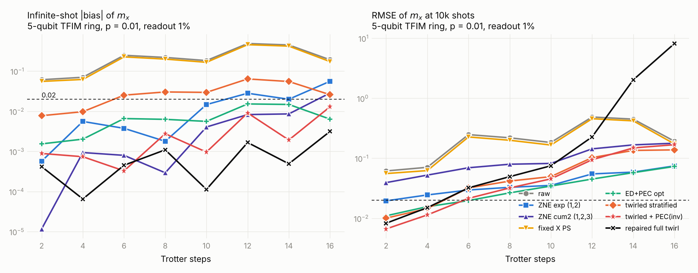
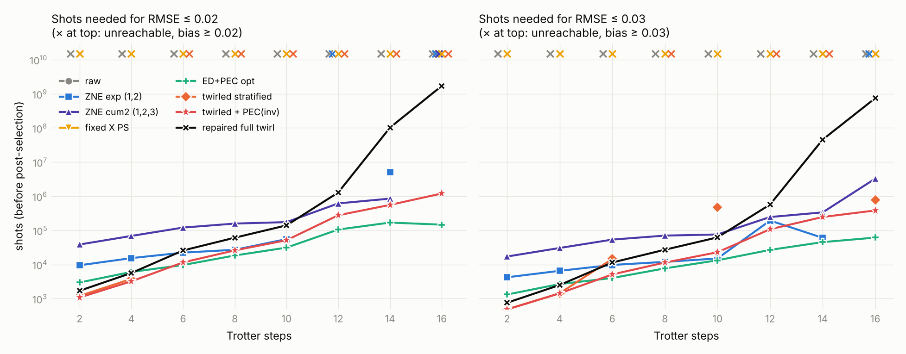

# Three-stage numerical test: ZNE, fixed Pauli checks, twirled checks with partial post-selection

7 October 2026. Code: `tfim_demo.py` (simulator), `protocols.py` (estimators and shot sampling), `run_demo.py` (sweep), `make_demo_report.py` (tables and figures). Raw results: `demo_results_2_4_6_8_10_12_14_16.json`, `demo_tables.md`, `demo_run.log`. Repaired full twirl (any flavor, controlled-X repair): `repaired.py`, `run_repaired_sweep.py`, `repaired_sweep.json`, `repaired_sweep.log`. Side tests: `multi_check.py` (two or three checks per step), `wls_test.py` (weighted least squares and species truncation).

## 1. Verdict

On a 5-qubit transverse-field Ising ring with 1% two-qubit depolarizing noise and 1% readout error, Trotter depth 2 to 16 (20 to 160 CX gates):

| | standard ZNE (exponential) | fixed Pauli checks, full post-selection | twirled checks + stratified extrapolation + PEC on the invisible sector | repaired full twirl (any flavor, controlled-X repair) |
|---|---|---|---|---|
| bias at infinite shots | ≤ 0.015 up to depth 10, then 0.02–0.06 | 0.06–0.46 (as bad as unmitigated) | ≤ 0.003 up to depth 10, ≤ 0.013 at depth 16 | ≤ 0.002 at every depth, ≤ 0.003 at depth 16 |
| scatter at 10k shots | 0.02–0.05 | 0.005–0.011 | 0.007–0.17 | 0.008–0.075 up to depth 10, 0.23 at 12, then 2.0 and 8.1 |
| shots for RMSE ≤ 0.02 | 9k (d=2) … 55k (d=10); unreachable at d=12 and 16 | unreachable at every depth | 1k (d=2) … 51k (d=10) … 277k (d=12) … 1.2M (d=16) | 2k (d=2) … 140k (d=10) … 1.3M (d=12) … 10⁸ (d=14), 2·10⁹ (d=16) |
| needs a noise model | no | no | one Pauli rate per CX gate (the rotation-axis fault) | no |

So the three claims hold with one qualification each:

- **More accurate than ZNE.** At every depth the bias is smaller than exponential ZNE's, and from depth 12 on ZNE's bias alone exceeds the 0.02 target while ours stays under it. Second-order-cumulant ZNE has comparable bias but 3× the scatter.
- **Cheaper than fixed checks.** Fixed-flavor Pauli checks with full post-selection never reach the target: they catch 8 of the 15 fault types deterministically but the check gadgets add as much noise as they remove. The paper-style completion of fixed checks, first-order PEC with an exact noise model, does reach the target; its optimistic version (gadget noise fully mitigated) is 3–8× cheaper than our protocol at depth ≥ 12 and comparable below, but it needs the full learned noise model of the payload and of the gadgets, and its realistic version with unmitigated gadget noise fails on bias.
- **The resource is manageable** in the sense that a 0.02 target is reached with $10^4$–$10^5$ shots up to depth 10 and $10^5$–$10^6$ beyond, where exponential ZNE cannot reach it at all.

The qualification that matters: without the small PEC correction our protocol has a residual bias of 0.01–0.06 that grows with depth. It comes from faults along the rotation axis (Z on the Rz target after the first CX, $Z_jZ_k$ after the second; 2 of the 30 Pauli faults per bond gadget), which no Pauli check compatible with the rotations can see. Removing them costs a factor $e^{4\Lambda_{inv}} = 1.05$–$1.5$ in variance and requires that one rate per gate.

The model-free alternative is the **repaired full twirl** (Stage 3c): allow every Pauli as a flavor and insert a controlled-$X$ from the ancilla before and after each $R_z$ whose bond anticommutes with it. Every payload fault, rotation-axis ones included, then flags with probability exactly ½, and the stratified estimate is unbiased to within $3\times10^{-3}$ at every depth with no noise model at all. The price is five extra gadget gates per step: the clean fraction halves, the standard deviation is 1.2–2.4× that of the PEC-completed constrained twirl up to depth 12 and explodes beyond (depth 14: std 2.0 at 10k shots), where the clean species carries less than 4% of the shots. It is the most accurate line in the study and the most expensive one at depth; which to use depends on whether the single rotation-axis rate can be learned reliably.

**Figure 1.** Infinite-shot bias (left) and RMSE at $10^4$ shots (right) of the mean magnetization $m_x$ against Trotter depth. Dashed line: the 0.02 target. Black crosses: repaired full twirl (Stage 3c), the lowest bias at every depth and the fastest-growing RMSE.

**Figure 2.** Shots (before post-selection) needed for RMSE ≤ 0.02 (left) and ≤ 0.03 (right), $N_{req} = N\,\mathrm{Var}/(\varepsilon^2 - \mathrm{bias}^2)$. Crosses at the top: unreachable because the bias exceeds the target.

## 2. Setup

**Circuit.** Transverse-field Ising ring, $n=5$ data qubits in $|+\rangle^{\otimes5}$. One Trotter step is $R_x(\theta)$ on every qubit followed by one ZZ layer, in which every bond $(j,k)$ receives $\exp(-i\tfrac\phi2 Z_jZ_k)$ compiled as $CX(j,k)\,R_z^{(k)}(\phi)\,CX(j,k)$, bonds ordered even, odd, closing. Angles $\theta=3\pi/8$, $\phi=-\pi/4$ as in the anchor paper. Depths 2–16 give 20–160 CX gates. Observable: mean magnetization $m_x = \tfrac15\sum_i\langle X_i\rangle$ (nearest-neighbour $\langle X_iX_{i+1}\rangle$ is also recorded in the JSON).

**Noise.** Two-qubit depolarizing noise of total probability $p=0.01$ after every CX and after every controlled-Pauli of a check gadget; readout flip $q = 0.01$ on the check ancilla; single-qubit gates and resets perfect. Nothing is twirled in the noise model: it is Pauli by construction.

**Simulation.** Exact density-matrix evolution. For the checked circuits the state is branched by the number of flagged checks (at most $d+1$ branches), so every rule "accept at most $t$ flags" is evaluated exactly. The X-basis outcome distribution of every branch is computed exactly, and finite-shot experiments are sampled from it: $N = 10^4$ shots, 300 repetitions, RMSE and standard deviation from the repetitions. For the twirled protocol every shot draws its own flavor from a pool of 200 pre-computed flavor draws.

**Ideal values** of $m_x$ oscillate with depth (0.64, 0.49, 0.84, 0.65, 0.52, 0.94, 0.81, 0.43 for $d = 2,\dots,16$), which is why the raw bias is not monotone.

## 3. The three protocols

### Stage 1: standard ZNE

No checks. Every CX noise rate is scaled by $G = 1, 2, 3$ (exact rescaling, the best case for ZNE). Two estimators: exponential fit through $G=1,2$ and second-order cumulant fit through $G=1,2,3$ (polynomial of degree 2 in $G$ for $\ln m_x$). Shots split equally across gains.

### Stage 2: fixed Pauli checks, full post-selection (the standard protocol)

One check ancilla per Trotter step brackets the ZZ layer: ancilla in $|+\rangle$, controlled-$P_L$ on the data, the ZZ layer, controlled-$P_L$ again, X-basis measurement, reset. $P_L$ must commute with every $Z_jZ_k$ so that the syndromes stay deterministic through the rotations (anchor paper, Appendix B.3); then $P_R = P_L$. The fixed flavor is $X^{\otimes5}$ every step (equivalently $Z^{\otimes5}$; both were run and behave alike). It flags a fault iff the fault has an odd number of $Y$ or $Z$ components: 8 of the 15 two-qubit Paulis, deterministically. Accept only shots with no flag.

Two references complete this stage in the spirit of the anchor paper (error detection plus first-order PEC on the undetected faults): an **optimistic** one in which the gadgets are noiseless and the undetected payload faults are cancelled exactly (the expectation of first-order PEC, cost $e^{4\Lambda_u}/\alpha$ with $\Lambda_u$ the undetected payload weight), and a **realistic** one in which the gadgets are noisy and only payload faults are cancelled.

### Stage 3: twirled checks, partial post-selection, stratified extrapolation (our protocol)

Same ancilla and windows, but the flavor is redrawn for every shot from the family that commutes with all bonds: with probability ½ a Z-string on a uniformly random subset (identity allowed), with probability ½ a string with X or Y on every qubit. For this family every net fault that is not an even-weight Z-string is flagged with probability exactly ½, whatever its type, and even-weight Z-strings are never flagged (`test_demo.py` checks both). Gadget cost: 10 controlled-Paulis for an XY-string, 2.5 on average for a Z-string.

Analysis follows `THEORY.md`:
- The windows are disjoint, so a shot with $f$ steps containing a visible net fault survives the rule "at most $t$ flags" with probability $\Pr[\mathrm{Bin}(f,\tfrac12)+\mathrm{Bin}(d-f,q)\le t]$. Species are labelled by $f$.
- All $d+1$ threshold rules are evaluated on the same shots; the acceptance rates and the accepted sums of the observable give two linear systems in the species weights $q_f$ and contributions $W_f$, solved by least squares for $f \le 5$. The estimate is $W_0/q_0$, the expectation conditioned on no visible fault.
- "Twirled PS only" (accept no flags, no extrapolation) and "single-species" (leak subtraction with $\beta=\tfrac12$, which assumes every faulty shot has exactly one faulty step) are reported for comparison.
- **3b**: the same with first-order PEC on the invisible sector (rates of the two rotation-axis faults per bond gadget set to zero), cost factor $e^{4\Lambda_{inv}}$ applied to the variance.

### Stage 3c: repaired full twirl (any flavor $P_L$)

Same ancilla and windows, but $P_L$ is drawn uniformly from all $4^5$ Paulis (identity included). For every bond whose $Z_jZ_k$ anticommutes with $P_L$ a controlled-$X_k$ from the same ancilla is inserted immediately before and after the $R_z^{(k)}$ (Martiel–Javadi-Abhari, SI §V.B): in the ancilla-$|1\rangle$ branch the sandwich reverses the rotation, $X_kR_z(\phi)X_k = R_z(-\phi)$, and $P_L\,e^{+i\frac\phi2 Z_jZ_k} = e^{-i\frac\phi2 Z_jZ_k}P_L$, so the two branches agree up to sign and $P_R = P_L$ remains a valid check. The flag rule is unchanged, but the image met by the rotation-axis faults is now unconstrained: $Z_k$ after the first CX meets $CX\,P_L\,CX$, $Z_jZ_k$ after the second meets $P_L$, and each anticommutes with half of all flavors. Every payload fault is a fair coin (verified numerically in `repaired.py`), so the threshold-species analysis of Stage 3 applies without an invisible sector and without PEC. The controlled-$X$ gates carry the same two-qubit depolarizing noise as the controlled-Paulis; on average 2.5 bonds per step anticommute, so the gadget costs $7.5 + 5.0 = 12.5$ noisy two-qubit gates per step against 7.5 for the constrained family and 10 for the payload. Species $f \le 7$ are used because the extra gadget noise raises the typical number of faulty steps ($f \le 5$ leaves a truncation bias of $+0.02$ at depth 12; $f \le 6$ and $7$ agree). Code: `repaired.py`, `run_repaired_sweep.py`; same shots, repetitions and flavor-pool size as Stage 3.

### Which line is "our protocol"

"Twirled, stratified" is the model-free core: it removes exactly what the checks can see, and its residual is the rotation-axis sector that no compatible check can see, not an approximation error. The protocol proper is the three-part pipeline twirl → stratified extrapolation → first-order PEC on the invisible sector, whose only model input is one rate per gate. Both rows are reported.

### The PEC step, learned and applied

In the simulation the two invisible rates per bond gadget ($Z_k$ after the first CX, $Z_jZ_k$ after the second, $p/15$ each) are set to zero, the infinite-shot expectation of first-order PEC with exact rates, and the variance is multiplied by $e^{4\Lambda_{inv}}$. In an experiment they would be learned by sparse Pauli–Lindblad learning of the twirled CX layer (the checks cannot supply them, since these faults never flag; they sit near the known CX fidelity degeneracy). PEC is applied by quasi-probability sampling with sign flips and the weight $\gamma = \exp(2\sum\lambda_{inv})$; the inserted Paulis are even-weight Z-strings, invisible to every flavor, so acceptance and flag statistics are unchanged and the weighted outcomes go through the same linear species inversion.

### ED+PEC in detail

Anchor-paper protocol: learn a sparse Pauli–Lindblad model of every layer including gadgets; classify faults by back-propagated syndrome; first-order post-selected noise $= \sum_{\nu \in V_u}\lambda_\nu(\mathcal P_\nu - 1)$; invert by PEC with $\gamma_L = \exp(2\sum_{V_u}\lambda_\nu)$; post-select with the unnormalized-mean rescaling (pooling). Cost $\gamma_L^2/\alpha$. Our reference: fixed flavor $X^{\otimes 5}$, 7 of 15 Paulis undetected per CX location, their rates set to zero, cost $e^{4\Lambda_u}/\alpha$ with $\Lambda_u = 14\,(p/15)\cdot 5\cdot d$ charged as $N\,\mathrm{Var} \approx (\gamma^2 - O^2)/\alpha$. Optimistic = noiseless gadgets (gadget faults assumed learned and cancelled for free); realistic = gadget noise left in. The true protocol lies between; with gadget weight $0.1d$ and about half undetected, $\gamma^2$ grows by roughly $e^{0.2d}$ (×11 at $d=12$), which would put realistic ED+PEC at or above our cost. Not computed exactly.

## 4. Results

Full tables in `demo_tables.md`. Bias is at infinite shots; std and RMSE at $10^4$ shots.

**Bias of $m_x$**

| protocol | d=2 | d=4 | d=6 | d=8 | d=10 | d=12 | d=14 | d=16 |
|---|---|---|---|---|---|---|---|---|
| raw | −0.061 | −0.070 | −0.247 | −0.219 | −0.183 | −0.486 | −0.448 | −0.191 |
| ZNE exponential | +0.001 | +0.006 | −0.004 | +0.002 | +0.015 | −0.028 | −0.020 | +0.056 |
| ZNE 2nd cumulant | 0.000 | +0.001 | −0.001 | 0.000 | +0.004 | −0.008 | −0.009 | +0.028 |
| fixed checks, full PS | −0.055 | −0.062 | −0.226 | −0.199 | −0.166 | −0.455 | −0.419 | −0.173 |
| ED+PEC, optimistic | −0.002 | −0.002 | −0.007 | −0.006 | −0.006 | −0.015 | −0.015 | −0.006 |
| ED+PEC, realistic | −0.025 | −0.022 | −0.120 | −0.099 | −0.072 | −0.266 | −0.241 | −0.064 |
| twirled, PS only | −0.061 | −0.071 | −0.240 | −0.216 | −0.182 | −0.474 | −0.439 | −0.192 |
| twirled, stratified | −0.008 | −0.010 | −0.025 | −0.030 | −0.029 | −0.064 | −0.055 | −0.026 |
| twirled, stratified + PEC(inv) | −0.001 | +0.001 | 0.000 | −0.003 | −0.001 | −0.009 | +0.002 | +0.013 |
| repaired full twirl (3c) | 0.000 | 0.000 | −0.001 | −0.001 | 0.000 | −0.002 | −0.001 | +0.003 |

**Standard deviation of $m_x$ at $10^4$ shots**

| protocol | d=2 | d=4 | d=6 | d=8 | d=10 | d=12 | d=14 | d=16 |
|---|---|---|---|---|---|---|---|---|
| ZNE exponential | 0.020 | 0.024 | 0.029 | 0.033 | 0.032 | 0.047 | 0.055 | 0.050 |
| ZNE 2nd cumulant | 0.039 | 0.052 | 0.069 | 0.079 | 0.082 | 0.143 | 0.167 | 0.176 |
| ED+PEC, optimistic | 0.011 | 0.016 | 0.019 | 0.026 | 0.034 | 0.042 | 0.056 | 0.073 |
| twirled, stratified | 0.006 | 0.011 | 0.020 | 0.029 | 0.040 | 0.080 | 0.123 | 0.135 |
| twirled, stratified + PEC(inv) | 0.007 | 0.011 | 0.021 | 0.032 | 0.045 | 0.094 | 0.149 | 0.167 |
| repaired full twirl (3c) | 0.008 | 0.015 | 0.032 | 0.049 | 0.075 | 0.226 | 2.02 | 8.15 |

**Shots for RMSE ≤ 0.02**

| protocol | d=2 | d=4 | d=6 | d=8 | d=10 | d=12 | d=14 | d=16 |
|---|---|---|---|---|---|---|---|---|
| ZNE exponential | 9k | 15k | 22k | 27k | 55k | ∞ | 5.1M | ∞ |
| ZNE 2nd cumulant | 38k | 69k | 121k | 158k | 174k | 615k | 849k | ∞ |
| fixed checks, full PS | ∞ | ∞ | ∞ | ∞ | ∞ | ∞ | ∞ | ∞ |
| ED+PEC, optimistic | 3k | 6k | 10k | 18k | 31k | 105k | 169k | 147k |
| twirled, stratified | 1k | 4k | ∞ | ∞ | ∞ | ∞ | ∞ | ∞ |
| twirled, stratified + PEC(inv) | 1k | 3k | 11k | 26k | 51k | 277k | 556k | 1.2M |
| repaired full twirl (3c) | 2k | 6k | 26k | 61k | 140k | 1.3M | 1.0×10⁸ | 1.7×10⁹ |

**Acceptance.** Twirled, no flags: 0.83, 0.69, 0.58, 0.48, 0.40, 0.34, 0.28, 0.23. Inferred clean fraction $q_0$: 0.71, 0.49, 0.35, 0.25, 0.18, 0.13, 0.09, 0.06. Fixed checks: 0.80 down to 0.17. Repaired full twirl, no flags: 0.79, 0.62, 0.49, 0.39, 0.30, 0.24, 0.19, 0.15; clean fraction $q_0$: 0.63, 0.39, 0.25, 0.15, 0.10, 0.06, 0.04, 0.02.

### Repaired full twirl across the sweep

The repaired full twirl is unbiased at every depth: $|{\rm bias}| \le 0.002$ for $d \le 14$ and $0.003$ at $d = 16$, against $0.013$ for the PEC-completed constrained twirl and $0.056$ for exponential ZNE at $d=16$, with no noise model. Its cost is governed by the clean fraction $q_0$, which is roughly the square of the constrained family's because the gadget is 1.7× noisier: $q_0 = 0.63 \to 0.02$ over the sweep against $0.71 \to 0.06$. Up to depth 10 the standard deviation is 1.2–1.7× that of the PEC-completed constrained twirl and the shot count 2–3× (2k, 6k, 26k, 61k, 140k for RMSE ≤ 0.02); at depth 12 it is 2.4× in std and 5× in shots (1.3M); at depths 14 and 16, where $q_0 < 0.04$, the species inversion amplifies the noise by two orders of magnitude (std 2.0 and 8.1 at 10k shots; the shot counts of $10^8$ and $2\times10^9$ are the formal $N\,{\rm Var}/\varepsilon^2$). The species cutoff is not the cause: at depth 12, $f\le5,6,7$ give std 0.24, 0.22, 0.23. Details of the mechanism in `theory/why_zz_is_invisible.md`, Section 6.

### Noise-level dependence

The ordering above is specific to $p=q=1\%$. Repeating the comparison at 0.5% and 0.2% (`THRESHOLD.md`, `fig_threshold.png`) shows that the check-based protocols stay unbiased at every noise level and that their cost relative to exponential ZNE is a function of the clean fraction $q_0$ alone, with break-even at $q_0\approx0.3$, i.e. $(g_p+g)\,p\,d\lesssim1.3$ (one expected fault in the checked circuit, gadgets included; $pd\lesssim0.06$ for the repaired gadget). At 0.2% the repaired twirl is 1.6–4× cheaper than exponential ZNE at depths 16–24 with no noise model.

## 5. Reading the results

**Stage 1.** On this observable the decay is close to a single exponential, so exponential ZNE is unbiased to about 0.01 up to depth 10. What fails first is the variance: 0.02–0.05 at $10^4$ shots, because the amplified points carry little signal. Beyond depth 10 the bias also exceeds 0.02. The second-cumulant fit fixes most of the bias and triples the scatter.

**Stage 2.** The fixed check removes about half of the payload noise deterministically and adds ten noisy gadget gates per step. Net effect on the bias: a few per cent. Full post-selection on fixed checks does not help here, and it is not a matter of shots. The paper's completion, first-order PEC on the undetected faults, does work and is the cheapest unbiased method in the table, but only in its optimistic form. With the gadget noise left in the realistic variant the bias is 0.02–0.27. In practice the gadget noise would be learned and cancelled too, which raises $\Lambda_u$ and the cost by a factor we did not compute; the optimistic line is a lower bound on its cost.

**Stage 3.** Post-selecting on twirled checks alone is useless, as the theory predicts: each faulty step leaks with probability ½, so the accepted set is almost as noisy as the raw one. The extrapolation is what does the work. The single-species formula breaks down beyond depth 2 because most faulty shots have more than one faulty step; the threshold stratification over $f \le 5$ species handles that and is exact up to the invisible sector. Its residual (0.01–0.06) is the rotation-axis sector; 3b removes it with one learned rate per gate, 3c removes it with five extra gadget gates per step and no model.

The variance of the stratified estimator grows roughly as $e^{\Lambda_{total}}$ times an amplification of about 4 for isolating the clean species, which is why it overtakes ZNE's variance at depth 12. Weighted least squares does not help (`wls_test.log`), truncating at $f\le3$ adds bias, and two or three checks per step make things worse: the extra gadget noise outweighs the sharper coin (`multi_check.log`, depth 8: bias −0.03 → −0.06 for two checks, same variance).

**Resource comparison.** Against exponential ZNE our protocol needs fewer shots at every depth where both reach the target, and reaches it where ZNE cannot. Against second-cumulant ZNE it needs 2–30× fewer shots. Against the optimistic ED+PEC reference it is comparable up to depth 8 and 3–8× more expensive beyond, with far less model knowledge required. The model-free repaired twirl (3c) costs 2–3× more shots than 3b up to depth 10 and 5× at depth 12, and is not usable at depths 14–16 at this noise level.

## 6. What this does and does not show

- It shows that twirling the check flavor and extrapolating in the accepted fraction turns Pauli checks from useless (stage 2) into the most accurate method in the table, on a deep non-Clifford circuit, with no noise model except one rate per gate.
- It does not show a resource advantage over model-based ED+PEC when the model is exact. The advantage is accuracy against ZNE, feasibility against fixed checks, and independence from the noise model against ED+PEC.
- The invisible sector is intrinsic to checks that commute with the rotations. On this circuit it is 2 of 30 Pauli faults per bond gadget. Under biased noise it could be larger or smaller. It can be removed without a model by the controlled-$X$ repair (3c), at the price of gadget noise that limits the usable depth.
- Finite-ensemble noise of the 200 flavor draws contributes about $10^{-3}$ to the quoted biases.
- 5 qubits, exact amplification for ZNE, perfect resets and single-qubit gates, no leakage. The ZNE baseline is therefore favoured; the fixed-check baseline is not, since its gadget noise is included while the ED+PEC reference's is not.

## 7. Next for a serious demo

1. Learn the invisible-sector rate from data instead of assuming it (it is one Pauli per gate; the rejected shots and the acceptance statistics constrain it).
2. Reduce the gadget cost: Z-string flavors cost 2.5 gates against 10 for XY-strings; a biased flavor distribution with the matching species model could halve the gadget noise. For the repaired twirl, a flavor distribution that keeps the number of anticommuting bonds small while preserving the ½ coin for the rotation-axis faults would cut the five repair gates per step.
3. Replace exact rate scaling in the ZNE baseline by probabilistic error amplification with a learned model, so both sides carry realistic model error.
4. Larger $n$ with a statevector or tensor-network simulator, since the density matrix limits us to $n \approx 8$.
5. Shot allocation across threshold rules and a maximum-likelihood species fit, which may shave the factor-4 amplification.
