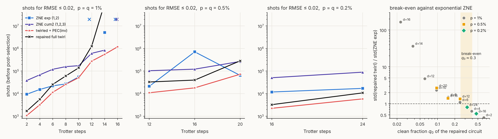

# Noise-level dependence: is there a threshold for the checks to help?

7 October 2026. Code `threshold_scan.py` (usage `python3 threshold_scan.py 
 <depths> [M]`), `fig_threshold.py`; data `threshold_p0.005.json`, `threshold_p0.002.json` (and the 1% sweep in `demo_results_*.json`, `repaired_sweep.json`); table `threshold_table.md`; figure `fig_threshold.png`.

## Question

At $p=q=1\%$ the repaired full twirl is unbiased but the most expensive protocol beyond depth 10, because its 12.5 noisy gadget gates per step add more noise than the checks remove per shot. Does this reverse when gate and readout fidelity improve, and is there a threshold-like condition? Same circuit and estimators as `DEMO.md`; $p = q$ scaled together to 0.5% and 0.2%; depths chosen so that the circuit remains challenging ($d=12,16,20$ at 0.5%, $d=16,24$ at 0.2%); 100 flavor draws instead of 200 (ensemble bias ≲ 2×10⁻³); exponential and second-cumulant ZNE run at every point as the comparison.

## Results

**Figure.** Shots for RMSE ≤ 0.02 against depth at $p=q=1\%$, 0.5%, 0.2% (first three panels; ✕ at top = bias exceeds target), and the ratio of the repaired twirl's standard deviation to exponential ZNE's against the clean fraction $q_0$ of the repaired circuit, all noise levels and depths on one plot (right).

| p = q | d | $q_0$ (rep.) | ZNE exp: bias / std / shots | ZNE cum2 | twirled + PEC(inv) | repaired full twirl |
|---|---|---|---|---|---|---|
| 1% | 8 | 0.15 | +0.002 / 0.033 / 27k | −0.000 / 0.079 / 158k | −0.003 / 0.032 / 26k | −0.001 / 0.049 / 61k |
| 1% | 12 | 0.06 | −0.028 / 0.047 / ∞ | −0.008 / 0.143 / 615k | −0.009 / 0.094 / 277k | −0.002 / 0.226 / 1.3M |
| 1% | 16 | 0.02 | +0.056 / 0.049 / ∞ | +0.028 / 0.176 / ∞ | +0.013 / 0.167 / 1.2M | +0.003 / 8.1 / 1.7·10⁹ |
| 0.5% | 12 | 0.25 | −0.008 / 0.027 / 21k | −0.001 / 0.064 / 104k | −0.002 / 0.021 / 11k | −0.001 / 0.036 / 33k |
| 0.5% | 16 | 0.15 | +0.020 / 0.028 / 714k | +0.007 / 0.065 / 122k | −0.000 / 0.027 / 18k | −0.000 / 0.040 / 40k |
| 0.5% | 20 | 0.10 | −0.012 / 0.040 / 65k | −0.003 / 0.102 / 268k | +0.001 / 0.054 / 73k | −0.002 / 0.106 / 285k |
| 0.2% | 16 | 0.47 | +0.004 / 0.021 / 12k | +0.001 / 0.045 / 51k | +0.000 / 0.009 / 2k | −0.000 / 0.011 / 3k |
| 0.2% | 24 | 0.33 | −0.003 / 0.026 / 17k | −0.001 / 0.060 / 90k | +0.001 / 0.015 / 6k | −0.001 / 0.021 / 11k |

Full table with all 1% depths in `threshold_table.md`.

## Reading

1. **Bias never depends on the noise level.** The repaired twirl is unbiased to ≤ 0.003 at every point, and the constrained twirl + PEC(inv) to ≤ 0.003 except at 1%, $d\ge12$ where the invisible-sector PEC's second-order remainder shows (0.009, 0.013). Exponential ZNE's bias is the thing that moves: it exceeds 0.02 at 1% for $d\ge12$ and at 0.5% for $d=16$ (+0.020), and is harmless at 0.2%. So in the user's sense of "adds error rather than helps", the checks never add *error*; the only question is cost.

2. **The cost ratio to ZNE is a function of the clean fraction alone.** Points from all three noise levels collapse onto one curve in the right panel: $\mathrm{std}_{\rm rep}/\mathrm{std}_{\rm ZNE}\approx 1$ at $q_0\approx0.3$, 1.4 at $q_0\approx0.15$, 2.5 at 0.10, 5 at 0.06, and divergent below 0.04 (where the inferred $q_0$ is within 3σ of zero at 10⁴ shots). Pairs with equal $q_0$ at different $(p,d)$ agree: (1%, $d=8$) and (0.5%, $d=16$) both have $q_0\approx0.15$ and ratios 1.49 and 1.41; (1%, $d=10$) and (0.5%, $d=20$) have $q_0\approx0.10$ and ratios 2.3 and 2.7.

3. **The threshold, stated as a condition on the circuit.** With $g$ noisy gadget gates and $g_p$ payload gates per step, $q_0\approx(1-\tfrac{14}{15}(g_p+g)p)^d\approx e^{-0.93(g_p+g)pd}$; for the repaired gadget $g_p+g=22.5$. Break-even against exponential ZNE at $q_0\approx0.3$ is then
$$ (g_p+g)\,p\,d \;\lesssim\; 1.3, \qquad\text{i.e.}\qquad p\,d\lesssim 0.06 \text{ for the repaired circuit:} $$
$d\lesssim6$ at 1%, $d\lesssim12$ at 0.5%, $d\lesssim29$ at 0.2%, $d\lesssim58$ at 0.1%. The constrained family (17.5 gates per step) has the same break-even at $pd\lesssim0.075$, and the plain post-selection cost $1/q_0$ of either protocol is below ZNE's variance amplification in that regime. The condition is "about one expected fault in the whole checked circuit"; it is the same bookkeeping as van den Berg et al.'s critical payload error rate (`theory/gadget_noise_survey.md`), with the extrapolation's amplification factor included.

4. **Where ZNE is biased the checks win regardless of cost.** At 0.5%, $d=16$ exponential ZNE needs 714k shots because its bias eats the error budget, while the repaired twirl needs 40k and the constrained + PEC 18k. At 1%, $d\ge12$ exponential ZNE cannot reach the target at all. Second-cumulant ZNE repairs the bias at 3–5× the variance and is then 2–4× more expensive than the repaired twirl wherever $q_0\gtrsim0.1$.

5. **At 0.2% the repaired twirl is the second-cheapest protocol at every depth tested**, 4× cheaper than exponential ZNE in shots at $d=16$ and 1.6× at $d=24$, with no noise model, and within 2× of the constrained family with PEC.

## Summary

Theory of this break-even (cost exponents, why no threshold in $p$ alone exists, the asymptotic condition $1+r<G_{\max}\kappa$ on gadget overhead and observable sensitivity): `theory/breakeven_theory.md`, checked against these data in `breakeven_check.md`.

There is a threshold, but it is a soft one on the total expected fault count of the checked circuit rather than on the gate error alone: detection-based extrapolation is cheaper than exponential ZNE when $(g_p+g)\,p\,d\lesssim1.3$, i.e. the clean fraction stays above ≈ 0.3, and it is unbiased at all noise levels. At today's 0.2–0.5% two-qubit errors this covers Trotter circuits of 12–30 steps on this register; at 1% only shallow ones. Reducing $g$ (biased flavor distribution, single-sided checks, dual-purpose ancillas; survey in `theory/gadget_noise_survey.md`) moves the threshold proportionally.
