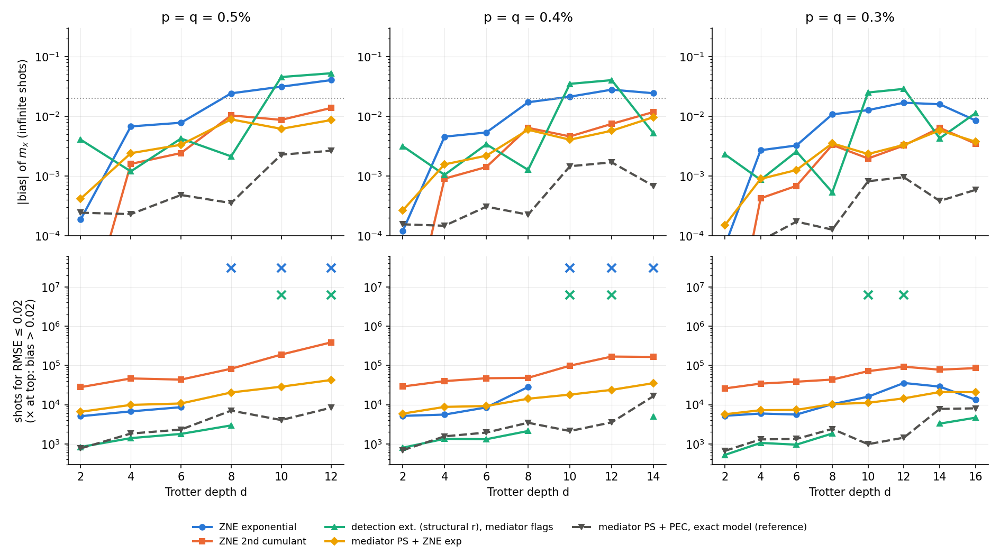

# Heavy-hex plaquette: Pauli-check detection vs ZNE at p = 0.5–0.3%

8 October 2026. Code: `hh_sim.py` (simulator), `test_hh.py` (checks), `compilation_check.py`, `classify.py` (single-fault classification → `classify.json`), `run_hh.py` (sweep → `hh_p*.json`, logs `run_p*.log`), `make_hh_report.py` (→ `hh_tables.md`, `fig_hh.png`).

Question: on the hardware-native layout of paper App. B (TFIM ring of 6 on one heavy-hex plaquette, bonds mediated by edge qubits), at two-qubit error p = 0.5%, 0.4% and 0.3%, does Pauli-check error detection used for extrapolation beat conventional ZNE?

## 1. Verdict

**Figure.** Infinite-shot |bias| of m_x (top) and shots for RMSE ≤ 0.02 (bottom). × at the top: the bias alone exceeds 0.02.

1. **Yes, with the free mediator checks used for post-selection followed by exponential ZNE (`PS+ZNE exp[M]`).** It reaches RMSE ≤ 0.02 at all 21 (p, d) points, with |bias| ≤ 0.010 and no noise model. Plain exponential ZNE fails on bias from d = 8 at 0.5% and from d = 10 at 0.4%. The conventional method that stays unbiased, second-cumulant ZNE, needs **3.4–9× more shots** than PS+ZNE at every point. PS+ZNE matches plain exponential ZNE in cost where the latter still works (0.3%, every depth; 0.4–0.5%, d ≤ 6).
2. **Pure detection-driven extrapolation (no noise amplification) is the cheapest at shallow depth, but not robust.** `ext r[M]` uses only the flagged/unflagged split of one circuit and a structural ratio r. It needs 0.5–5k shots, 3–10× fewer than ZNE, wherever it works. It fails on bias at d = 10–12 at every noise level (−0.025 to −0.053). The reason is in §4.
3. **Peripheral checks help plain post-selection but not the extrapolated protocols.** They add 12 cZ and 6 readouts per step. They catch the X/Y data faults the mediators miss, which lowers the residual bias of PS alone: PS+SV[MP] reaches the target at a few points where PS+SV[M] does not (e.g. 0.4%, d = 6: 2.4k vs 125k). But acceptance falls (0.47 vs 0.69 at 0.5%, d = 4), and for the protocols that work across depths (PS+ZNE, PEC) [MP] is never meaningfully cheaper than [M]. PS+SV+ZNE exp, for example, costs 1.3–2.4× more with peripherals at 0.5%. The remaining invisible Z sector, not the X/Y one, limits the method.
4. **Parity symmetry verification (SV) hurts at depth.** It is a single global check, so pairs of Z faults cancel in it, and post-selecting on it distorts both ZNE and PEC from d ≈ 8 on.
5. **Lowering p from 0.5% to 0.3% shifts the failures to larger depth but leaves the ranking unchanged.** This matches the paper's statement that cost exponents scale with p·d.
6. **The paper's App. B design premise is wrong under depolarizing noise.** See §3: the compilation twirl is a no-op, and every valid local check is blind to logical Z faults inside the ZZ layer.

## 2. Setup

- **Layout.** 6 data qubits on the plaquette vertices (TFIM ring of 6), mediators m_i on the edges, peripheral ancillas p_i on the outgoing edges (paper Fig. `heavyhex`).
- **Trotter step.** R_x(θ) on every data qubit (noiseless). Then the ZZ layer: bonds (0,1),(2,3),(4,5) followed by (1,2),(3,4),(5,0). Each bond is `CX(i→m) CX(j→m) Rz_m(φ) CX(j→m) CX(i→m)` (4 CX per bond, 24 per step). The mediator is measured in Z (the flag) and reset after its bond.
- **Peripheral checks (config [MP] only).** cZ(p_i→q_i) before and after the ZZ layer; X readout.
- **Parameters.** θ = 3π/8, φ = −π/4, |+⟩^6, observable m_x = ⅙ Σ⟨X_i⟩. ΠX_i is a symmetry with ideal value +1.
- **Noise.** Two-qubit depolarizing p after every CX and cZ. Readout flip q = p on mediators and peripherals. Data readout and single-qubit gates are perfect.
- **Simulation.** Exact density matrix of 6 data qubits plus one transient mediator slot. This is exact because each mediator is used once per step on disjoint qubits.
  - The peripheral flags follow exactly from the Pauli image rule (image Z_i throughout the layer). A data X/Y fault inside the window flips the flag. A fault on the ancilla after the first cZ applies Z_i to the data (for X/Y) and/or flips the flag (for Z/Y).
  - `test_hh.py` checks this against an explicit-ancilla simulation (agreement 1e-16), and the ideal circuit against matrix exponentials.
  - The state is branched by flag count.
- **Shots.** N = 10⁴ per protocol (split equally over gains), 300 repetitions, N_req = N·Var/(0.02² − bias²).
- **ZNE gain scaling** is exact rate scaling of all two-qubit gates, the best case for ZNE, as in the main demo.

**Protocols** (all on the same mediated circuit):

| name | what it does | extra circuits | noise knowledge |
|---|---|---|---|
| ZNE exp / cum2 | flags ignored; exponential fit (G = 1,2) / quadratic in ln m_x (G = 1,2,3) | amplified copies | none |
| SV+… | additionally post-select parity +1 | – | none |
| PS[c] | keep shots with no flag | – | none |
| PS+ZNE exp/cum2[c] | ZNE on post-selected data at each gain | amplified copies | none |
| ext r[c] | Ô = O_PS·(O_PS/O_all)^r, r = (undetected harmful)/(detected) Pauli-type count per step | none | relative rates (depolarizing) + fault classification |
| PEC oracle[c] | undetected-harmful rates set to 0 (anchor-paper ED+PEC), variance × e^{4Λ_u} | – | full exact model of the undetected sector |

PS+ZNE and ext r differ in how they reach zero noise. PS+ZNE raises the noise physically and extrapolates the post-selected value in G. It measures how the undetected remainder decays and needs no assumption about it. ext r lowers the noise by filtering on flags, from O_all (weight Λ_d+Λ_u) to O_PS (weight Λ_u), and extends that line by the ratio r. It assumes that undetected faults move m_x as much, per unit rate, as detected ones.

## 3. What the checks can and cannot see

**The compilation twirl does nothing under depolarizing noise.** Compilation B of the mediated gadget (mediator as control, R_x on m, data in the H frame) is compilation A conjugated by local Hadamards. Depolarizing noise is invariant under that conjugation, so the flag-resolved data channels are identical (`compilation_check.py`: max |Choi_A − Choi_B| = 3e-16). Twirling the image type relabels which physical Pauli is invisible but leaves the invisible logical errors at the same rate.

**What every valid local check misses.** This is the paper's own argument in Sec. "Why the rotation-axis fault is invisible", applied to a whole layer: a check transparent to the ZZ rotations must have an image in the commutant of {Z_iZ_j}. Single-wire and mediator checks can only realize Z-type images on the data, so logical Z-type data faults inside the ZZ layer are invisible to all of them. Those are exactly the faults that flip ⟨X_i⟩. The global parity sees odd-weight Z, but only as one end-of-circuit check, where pairs cancel.

**Single-fault classification** (`classify.py`, step 1 of 3, both sub-layers agree). Undetected-harmful Paulis per CX location of a bond gadget, letters on (data, mediator):

| location | mediator flags only | mediators + peripheral |
|---|---|---|
| after CX#1 | IZ, ZI, XX, XY, YX, YY | IZ, ZI |
| after CX#2 | IZ, ZI, ZZ, XX, XY, YX, YY | IZ, ZI, ZZ |
| after CX#3 | IZ, ZI, ZZ, XI, XZ, YI, YZ | IZ, ZI, ZZ |
| after CX#4 | ZI, ZZ, XI, XZ, YI, YZ | ZI, ZZ |
| total per bond | 26 of 60 (43%) | 10 of 60, plus 12 of 30 on the peripheral cZs |

So the "no invisible sector" entry for "mediators + peripheral" in paper Table `hh-coins` is incorrect. The mediator image has no data support after CX#3/#4, so X/Y data faults there are invisible without peripherals. The peripheral cZ gates add their own invisible faults: data faults after the closing cZ lie outside every window, and an ancilla X between the cZs applies Z_i.

## 4. Why the structural-ratio extrapolation fails at d = 10–12

The detected sector is dominated by X/Y faults and the undetected sector by Z faults. For m_x these are not equally harmful. At d = 10–12 the ideal m_x is 0.86–0.88, an X-polarized state that Z faults damage strongly and X faults barely touch. The detected step from O_all to O_PS is then much smaller than the undetected remainder, the extrapolation undershoots, and the bias is −0.03 to −0.05.

At d ≤ 8 the two sectors happen to be roughly equally harmful, so r ≈ 0.81 works. An observable-specific r (the README's "O-specific ratio", or a Clifford-trained r as in `nonclifford/`) would be needed to make this estimator robust. PS+ZNE avoids the question by measuring the undetected decay directly.

## 5. Numbers

Full tables (N_req and bias for 18 protocols at every point) are in `hh_tables.md`. Shots for RMSE ≤ 0.02, with the infinite-shot bias in parentheses:

| p | d | ZNE exp | ZNE cum2 | PS+ZNE exp [M] | ext r [M] | PEC oracle [M] |
|---|---|---|---|---|---|---|
| 0.5% | 4 | 7k (+0.007) | 47k (+0.002) | 10k (+0.002) | 1k (−0.001) | 2k (−0.000) |
| 0.5% | 8 | ∞ (+0.024) | 82k (+0.010) | 20k (+0.009) | 3k (+0.002) | 7k (−0.000) |
| 0.5% | 12 | ∞ (−0.040) | 389k (−0.014) | 43k (−0.009) | ∞ (−0.053) | 8k (−0.003) |
| 0.4% | 8 | 28k (+0.017) | 48k (+0.006) | 14k (+0.006) | 2k (+0.001) | 3k (−0.000) |
| 0.4% | 14 | ∞ (+0.024) | 165k (+0.012) | 35k (+0.010) | 5k (−0.005) | 16k (−0.001) |
| 0.3% | 8 | 10k (+0.011) | 44k (+0.003) | 10k (+0.004) | 2k (+0.001) | 2k (−0.000) |
| 0.3% | 12 | 36k (−0.017) | 93k (−0.003) | 14k (−0.003) | ∞ (−0.029) | 1k (−0.001) |
| 0.3% | 16 | 13k (+0.009) | 85k (+0.003) | 21k (+0.004) | 5k (−0.011) | 8k (−0.001) |

PS acceptance with mediator flags: 0.83 to 0.33 at 0.5% (d = 2 to 12), 0.89 to 0.41 at 0.3% (d = 2 to 16).

## 6. Caveats and next steps

- **ZNE assumes exact gain scaling** for both plain ZNE and PS+ZNE. On hardware, folding or PEA carries model error, and that affects both alike.
- **The PEC reference uses exact rates** for 26 Paulis per bond, which is the anchor paper's full learned model.
- **Mediators are measured and reset every step** (dynamic circuits). The anchor paper measures once at the end, where a mediator left in |1⟩ flips the sign of later rotations.
- **Data readout error, idle noise, single-qubit-gate noise and leakage are not modelled.** Noise is depolarizing; for biased noise the compilation twirl would have an effect (it symmetrizes the noise) but still cannot reveal logical Z faults.
- **The results cover one observable and one angle set**, with ideal m_x oscillating with depth. The ext-r failure is tied to an X-polarized ideal state, so other observables would move it.
- **Next steps:** an observable-specific or Clifford-trained ratio for ext r (cheap, could combine its shot cost with PS+ZNE's robustness); PS+ZNE with probabilistic error amplification on a learned model; and correcting paper App. B (Table `hh-coins`, "Fitting the heavy-hex geometry") in the light of §3.
