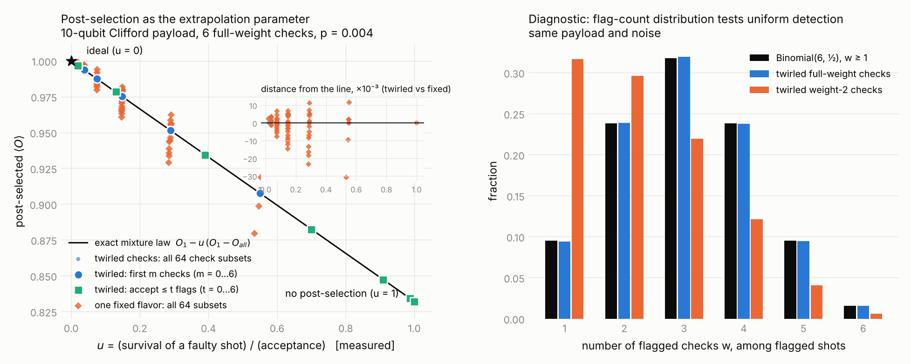
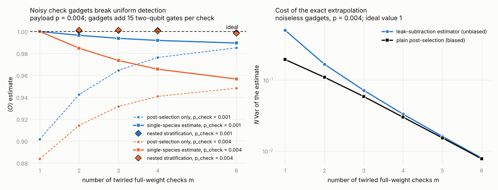

# Error-detection ZNE: what the post-selected observable does as the detection events vary

Theory note, 7 October 2026. Companion to `../REPORT.md`; numerical checks in this folder (`edtheory.py`, `run_theory.py`, `theory_results.txt`).

The question: post-selection on Pauli checks removes only the faults that anticommute with the checks, so it is not a uniform noise scaling. What is the right one-parameter family behind "error-detection ZNE", what does varying the accepted fraction do to that parameter, and does randomizing the check flavors (a randomized-compiling-type argument) make the family uniform?

## Contents

1. [Main results](#1-main-results)
2. [Setting](#2-setting)
3. [Fixed checks: projection, not scaling](#3-fixed-checks-projection-not-scaling)
4. [Twirled checks: detection becomes a coin and post-selection becomes a mixture](#4-twirled-checks-detection-becomes-a-coin-and-post-selection-becomes-a-mixture)
5. [Varying the accepted fraction: the parameter $u$](#5-varying-the-accepted-fraction-the-parameter-u)
6. [The estimator and its cost](#6-the-estimator-and-its-cost)
7. [Comparison with noise scaling](#7-comparison-with-noise-scaling)
8. [The detector model from the detection events](#8-the-detector-model-from-the-detection-events)
9. [Non-uniform detection: species and stratification](#9-non-uniform-detection-species-and-stratification)
10. [Local checks and check-gadget noise](#10-local-checks-and-check-gadget-noise)
11. [Non-Clifford circuits](#11-non-clifford-circuits)
12. [Shared language with arXiv:2609.31934: Pauli paths and reactivity functions](#12-shared-language-with-arxiv260931934-pauli-paths-and-reactivity-functions)
13. [Numerical verification](#13-numerical-verification)
14. [Protocol](#14-protocol)
15. [Open points](#15-open-points)
16. [Files](#16-files)

---

## 1. Main results

1. **With fixed checks, post-selection is a projection of the noise, not a scaling.** The post-selected observable depends on which faults the particular checks happen to see. Across subsets of the checks, $\ln\langle O\rangle_{PS}$ is linear in the measured $-\ln\alpha$ only if the detected faults flip $O$ at a constant rate, and the line reaches the ideal value only if that rate equals the rate for all faults. The ratio $r$ used in `REPORT.md` is exactly the correction for this. It is an assumption, not a theorem (Section 3).

2. **Twirling the check flavor turns detection into a fair coin.** If a check's left Pauli is drawn uniformly from the non-identity Paulis on its support, every fault that touches the support is flagged with the same probability $1-\sigma_w$ ($\sigma_w = (2^{2w-1}-1)/(4^w-1)$, $\to 1/2$ for a full-weight check), whatever its Pauli type. Independent draws for different checks give independent coins (Section 4.1).

3. **Mixture law.** When every fault is visible to every twirled check, the accepted state is exactly a convex mixture of the fault-free state and the unmitigated state:
   $$\rho_{\mathcal A} = (1-u)\,\rho_1 + u\,\rho_{all}, \qquad u = \beta_{\mathcal A}/\alpha_{\mathcal A},$$
   where $\beta_{\mathcal A}$ is the survival probability of a faulty shot under the acceptance rule $\mathcal A$ and $\alpha_{\mathcal A}$ the measured acceptance. This holds to all orders in the noise, for every observable at once, for any acceptance rule (subsets of checks, flag-count thresholds, partial rejection), and is unaffected by readout errors on the check qubits (Section 4.2).

4. **Consequences.** $u$ is the extrapolation parameter and it is measured, not modeled. Every acceptance rule puts the observable on the same straight line through $(1, O_{all})$ and $(0, O_1)$, so two points determine the fault-free value and any further point is a consistency test. The estimator is a leak subtraction, $\hat O_1 = (\alpha O_{PS} - \beta O_{all})/(\alpha-\beta)$, equivalently a weighted mean in which rejected shots carry a small negative weight (Sections 5 and 6).

5. **This is a different family from ZNE.** Noise scaling multiplies every elementary rate by $G$ and produces an exponential family that needs an ansatz. Twirled detection multiplies the probability of every non-trivial fault configuration by the same factor and produces a convex mixture with the ideal channel, which is linear by construction. Mapping one onto the other gives an observable-dependent effective gain (Section 7).

6. **When detection is not uniform, the bias is a covariance.** For a general ensemble of checks the leak-subtraction estimator is biased by $\mathrm{Cov}_w(1-d_F,\,O_F)/(\alpha-\beta)$, the covariance over faulty configurations between survival probability and observable response. Faults that are visible to different subsets of the checks form "species"; the full subset family of $K$ twirled checks determines all $2^K$ species weights exactly, at a conditioning cost of about $6.3^K$. A nested version with $K+1$ points costs about $2.3^K$ (Section 9).

7. **Local checks and noisy check gadgets are the practical obstacles.** Local checks give fault-dependent multiplicities, which the design rule "equal multiplicity everywhere" or the stratified inversion addresses. Check gadgets add gates whose faults are seen by fewer checks than the payload faults; in the toy their count exceeds the payload. Stratification repairs the bias, the gate overhead it cannot (Section 10).

8. **Non-Clifford circuits.** The mixture law needs the net fault at the check to be a Pauli, so twirled checks must bracket Clifford segments; faults at the rotations are then uncovered. Checks that thread through rotations keep deterministic syndromes but cannot be twirled, so they fall back to the fixed-check case and need a ratio (Section 11).

9. **Noise model.** The mixture law uses only that faults are stochastic Pauli operators; it holds for arbitrary rates, biased channels and correlated multi-qubit faults, and is verified under those (Section 13, E6). The anchor paper's spacetime Pauli-Lindblad framework and the reactivity-function framework of arXiv:2609.31934 speak the same language; Section 12 gives the dictionary.

Numerically (Section 13): with twirled full-weight checks the estimator returns the ideal value to $\pm 3\times10^{-4}$ for every subset size and threshold; with one fixed flavor the same quantity wanders by $\pm 2\%$; local twirled checks need stratification; noisy gadgets bias the single-species estimate by up to 4% and nested stratification brings it back to $10^{-3}$.

---

## 2. Setting

**Noise.** Stochastic Pauli faults $\nu$ at circuit locations, independent, with probabilities $p_\nu$ (Pauli-Lindblad rates $\lambda_\nu$, $p_\nu = (1-e^{-2\lambda_\nu})/2$). A configuration $A\subseteq V$ has weight $w(A)=\prod_{\nu\in A}p_\nu\prod_{\nu\notin A}(1-p_\nu)$ and produces the state $\rho_A$. The fault-free configuration has weight $w_\varnothing = \prod_\nu(1-p_\nu)$ and state $\rho_\varnothing$.

**Checks.** A two-sided coherent Pauli check $j$ has a left Pauli $P_L^{(j)}$ on support $W_j$ inserted before a window of layers, and $P_R^{(j)} = U_{win}P_L^{(j)}U_{win}^\dagger$ after it, both controlled by an ancilla in $|+\rangle$ that is finally measured in the $X$ basis. Through a Clifford window a Pauli fault inside the window propagates to a Pauli $F_j(A)$ at the right end, and the ancilla reads 1 iff $F_j(A)$ anticommutes with $P_R^{(j)}$, equivalently iff the back-propagated fault anticommutes with $P_L^{(j)}$ on $W_j$. The gadgets act trivially on the data apart from recording that bit, so checks do not interfere with each other. Readout flips on check $j$ with probability $q_j$.

**Observable and acceptance.** $O$ is any observable on the data; $O_A = \mathrm{Tr}[O\rho_A]$. An acceptance rule is a set $\mathcal A\subseteq\{0,1\}^K$ of syndromes; the two we use most are subsets of checks ($T\subseteq[K]$: accept iff every check in $T$ reads 0) and thresholds (accept iff at most $t$ checks read 1). $\alpha_{\mathcal A}$ is the acceptance probability and $O_{\mathcal A}$ the conditional mean. $O_{all}$ is the unmitigated value.

**Visibility.** A configuration is *visible* to check $j$ if its back-propagated net fault is not the identity on $W_j$; $V(A)\subseteq[K]$ is the set of checks it is visible to. Invisible faults include everything outside the windows, everything on the ancillas that commutes with the readout, and configurations whose net fault cancels on $W_j$.

For the Clifford/Pauli-observable special case used in the numerics, $O_A = \pm O_0$ and the sign is a parity $o(A)=\bigoplus_{\nu\in A}o_\nu$.

---

## 3. Fixed checks: projection, not scaling

Fix the check Paulis. Each elementary fault then has a deterministic syndrome $s_\nu\in\mathbb F_2^K$ and, for a Pauli observable in a Clifford circuit, a flip bit $o_\nu$. The characteristic function of (syndrome, flip) over independent faults factorizes,

$$
\mathbb E\big[(-1)^{x\cdot S + yF}\big] = \exp\Big[-2\sum_\nu\lambda_\nu\,(x\cdot s_\nu\oplus y\,o_\nu)\Big],
$$

and post-selecting on subset $T$ of the checks is a sum over the $2^{|T|}$ characters supported on $T$:

$$
O_T = O_0\,\frac{\sum_{x\in\langle T\rangle}\exp[-2\sum_\nu\lambda_\nu(x\cdot s_\nu\oplus o_\nu)]}{\sum_{x\in\langle T\rangle}\exp[-2\sum_\nu\lambda_\nu\,x\cdot s_\nu]}.
$$

Expanding in the rates,

$$
\ln O_T = \ln O_0 - 2\Lambda_O^{u}(T) + O(\lambda^2),\qquad \Lambda_O^u(T) = \sum_{\nu:\ s_\nu|_T = 0,\ o_\nu = 1}\lambda_\nu ,
$$

and $-\ln\alpha_T = \Lambda^d(T) + O(\lambda^2)$ with $\Lambda^d(T)$ the rate of faults detected by $T$. So post-selection does to the rates what a projector does: $\lambda_\nu\mapsto\lambda_\nu\,\mathbb 1[s_\nu|_T=0]$. Which faults are kept is set by the check, and nothing forces the kept faults to be representative of the removed ones.

Writing $f_O^d(T) = \Lambda_O^d(T)/\Lambda^d(T)$ for the fraction of $T$-detected weight that flips $O$,

$$
\ln O_T = \ln O_0 - 2\Lambda_O + 2 f_O^d(T)\,\big(-\ln\alpha_T\big) + O(\lambda^2).
$$

Two statements follow.

- The points $(-\ln\alpha_T,\ \ln O_T)$ over subsets $T$ lie on one line iff $f_O^d(T)$ is the same for every subset: each check must sample the $O$-flipping faults at the same rate. For generic checks this is only approximately true (Figure 1 of `REPORT.md`, where the scatter is visible).
- The line reaches $\ln O_0$ at $-\ln\alpha = \Lambda_O/f_O^d$, which equals the total fault weight $\Lambda$ only if $f_O^d = \Lambda_O/\Lambda$, i.e. if detected and undetected faults flip $O$ at the same rate. Otherwise the endpoint has to be supplied: $x^* = \Lambda^d(1+r)$ with $r = \Lambda_O^u/\Lambda_O^d$, which is the two-point estimator of `REPORT.md` Section 4.

At second order, pairs of detected faults with equal syndromes survive and multiply $O_T$ by $1 - 2\sum_{s\neq0}\Lambda_{(s,0)}\Lambda_{(s,1)}$; for a single check every pair of detected faults cancels, which is why one check leaks at order $(\Lambda^d)^2$.

The upshot is the one the question anticipated: with fixed checks the "noise scale" that post-selection removes is check-specific and observable-specific. The extrapolation can be made to work (Section 5 of `REPORT.md`) but only by assuming the removed faults stand in for the kept ones.

---

## 4. Twirled checks: detection becomes a coin and post-selection becomes a mixture

### 4.1 The flavor twirl

**Lemma (uniform detection).** Let $P$ be uniform over the $4^w-1$ non-identity Paulis on a set $W$ of $w$ qubits, and let $Q$ be any Pauli. If $Q|_W\neq I$ then

$$
\Pr[\{P,Q\}\neq 0] = \frac{2^{2w-1}}{4^w-1} \equiv 1-\sigma_w ,\qquad \sigma_1=\tfrac13,\ \sigma_2=\tfrac7{15},\ \sigma_w\to\tfrac12 ,
$$

and if $Q|_W = I$ the probability is 0.

*Proof.* Exactly half of all $4^w$ Paulis on $W$ anticommute with a fixed non-identity $Q|_W$, and none of them is the identity. $\square$

The probability depends on the fault only through whether it touches $W$. A twirl over a smaller set does not do this: drawing $P\in\{X,Z\}$ on one qubit flags $X$ and $Z$ faults half the time and $Y$ faults always. What is needed is a set in which every non-identity $Q$ anticommutes with the same fraction of members; the full non-identity group has that property, and that is the set to randomize over.

Because $P_R = U P_L U^\dagger$ and Clifford conjugation permutes the non-identity Paulis, a uniformly random $P_L$ gives a uniformly random $P_R$, so the lemma applies at either end. Independent draws for different checks give independent flags, since the gadgets do not change the data part of the fault.

This is the detection analogue of randomized compiling. Randomized compiling averages the *noise* over a Pauli frame so that the channel's action no longer depends on the Pauli type of the error. The flavor twirl averages the *detector* over the Pauli group on its support so that the probability of a flag no longer depends on the Pauli type of the fault.

### 4.2 The mixture law

**Theorem.** Assume (H1) stochastic Pauli faults; (H2) $K$ checks whose left Paulis are drawn independently and uniformly from the non-identity Paulis on their supports; (H3) every non-trivial fault configuration is visible to every check; (H4) the check gadgets are noiseless, readout flips with probability $q_j$ allowed. Let $b_j = \sigma_{w_j}(1-q_j) + (1-\sigma_{w_j})q_j$ be the probability that check $j$ reads 0 on a faulty shot, $a_j = 1-q_j$ the same on a fault-free shot, and for an acceptance rule $\mathcal A$ let

$$
\beta_{\mathcal A} = \sum_{s\in\mathcal A}\prod_j b_j^{1-s_j}(1-b_j)^{s_j},\qquad a_{\mathcal A} = \sum_{s\in\mathcal A}\prod_j a_j^{1-s_j}(1-a_j)^{s_j}.
$$

Then the accepted, normalized state is

$$
\rho_{\mathcal A} = (1-u)\,\rho_1 + u\,\rho_{all},\qquad u = \frac{\beta_{\mathcal A}}{\alpha_{\mathcal A}},
$$

where $\rho_1$ is the state conditioned on no visible fault and $\rho_{all} = \sum_A w(A)\rho_A$ is the unmitigated state. Consequently, for every observable,

$$
O_{\mathcal A} = O_1 - u\,(O_1 - O_{all}),\qquad O_1 = \frac{\alpha_{\mathcal A}O_{\mathcal A} - \beta_{\mathcal A}O_{all}}{\alpha_{\mathcal A}-\beta_{\mathcal A}}.
$$

*Proof.* Condition on the configuration. A fault-free shot is accepted with probability $a_{\mathcal A}$. By the lemma and (H2)–(H3), on a faulty shot the $K$ readings are independent Bernoulli($1-b_j$) variables whatever the configuration, so it is accepted with probability $\beta_{\mathcal A}$. Hence

$$
\alpha_{\mathcal A}\rho_{\mathcal A} = a_{\mathcal A}w_\varnothing\rho_\varnothing + \beta_{\mathcal A}\big(\rho_{all} - w_\varnothing\rho_\varnothing\big),\qquad \alpha_{\mathcal A} = a_{\mathcal A}w_\varnothing + \beta_{\mathcal A}(1-w_\varnothing).
$$

Eliminating $a_{\mathcal A}w_\varnothing = \alpha_{\mathcal A}-\beta_{\mathcal A}(1-w_\varnothing)$ from the first equation gives $\alpha_{\mathcal A}\rho_{\mathcal A} = (\alpha_{\mathcal A}-\beta_{\mathcal A})\rho_\varnothing + \beta_{\mathcal A}\rho_{all}$. $\square$

Remarks.

- The law is exact in the noise strength. No expansion in $\lambda$ was made; in particular the syndrome-cancelling pairs that produce the second-order term of Section 3 are simply faulty configurations, flagged with the same probability as any other.
- The law is exact for any stochastic Pauli noise, not only depolarizing noise. The proof used (H1) only through "the net fault of a configuration is a Pauli operator"; the rates can be arbitrary and biased, faults can act on several qubits at once, and they can be correlated across locations and layers, because the lemma is applied to the *net* fault of the whole configuration. What is excluded is non-Pauli noise that has not been twirled (coherent errors, amplitude damping) and leakage. Section 13, E6 checks this with Z-biased random per-location rates plus correlated three-qubit faults.
- The fault-free survival $a_{\mathcal A}$ and the fault-free weight $w_\varnothing$ both dropped out. Readout errors enter only through $b_j$, and for a full-weight check $\sigma=\tfrac12$ gives $b_j = \tfrac12$ independently of $q_j$: readout errors on full-weight twirled checks are invisible to the estimator.
- $\rho_1$ is the state with the *visible* sector removed. Under (H3) that is the fault-free state. With partial coverage (Sections 9–10) it is the state with only invisible faults, $O_1 = O_0\,e^{-2\Lambda_O^{inv}}$ in the Clifford/Pauli case, and the invisible sector has to be handled by other means (more coverage, PEC on it as in the paper, or a ratio assumption as in `REPORT.md`).
- The statement is about the *pooled* ensemble. Averaging separately normalized post-selected means over flavor draws is not the same thing; the paper's Appendix A rescaling is needed, and for equal shot counts it amounts to pooling all accepted shots across draws. The flavor can be redrawn per shot, per randomization, or per batch, as long as the pooling is done this way.

---

## 5. Varying the accepted fraction: the parameter $u$

$u = \beta_{\mathcal A}/\alpha_{\mathcal A}$ is the abundance of faulty shots in the accepted set relative to the raw set: $\Pr[\text{faulty}\mid\text{accepted}] = u\,\Pr[\text{faulty}]$. It is measured, since $\alpha$ is counted and $\beta$ is fixed by the twirl ($\beta = 2^{-m}$ for $m$ full-weight checks, up to $4^{-n}$ corrections). All ways of varying the accepted fraction move along one line:

| acceptance rule | $\beta_{\mathcal A}$ (full-weight checks) | range of $u$ |
|---|---|---|
| no post-selection | 1 | 1 |
| all of $m$ checks read 0 | $2^{-m}$ | $2^{-m}/\alpha_m$ |
| at most $t$ of $K$ checks read 1 | $\Pr[\mathrm{Bin}(K,\tfrac12)\le t]$ | between the two above |
| keep a fraction $\eta$ of flagged shots | $2^{-m} + \eta(1-2^{-m})$ | continuous |

The subset family and the threshold family interleave on the same line (Figure 1, left). Partial rejection fills the gaps but adds no information: it is a convex combination of two points already on the line. Only the number of independent twirled checks changes the endpoint $u_{min} = 2^{-K}/\alpha_K$, which is also the point of lowest variance.

Two points determine $O_1$; the natural pair is $u=1$ (all shots) and $u_{min}$ (all checks), and that is what the leak-subtraction estimator uses implicitly. Intermediate rules are consistency tests: a departure from the line signals that (H2)–(H4) are violated (Section 9).

For the subset family on fixed checks the same plot is not a line (Figure 1, orange), and the departures at a given $u$ are of order $\pm 2\%$ in the toy, against $\pm 10^{-4}$ for twirled checks.

**Figure 1.** Left: post-selected $\langle O\rangle$ against the measured $u$ for a 10-qubit random Clifford payload with six full-weight checks and two-qubit depolarizing noise $p = 0.004$ on every payload gate, noiseless gadgets. With twirled checks (pooled over 1000 flavor draws) the first-$m$-checks family, the flag-threshold family and all 64 check subsets lie on the line $O_1 - u(O_1 - O_{all})$ with $O_1 = 1$; the inset shows the residuals. With a single fixed flavor the 64 subsets scatter around the line. Right: the number of flagged checks among flagged shots is Binomial$(6,\tfrac12)$ for twirled full-weight checks and not for twirled weight-2 checks, whose faults are seen by varying numbers of checks.

---

## 6. The estimator and its cost

With $A_i\in\{0,1\}$ the acceptance indicator and $o_i$ the outcome of shot $i$,

$$
\hat O_1 = \frac{\sum_i (A_i-\beta)\,o_i}{\sum_i (A_i-\beta)} .
$$

Accepted shots carry weight $1-\beta$, rejected shots weight $-\beta$. The rejected shots are a representative sample of faulty shots, and the estimator subtracts the known leak $\beta$ of such shots into the accepted set. It is the classical correction for a detector with a known false-negative rate, and it is consistent as long as $\alpha>\beta$, i.e. as long as post-selection removes anything.

By the delta method, for $\pm1$ outcomes,

$$
N\,\mathrm{Var}(\hat O_1)\approx\frac{(1-\beta)^2\,\alpha\,m_{acc} + \beta^2(1-\alpha)\,m_{rej}}{(\alpha-\beta)^2},\qquad m_{acc} = 1-2O_1O_{PS}+O_1^2,\ m_{rej} = 1-2O_1O_{rej}+O_1^2 .
$$

As $\beta\to0$ this tends to $(1-O_{PS}^2)/\alpha$, the cost of plain post-selection. The leak subtraction is therefore free once enough checks are used; in the toy the overhead relative to plain post-selection is $2.5\times$ with one check and $1.0\times$ with six (Figure 2, right). The cost scales as $1/\alpha\approx e^{\Lambda^{vis}}$, against $e^{4\Lambda}$ for probabilistic error cancellation on the same faults.

---

## 7. Comparison with noise scaling

Noise scaling acts on the generator, $\lambda_\nu\mapsto G\lambda_\nu$, so for a Pauli observable in a Clifford circuit $O(G) = O_1e^{-2G\Lambda_O}$: an exponential family whose extrapolation needs an ansatz and whose higher orders grow with $G$. Twirled detection acts on configuration probabilities, $w(A)\mapsto(1-d)\,w(A)$ for every $A\neq\varnothing$ with the same $d$, which is a convex combination with the fault-free channel: $\Phi_u = (1-u)\,\mathbb 1 + u\,\Phi_{all}$. Linear extrapolation is then exact with two points.

Matching the two families observable by observable,

$$
e^{-2G_{\rm eff}\Lambda_O} = 1-u\big(1-e^{-2\Lambda_O}\big)\quad\Rightarrow\quad G_{\rm eff}(u) = \frac{-\ln\!\big[1-u(1-e^{-2\Lambda_O})\big]}{2\Lambda_O} = u\,\big[1 + (1-u)\Lambda_O + O(\Lambda_O^2)\big].
$$

So $u$ plays the role of the gain only at small noise, and the correction is observable-dependent. That is the formal content of "post-selection is not a comprehensive error scaling": it is a dilution of the whole fault distribution, and the quantity that is linear in it is the observable itself, not its logarithm. Fitting $\ln O$ against $u$ or against $-\ln\alpha$, as one would for ZNE, introduces curvature that is not there in $O$ against $u$.

---

## 8. The detector model from the detection events

With twirled checks the detection statistics characterize the visible noise without any noise model.

- **Fault-free weight.** $\alpha_K = w_\varnothing a_K + (1-w_\varnothing)\beta_K$ gives $w_\varnothing = (\alpha_K-\beta_K)/(a_K-\beta_K)$. In the toy, $\alpha_6 = 0.8213$ gives $w_\varnothing = 0.8185$ against the true $0.996^{50} = 0.8184$. The visible fault weight is $-\ln w_\varnothing$.
- **Flag-count histogram.** Among flagged shots the number of flags is $\mathrm{Bin}(K,\tfrac12)$ conditioned on being $\ge1$ when detection is uniform (readout flips modify this in a known way). Any departure, such as the excess of single flags in Figure 1 (right) for weight-2 checks, is a direct test of hypotheses (H2)–(H4).
- **Rejected shots.** They are a uniform sample of faulty shots: $O_{rej} = \mathbb E[O\mid\text{faulty}]$. In the toy $O_{rej} = 0.0748$ from the data and $0.0752$ from $(O_{all}-w_\varnothing O_1)/(1-w_\varnothing)$. A random two-qubit fault scrambles this observable almost completely.
- **Mean flags per shot** $= (1-w_\varnothing)K/2$ plus readout, a second route to $w_\varnothing$.

The information one wanted from "a detector model extracted from the syndromes rather than from a priori gate fidelities" is therefore available here in closed form: the visible fault weight, the fault-free probability, and the mean response of a faulty shot.

---

## 9. Non-uniform detection: species and stratification

### 9.1 The idea in plain terms

After the twirl, each check is a coin. A faulty shot that the check can *see* is flagged with a known probability ($\tfrac12$ for a full-weight check, $1-\sigma_w$ for a weight-$w$ one); a shot it cannot see is never flagged. When every fault is seen by every check, all faulty shots look the same to the checks: each survives post-selection with the same probability $\beta$. The accepted shots are then "all the clean shots, plus a known fraction $\beta$ of the faulty ones", and the leak subtraction removes that fraction.

When checks are local or nested, a given fault may be seen by some checks and not by others. Faulty shots then come in several *kinds*, distinguished by which checks can see them, and each kind survives post-selection with its own probability. With two full-weight checks $A$ and $B$:

| kind of faulty shot | survives "post-select on $A$" | on $B$ | on both | on neither |
|---|---|---|---|---|
| seen by $A$ and $B$ | ½ | ½ | ¼ | 1 |
| seen by $A$ only | ½ | 1 | ½ | 1 |
| seen by $B$ only | 1 | ½ | ½ | 1 |
| seen by neither (and clean shots) | 1 | 1 | 1 | 1 |

A single-$\beta$ leak subtraction assumes the first row for everything, so it under-subtracts the other kinds. That is the whole problem.

The fix uses the same shots in more ways. Post-selecting on $A$ only, on $B$ only, on both, or on none multiplies each kind's weight by a known factor (its row in the table). The four acceptance rates are therefore four linear equations in the four unknown kind weights, and the four conditional means of $O$ are four equations in the four unknown kind contributions to $O$. Solving both systems isolates the kind that no check can see; the ratio of its two unknowns is $\langle O\rangle$ with all visible noise removed. Nothing about the circuit or the noise model enters, only the coin biases fixed by the twirl and, if present, the calibrated readout error of the check qubits.

A worked example with the table above: suppose the kinds have weights $0.80$ (clean plus unseen), $0.05$ ($A$ only), $0.05$ ($B$ only), $0.10$ (both). The acceptance rates are then $1$, $0.925$, $0.925$ and $0.875$ for the four rules. From the differences, $1-\alpha_A = \tfrac12(q_A + q_{AB}) = 0.075$, $1-\alpha_B = \tfrac12(q_B+q_{AB}) = 0.075$, $\alpha_A-\alpha_{AB} = \tfrac12 q_B + \tfrac14 q_{AB} = 0.05$, which give back $q_{AB}=0.10$, $q_A=q_B=0.05$, $q_\varnothing=0.80$. The same arithmetic on the sums $\alpha\,\langle O\rangle$ gives the four contributions to $O$.

Why it costs something: kinds are told apart by survival factors that differ by a factor of two per check, so with $K$ checks the inversion has to resolve differences of relative size $2^{-K}$ in the data. Shot noise is amplified by about $6\times$ per check for the full inversion. When the kinds are ordered, so that each check sees a superset of what the next one sees (nested windows; faults in the check gadgets), the kinds are labelled by *how many* checks see them, $K+1$ rules suffice ("post-select on the outermost $i$ checks"), and the amplification drops to about $2.3\times$ per check.

### 9.2 The general statement

Drop (H3) and let a configuration $A$ survive an acceptance rule with probability $\pi_{\mathcal A}(A)$ that may depend on $A$. Then

$$
\hat O_1 - O_1 = \frac{\sum_{A\neq\varnothing}w(A)\,\big(\pi_{\mathcal A}(A)-\beta_{\mathcal A}\big)\big(O_A - O_1\big)}{\alpha_{\mathcal A}-\beta_{\mathcal A}} = \frac{\mathrm{Cov}_w\big(\pi_{\mathcal A},\,O\big)}{\alpha_{\mathcal A}-\beta_{\mathcal A}} .
$$

The single-species estimator is unbiased iff survival is uncorrelated with the observable's response over faulty configurations. Twirling kills the correlation within the set of faults a check can see; what remains is structural.

**Species.** Under (H2) and (H4), the survival of $A$ under subset $T$ depends on $A$ only through its visibility set $V(A)$: $\pi_T(A) = \prod_{j\in T}\big(b_j\ \text{if}\ j\in V(A)\ \text{else}\ a_j\big)$. Group configurations by $V$ into species with weights $q_V = \sum_{A:V(A)=V}w(A)$ and observable sums $W_V = \sum_{A:V(A)=V}w(A)O_A$. Then for every $T$,

$$
\alpha_T = \sum_V M_{TV}\,q_V,\qquad \alpha_TO_T = \sum_V M_{TV}\,W_V,\qquad M = \bigotimes_{j=1}^K\begin{pmatrix}1&1\\ a_j&b_j\end{pmatrix},
$$

with rows indexed by $T_j\in\{0,1\}$ and columns by $V_j\in\{0,1\}$ (the two-check table above is $M$ for $K=2$, $a=1$, $b=\tfrac12$). $M$ is invertible iff $a_j\neq b_j$ for every $j$, i.e. iff every check detects something.

**Stratified inversion.** The $2^K$ acceptance rates and conditional means over all subsets of $K$ twirled checks determine all species weights, and $O_1 = W_\varnothing/q_\varnothing$ is the expectation conditioned on no visible fault, exactly, for any supports and windows. The price is conditioning: $\kappa(M) = \kappa_1^K$ with $\kappa_1 = 6.34$ for $a=1,b=\tfrac12$ and $5.86$ for $b=\tfrac7{15}$.

**Nested version.** When the species are ordered by multiplicity $s$ (number of checks that see the fault), the $K+1$ nested subsets "outermost $i$ checks" give the $(K+1)\times(K+1)$ system $M_{is} = b^{\min(i,s)}a^{\,i-\min(i,s)}$, with condition numbers 22, 53, 121, 577 for $K = 2,3,4,6$ in the toy.

**Readout error.** It enters through $a_j = 1-q_j$ and $b_j$. For full-weight checks $b_j=\tfrac12$ regardless of $q_j$ and $a_j$ cancels in the single-species estimator, so readout error needs no calibration at all. For local checks a wrong $q_j$ shifts the inferred species weights but barely the ratio $W_\varnothing/q_\varnothing$: in the toy (three weight-2 checks, readout 1% assumed 0%) the estimate moved by $10^{-4}$, and by $3\times10^{-4}$ for 3% assumed 0% (Section 13, E7).

**Design rule.** The single-species estimator needs equal multiplicity for all visible faults. For local checks that means tiling the circuit so that every spacetime location lies inside the same number of check windows and touches the same number of supports; where that is not possible, stratify.

---

## 10. Local checks and check-gadget noise

**Local supports.** A twirled check on support $W_j$ sees a fault with probability $1-\sigma_{w_j}$ if the back-propagated fault touches $W_j$ and never otherwise. With several local checks the survival of a fault is $\prod_{j\in V(A)}\sigma_{w_j}$: a multiplicity-graded dilution. In the toy, three twirled weight-2 checks on the *same* support see one species, and the single-species estimates over all subsets agree to $\pm7\times10^{-4}$ with the stratified value, $0.934$. The value is far from 1 because 12% of the fault weight is invisible to that support. Three twirled weight-2 checks on *different* supports see species of multiplicity 1 to 3; the single-species estimates range from 0.924 to 0.964 depending on the subset, and the stratified inversion returns 0.998.

**What noise the numbers include.** Every run in `REPORT.md` (the Clifford toy and the Ising ring) has noise on the check-gadget gates at the same rate as the payload gates and readout flips on the check qubits at that same rate (0.4% or 1.2%). In this note E1 switches gadget noise *off* on purpose, to test the mixture law in isolation; E2 and E7 switch it on at $p_{check} = 0.001$ and $0.004 = p$, with readout error 0, 1% and 3%, and with biased gadget noise. The device in the anchor paper had a median readout error of 0.49%.

**Gadget noise.** Each full-weight check costs $2\times\tfrac34 n$ controlled-Pauli gates on average, 15 for $n=10$: six checks add 90 two-qubit gates to a 50-gate payload. Their faults fall into three classes.

- Faults in the left gadgets, and data faults in the right gadget of check $j$ as seen by the checks *outside* it, obey the lemma. A fault in the right gadget of check $j$ is visible only to the $K-1-j$ outer checks, so right-gadget faults form multiplicity species, and the single-species estimate acquires a bias that grows with $K$: 1.1% at $p_{check}=0.001$ and 4.3% at $p_{check}=0.004$ for six checks (Figure 2, left). Nested stratification removes it ($0.9988$ and $0.9983$).
- Faults in the outermost right gadget with an ancilla component $Y$ or $Z$ flag that check with certainty, those with ancilla component $I$ or $X$ are never seen. For two-qubit depolarizing gadget noise these two sets have equal weight and identical data-Pauli distributions, so in the leak subtraction they cancel exactly, and the estimator returns $O_0$ rather than $O_0e^{-2\Lambda_O^{outer}}$. This is what the numbers show (single check: $0.99993$). For biased gadget noise the residual is the difference between the two sets, $\sum w_F(O_F-O_1)\,(1-d_F-\beta)/(\alpha-\beta)$ with $d_F\in\{0,1\}$; with Z-heavy random gadget rates it was $3\times10^{-4}$ for one check (E7).
- Ancilla-only faults act like readout errors and drop out. Readout error itself changes the estimates by less than $10^{-3}$ at 1% (E7), as the theory says.

Stratification fixes the bias but not the budget: at $p_{check}=p$ the acceptance falls from 0.82 to 0.61 and the fault-free weight from 0.82 to 0.57. Full-weight twirled checks are affordable only when the register is small or the gadget gates are much better than the payload gates. The practical regime is local twirled checks with uniform multiplicity or stratification, which is also the regime of the paper's Ising construction.

**Figure 2.** Left: estimates of $\langle O\rangle$ (ideal 1) with $m$ twirled full-weight checks whose gadgets carry two-qubit depolarizing noise $p_{check}$, payload $p=0.004$. Plain post-selection improves with $m$; the single-species leak subtraction is exact for one check and acquires a multiplicity bias as $m$ grows; nested stratification over the $m+1$ nested subsets removes it. Right: $N\,\mathrm{Var}$ of the leak-subtraction estimator against plain post-selection for noiseless gadgets.

---

## 11. Non-Clifford circuits

The mixture law uses that the net fault at the check is a Pauli, so that its detection is a function of the fault alone. Through a Pauli rotation $R_Q(\theta)$ a fault $P$ with $\{P,Q\}\neq0$ becomes $\cos\theta\,P + i\sin\theta\,PQ$, and a check whose propagated image anticommutes with $Q$ no longer has a deterministic outcome. There are two ways out, and they are the two placements of Section 6 of `REPORT.md`.

- **Segment-wise twirled checks.** Bracket each Clifford segment between rotation layers with its own twirled check pair (or several). Within a segment all hypotheses hold and the mixture law is exact for that segment's faults. Faults *at* the rotations, including over-rotations and axis errors, are invisible and remain in $O_1$. Mid-circuit measurement or many ancillas are needed.
- **Threading checks that commute with the rotations.** These keep deterministic syndromes (the paper's Appendix B.3) but their flavor is confined to the commutant of the rotations, so detection is not uniform. They are fixed checks in the sense of Section 3 and need the ratio or the trained ratio of `REPORT.md` Section 7.

In both cases the hard part, the response of the observable to the invisible faults, is exactly the part the detector cannot see; what the twirl buys is an exact and model-free removal of everything it can see.

---

## 12. Shared language with arXiv:2609.31934: Pauli paths and reactivity functions

Suchsland, Schuster, Rudolph, Noll, O'Brien and Minev, *Quantum error mitigation from information dynamics* (arXiv:2609.31934), organise error mitigation around one object, the reactivity function. Several things in this note are special cases of their framework, and it is better to say so than to invent parallel names. This section is self-contained: 12.1 derives what is needed from their paper, 12.2 derives the dictionary, 12.3 says the same in plain words, 12.4 lists what is adopted. The longer reading note is `reactivity_connection.md`.

### 12.1 The framework, derived

**Pauli paths.** Write operators in the Pauli basis, $|\rho\rangle\!\rangle = \sum_P \tfrac{1}{2^N}\mathrm{Tr}[P\rho]\,|P\rangle\!\rangle$. A circuit of $T$ layers $U_t$, each followed by a noise channel $\mathcal N_t$, gives $C = 2^N\langle\!\langle O|\prod_t(\mathcal N_t\mathcal U_t)|\rho\rangle\!\rangle$. Inserting the resolution of the identity $\sum_P|P\rangle\!\rangle\langle\!\langle P|$ after every layer turns this into a sum over *Pauli paths* $\vec P=(P_1,\dots,P_T)$, one Pauli per layer, each path contributing a noiseless amplitude $A_{\vec P} = 2^N\langle\!\langle O|P_T\rangle\!\rangle\prod_t\langle\!\langle P_t|\mathcal U_t|P_{t-1}\rangle\!\rangle\langle\!\langle P_1|\mathcal U_1|\rho\rangle\!\rangle$. This is a Feynman sum in operator space; $C(0)=\sum_{\vec P}A_{\vec P}$.

**Pauli noise damps each path by its exposure.** For a Pauli-Lindblad channel $\mathcal N_t = e^{\mathcal L_t}$, $\mathcal L_t = \sum_\nu\lambda_\nu(\mathcal P_\nu - 1)$, every Pauli is an eigenvector: $\mathcal P_\nu|P\rangle\!\rangle = \pm|P\rangle\!\rangle$ with the minus sign iff the fault $E_\nu$ anticommutes with $P$. Hence $\mathcal N_t|P\rangle\!\rangle = e^{-v_t(P)}|P\rangle\!\rangle$ with

$$
v_t(P) = 2\sum_{\nu\in\text{layer }t:\ \{E_\nu,P\}\neq0}\lambda_\nu ,
$$

the *exposure* of $P$ at layer $t$. For single-qubit depolarizing noise of rate $\gamma$ this is $\gamma$ times the number of non-identity sites of $P$, so the exposure is just the path weight $w$; in general it is a real number. A path is damped by $e^{-v_{\vec P}}$, $v_{\vec P}=\sum_tv_t(P_t)$, and

$$
C = \sum_{\vec P}e^{-v_{\vec P}}A_{\vec P} = \sum_v e^{-v}R(v),\qquad R(v)=\sum_{\vec P:\,v_{\vec P}=v}A_{\vec P}.
$$

$R(v)$ is the **reactivity function**: the total noiseless contribution of all paths with exposure $v$. It is signed and $\sum_vR(v)=C(0)$. Scaling every rate by $G$ scales every exposure by $G$, so the noisy value at gain $G$ is a Laplace transform of $R$: $C(G)=\sum_ve^{-Gv}R(v)$. Everything any rate-scaling method can learn is in $R$.

**Effective reactivity.** $C(G)$ is only known to finite precision at a few $G\ge1$, and a Laplace transform is ill-conditioned to invert, so only coarse features of $R$ are resolvable: smoothing $R$ on a scale $\delta v\lesssim 1/G$ changes $C(G)$ by a relative $O(G^2\delta v^2)$. In the regime where mitigation is affordable this leaves $O(1)$ features, which is why fits with few parameters work.

**Single-exponential ZNE is a delta-function reactivity.** If $R(v)\propto\delta(v-V)$ then $\ln C(G)$ is linear in $G$. For a Clifford circuit and a Pauli observable every fault either flips $O$ or not, so there is one effective path and ZNE is exact; this is why every estimator in the Clifford toy of this note is a single exponential. For a non-Clifford circuit $R$ has width, $\ln C(G)$ is curved, and the bias of exponential ZNE is set by that width. Their Pauli-path ZNE fits a cumulant expansion, $\ln C(G) = \sum_{m\le M}\kappa_m(1-G)^m/m!$, or a sum of a few exponentials, and picks $M$ by convergence.

**Discrete insertions.** Instead of scaling rates, insert exactly $k$ extra faults, each drawn from the rates ($\nu$ with probability $\lambda_\nu/\Lambda$, $\Lambda=\sum_\nu\lambda_\nu$). One insertion multiplies a path's amplitude by $+1$ or $-1$; averaged over the draw the factor is $1-2\sum_{\nu\text{ anticommuting}}\lambda_\nu/\Lambda = 1 - v_{\vec P}/\Lambda$. So

$$
C(k) = \sum_v\Big(1-\frac v\Lambda\Big)^kR(v),
$$

their Eq. 16 with $4w/3V$ replaced by $v/\Lambda$. Rate scaling is a Poisson mixture of insertions, $e^{-(G-1)v} = \sum_k e^{-K}\tfrac{K^k}{k!}(1-v/\Lambda)^k$ with $K=(G-1)\Lambda$, so insertion data determine amplification data and not conversely: insertions are strictly more informative and never cost more.

**Filter functions.** Any estimator that is a linear combination of noisy experiments, $\hat C=\sum_rh_rC(G_r)$ or $\sum_kh_kC(k)$, acts on the reactivity as

$$
\hat C = \sum_ve^{-v}h(v)R(v),\qquad h(v)=\sum_rh_re^{-(G_r-1)v}\ \text{ or }\ \sum_kh_k\Big(1-\frac v\Lambda\Big)^ke^{v},
$$

with bias $C(0)-\hat C = \sum_v[1-e^{-v}h(v)]R(v)$ and sampling overhead $X=(\sum|h|)^2$. The ideal filter is $h(v)=e^{v}$ at every exposure. With insertions, $e^{v} = e^{\Lambda}\sum_k\tfrac{(-\Lambda)^k}{k!}(1-v/\Lambda)^k$, i.e. $h_k=e^{\Lambda}(-\Lambda)^k/k!$, $\sum_k|h_k|=e^{2\Lambda}$, cost $e^{4\Lambda}$: this is **probabilistic error cancellation**, which the anchor paper writes as $\Gamma_{PEC}=\exp[4\sum\lambda_\nu]$. Richardson ZNE with $m+1$ gains is the filter that matches $e^{v}$ to order $v^{m}$. Their **tunable error cancellation** is the $m\to\infty$ limit with a particular spacing of gains: it matches $e^{v}$ essentially exactly for $v\le v^*$ and lets larger exposures go, at cost $e^{4v^*}$ instead of $e^{4\Lambda}$; $v^*$ is the knob, and PEC is its $v^*\to\Lambda$ end.

Their Fig. 14 is the picture to keep: PEC is a signed combination of $k$-insertion experiments in which every sector with a non-zero net number of faults cancels and only the fault-free sector survives.

### 12.2 The dictionary, derived

**Post-selection is a filter.** With twirled checks and full visibility, Section 4 gives $C_{\mathcal A} = (1-u)C(0)+uC(1)$, so

$$
C_{\mathcal A} = \sum_v\big[(1-u) + u\,e^{-v}\big]R(v)\quad\Longrightarrow\quad e^{-v}h_{\mathcal A}(v) = (1-u)+u\,e^{-v}.
$$

Post-selection does not act on exposures; it mixes in the undamped reactivity with weight $1-u$. That is the precise form of "not a comprehensive noise scaling".

**Leak subtraction is the PEC filter at post-selection cost.** The combination $\hat C = (C_{\mathcal A}-uC(1))/(1-u)$ has $e^{-v}h(v)\equiv1$: the same filter as PEC, exact at every exposure, with overhead $\approx1/\alpha\approx e^{\Lambda_{vis}}$ instead of $e^{4\Lambda}$. In the language of their Fig. 14, PEC removes the non-zero-fault sectors by signed interference; a twirled check tags every non-zero net fault with a fair coin and the subtraction removes the tagged fraction by counting. The exponent is divided by four and the price is paid in check qubits and gadget gates rather than shots.

**Fixed checks are a two-variable reactivity.** For a fixed check set $T$ split each path's exposure into the part from faults $T$ detects and the part it does not, $v_{\vec P}=v_d(\vec P)+v_u(\vec P)$. Then

$$
C(0)=\sum_{\vec P}A_{\vec P},\qquad C(1)=\sum_{\vec P}A_{\vec P}e^{-v_d-v_u},\qquad C_T = \sum_{\vec P}A_{\vec P}e^{-v_u} + O(\text{pairs}),
$$

i.e. a reactivity $R(v_d,v_u)$ in two variables. The two-point extrapolation of `REPORT.md`, $C_T^{1+r}/C(1)^r$, is exact iff $v_u = r\,v_d$ for every contributing path. In cumulant form, $\ln C_T - \ln C(0) = -\langle v_u\rangle + \tfrac12\mathrm{Var}(v_u)-\dots$ and $\ln C(1)-\ln C_T = -\langle v_d\rangle + \tfrac12\mathrm{Var}(v_d) + \mathrm{Cov}(v_d,v_u)-\dots$, moments over the signed path distribution $A_{\vec P}/C(0)$. The first-order ratio $r=\langle v_u\rangle/\langle v_d\rangle$ drops the second cumulants, which is why it was insufficient on the Ising ring, and the ratio fitted on Clifford training circuits absorbs them in the same way their fitted $\hat\kappa_m$ absorb unresolved orders. In the Clifford/Pauli-observable case $R$ is a delta function in both variables and every ratio is exact.

**Per-fault heralding is ZNE entered from below.** If each fault event is independently flagged with probability $1-\sigma$ (erasure conversion; or a twirled check window around every single location), the unnormalised accepted map is $\prod_\nu[(1-p_\nu)+\sigma p_\nu\mathcal P_\nu]$, which is $\alpha$ times the Pauli channel with rates $p'_\nu=\sigma p_\nu/(1-p_\nu+\sigma p_\nu)\approx\sigma p_\nu$. Heralded post-selection therefore sits on the ordinary rate-scaling family at gain $G\approx\sigma<1$, and $C_{herald}=\sum_ve^{-Gv}R(v)$. The reactivity ansätze apply unchanged, but the extrapolation distance to $G=0$ shrinks by $\sigma^k$. A single twirled window covering everything gives instead the mixture family above; a general set of twirled windows interpolates (the species of Section 9).

**Insertions on the undetected sector.** The "undetected faults amplified" estimator of `REPORT.md` scales $\mathcal L_u$ by $G$. By the Poisson relation, $e^{(G-1)\mathcal L_u}=\sum_ke^{-K}\tfrac{K^k}{k!}\mathcal D^k$ with $K=(G-1)\Lambda_u$ and $\mathcal D=\Lambda_u^{-1}\sum_{\nu\in V_u}\lambda_\nu\mathcal P_\nu$, so inserting $k$ undetected Paulis is the more informative experiment, and it leaves the acceptance unchanged because the inserted Paulis have zero syndrome.

### 12.3 The same, in plain words

Think of the observable as a sum over many "stories" of how information travels through the circuit. Each story is damaged by noise at a rate given by how much of the noise it touches, its exposure, and the observable is the sum of the stories weighted by $e^{-\text{exposure}}$. The reactivity function is the histogram of story weights against exposure. Amplifying the noise stretches the histogram's axis; ZNE guesses the histogram's shape from a few stretched versions and reads off the value at zero stretch. If all stories have the same exposure the histogram is a spike, the decay is a pure exponential, and ZNE is exact; this is the Clifford case. Otherwise the histogram has a width, and the width is what biases ZNE.

PEC and the paper's tunable cancellation are recipes for weighting experiments with extra inserted faults so that every story is restored to its noiseless weight; PEC restores all of them and pays exponentially in the total noise, tunable cancellation restores the low-exposure ones and pays exponentially only up to a chosen exposure.

Post-selection on twirled checks does something different: it does not stretch or restore anything, it dilutes. The accepted data are a blend of the noiseless answer and the noisy answer in a measured proportion $u$, so undoing the blend is a two-point straight line, with no histogram shape to guess. The cost is the rejected shots. Heralded detection of individual faults is yet another thing: it shrinks the histogram's axis, so ZNE runs from a point closer to zero and its guess matters less. And a fixed, un-twirled check removes the damage from some stories more than others, which is why its extrapolation needs the ratio that the training circuits supply.

### 12.4 What is adopted from their paper

- Their vocabulary: exposure $v$, reactivity $R(v)$, filter $h(v)$, bias $\sum[1-e^{-v}h]R$, cost $(\sum|h|)^2$. The statements of Sections 3–7 are special cases of these.
- Their result that insertions dominate amplification, applied to the undetected sector.
- Their convergence-knob philosophy for the fixed-check subset extrapolation: fit the cumulants of the detected exposure order by order and choose the order by their telescoping or AIC rule.
- Tunable error cancellation restricted to the undetected sector as a tunable version of the anchor paper's ED+PEC, composable with the mixture law (remove the visible sector exactly, then cancel the invisible one up to a threshold exposure).
- "ZNE from below" as the rationale for short twirled windows. Checked on the Ising ring (`reactivity_connection.md`, Section 3.1): same ansatz, points at $G<1$ instead of $G>1$, bias reduced 4–40×.

---

## 13. Numerical verification

All numbers are exact (stim detector error model and Walsh-Hadamard transform, see `edtheory.py`) for a 10-qubit random Clifford payload with 50 CZ gates, pooled over $M$ independent flavor draws. The ideal value is 1 throughout. Full output in `theory_results.txt`.

**E1. Mixture law, full-weight twirled checks, noiseless gadgets** ($p=0.004$, $M=1000$).

| $m$ checks | $\alpha$ | $u$ | $O_{PS}$ | $\hat O_1$ |
|---|---|---|---|---|
| 0 | 1.0000 | 1.0000 | 0.83205 | — |
| 1 | 0.9093 | 0.5499 | 0.90759 | 0.99986 |
| 2 | 0.8637 | 0.2894 | 0.95162 | 1.00033 |
| 3 | 0.8411 | 0.1486 | 0.97506 | 1.00003 |
| 4 | 0.8297 | 0.0753 | 0.98748 | 1.00014 |
| 5 | 0.8241 | 0.0379 | 0.99366 | 1.00003 |
| 6 | 0.8213 | 0.0190 | 0.99680 | 0.99999 |

Threshold rules (accept $\le t$ flags, $t = 0\ldots5$) give $\hat O_1 = 0.9977$ to $1.0003$ with $M=300$; the loosest rules amplify the finite-ensemble noise because $\alpha-\beta$ is small there. Readout flips $q=0.03$ on every check: unchanged to $10^{-4}$. Three times the noise ($p=0.012$, $O_{all}=0.575$): $\hat O_1 = 0.9956$ to $1.0008$ with $M=300$. All 64 subsets lie on the line (Figure 1).

**E3. One fixed flavor** (same payload, same checks held fixed). $\hat O_1$ over $m = 1\ldots6$: 1.0043, 0.9812, 0.9918, 1.0007, 1.0015, 1.0024.

**E4. Local twirled checks** (weight-2 supports, $K=3$, $M=600$).

| supports | single-species $\hat O_1$ over the 7 non-empty subsets | stratified $O_1$ |
|---|---|---|
| all three on qubits {0,1} | 0.9334 – 0.9350 | 0.9341 |
| {0,1}, {4,5}, {7,8} | 0.9239 – 0.9643 | 0.9983 |

**E2. Gadget noise** ($m$ twirled full-weight checks, all gadgets noisy, $M=300$).

| $p_{check}$ | $m$ | gadget gates | post-selection only | single-species $\hat O_1$ | nested stratification |
|---|---|---|---|---|---|
| 0.001 | 1 | 15 | 0.9017 | 0.99995 | — |
| 0.001 | 3 | 45 | 0.9645 | 0.9937 | 1.0008 |
| 0.001 | 6 | 90 | 0.9850 | 0.9894 | 0.9988 |
| 0.004 | 1 | 15 | 0.8838 | 0.99993 | — |
| 0.004 | 3 | 45 | 0.9315 | 0.9735 | 1.0011 |
| 0.004 | 6 | 90 | 0.9482 | 0.9566 | 0.9983 |

**E5. Flag-count distribution among flagged shots**, six checks: twirled full-weight $(0.094, 0.239, 0.319, 0.238, 0.094, 0.016)$ against Binomial $(0.095, 0.238, 0.318, 0.238, 0.095, 0.016)$; twirled weight-2 $(0.317, 0.296, 0.219, 0.121, 0.041, 0.006)$.

**Cost** (E1, $N\,\mathrm{Var}$): leak subtraction 0.50, 0.17, 0.072, 0.033, 0.016, 0.008 for $m=1\ldots6$; plain post-selection 0.20, 0.11, 0.060, 0.030, 0.015, 0.008.

**E6. Beyond depolarizing noise** (`run_pauli.py`; full-weight twirled checks, noiseless gadgets, $M=400$). Payload noise: 15 independent two-qubit Pauli faults per CZ with random log-normal rates, Z-type faults four times heavier, plus one random correlated three-qubit Pauli fault per layer with probability $p_3$. Single-species $\hat O_1$ (ideal 1):

| payload noise | $O_{all}$ | $m=1$ | $m=2$ | $m=3$ | $m=6$ |
|---|---|---|---|---|---|
| depolarizing, $p=0.004$ | 0.832 | 0.9982 | 0.9998 | 0.9996 | 1.0000 |
| biased random rates, $p=0.004$ | 0.839 | 0.9981 | 1.0000 | 0.9996 | 1.0000 |
| biased + correlated, $p_3=0.003$ | 0.809 | 0.9988 | 1.0004 | 0.9993 | 0.9999 |
| biased + correlated, $3\times$ ($p=0.012$, $p_3=0.009$) | 0.529 | 0.9963 | 1.0012 | 0.9980 | 0.9997 |

The residuals are the finite-ensemble noise of 400 flavor draws, the same size as for depolarizing noise.

**E7. Gadget noise and readout error** (`run_pauli.py`, `run_nested2.py`, `run_readout_local.py`). Six full-weight twirled checks always present, gadget noise $p_{check}=p=0.004$, post-selection on the innermost $m$:

| gadgets / readout | $m=1$ | $m=2$ | $m=3$ | $m=6$ |
|---|---|---|---|---|
| depolarizing gadgets, readout 0 | 0.7925 | 0.8185 | 0.8470 | 0.9569 |
| depolarizing gadgets, readout 1% | 0.7925 | 0.8185 | 0.8467 | 0.9562 |
| same, estimator assumes readout 0 | 0.7925 | 0.8185 | 0.8467 | 0.9562 |
| biased payload and gadgets, readout 1% | 0.8273 | 0.8500 | 0.8735 | 0.9639 |

The low values at small $m$ are the gadget noise of the unused checks, which no selected check can see; they are the invisible sector, not a failure of the law. With exactly $m$ checks present, nested stratification: depolarizing gadgets $1.0010, 1.0011, 1.0005$ for $m=2,3,4$ with readout 0 and the same to $10^{-4}$ with readout 1%; biased gadgets with readout 1%: $0.9997$ ($m=1$), $1.0010, 1.0009, 1.0005$. Local weight-2 checks (three supports, stratified): readout 1% calibrated $0.99834$, assumed 0% $0.99825$, assumed 2% $0.99842$; readout 3% assumed 0% $0.99807$.

---

## 14. Protocol

1. Choose check supports and windows so that every spacetime location of interest is covered with the same multiplicity, or accept stratification.
2. For every shot (or batch) draw each check's left Pauli uniformly from the non-identity Paulis on its support; compute the right Pauli by Clifford propagation. Record the flags.
3. Pool all shots. Form $\alpha$ and $O_{PS}$ for the full check set and $O_{all}$ from the same shots without post-selection. With full visibility, report $\hat O_1 = (\alpha O_{PS}-\beta O_{all})/(\alpha-\beta)$ with $\beta = \prod_j b_j$.
4. Check the hypotheses from the same data: the flag-count histogram against Binomial, and the linearity of $O_{\mathcal A}$ against $u$ across subset and threshold rules.
5. If the checks are nested or local, replace step 3 by the nested or full stratified inversion.
6. What remains in $\hat O_1$ is the invisible sector. Treat it with the paper's first-order PEC restricted to invisible faults, with a trained ratio, or by adding coverage.

---

## 15. Open points

- Finite-shot behaviour of the stratified inversions and the best allocation of shots across subsets; the single-species estimator was analysed, the stratified one only through its condition number.
- Twirls over structured subsets (e.g. the stabilizer group of a code, or a 2-design-like set) that keep the anticommutation fraction constant with fewer gadget gates than the full non-identity group.
- The non-Clifford segment-wise construction: how much of the rotation-layer noise is invisible in a realistic compilation, and whether a mid-circuit twirled check can be made cheaper than an ancilla per segment.
- Correlated and non-Markovian noise: the law needs only that the net fault at the check be a Pauli, not independence across locations, so leakage-free correlated Pauli noise is covered; leakage is not.
- Whether the uniform-detection coin can be realized more cheaply by randomizing the *payload* frame (randomized compiling) against a fixed check, which is equivalent for the detection probability if the frame randomization acts transitively on the check's image.
- The relation to Pauli-path reactivity functions (arXiv:2609.31934) is worked out in `reactivity_connection.md`: twirled post-selection is the PEC filter at post-selection cost, per-fault heralding is ZNE entered from below, and the fixed-check ratio is a first-order cumulant of a two-variable reactivity.

---

## 16. Files

| file | content |
|---|---|
| `edtheory.py` | twirled/fixed check builder, exact joint distribution, acceptance rules, single-species and stratified estimators, variance |
| `run_theory.py` | experiments E1–E5; writes `theory_results.json` |
| `run_strat.py`, `run_nested.py` | full and nested stratification under gadget noise |
| `run_pauli.py`, `run_nested2.py`, `run_readout_local.py` | E6 (biased and correlated Pauli noise) and E7 (gadget noise, readout error); outputs `pauli_results.txt`, `nested2.txt`, `readout_local.txt` |
| `fig_theory.py` | Figures 1 and 2 |
| `theory_results.txt` | all printed output |
| `reactivity_connection.md`, `zne_below.txt` | reading note on arXiv:2609.31934 (reactivity functions, PP-ZNE, TEC) and the "ZNE from below" check it suggested; script in `../nonclifford/zne_below.py` |

Requires `numpy`, `stim`, `matplotlib`. The runs take about ten minutes in total.
