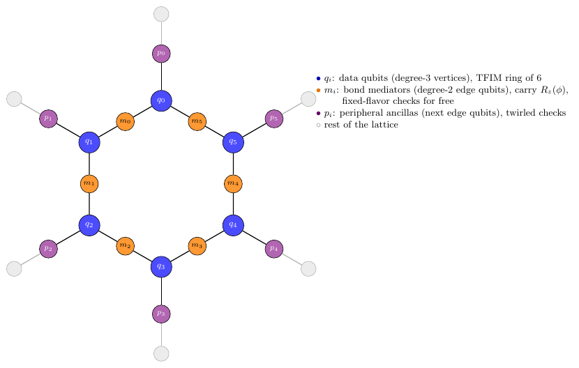

# Hardware-native check circuits: what the spacetime-code papers do, what our demo assumed, and a ring design that keeps the twirl

7 October 2026. Coin tables: `sim/hw/coins.py` (copied to `demo/hw_coins.py`). Figures: `paper/figs/fig_hw_gadget.tex` (anchor-paper gadget), `paper/figs/fig_hw_design.tex` (proposed design).

## 1. What our demo assumed, and why it is naive

Our gadget applies controlled-Paulis from **one** ancilla to **all five** data qubits (weight-5 flavors), and the repaired variant adds controlled-$X$ from the same ancilla to arbitrary bond targets. That assumes all-to-all ancilla–data connectivity. On a line or heavy-hex device a weight-$w$ controlled-Pauli from one ancilla costs about $3w$ CNOTs with SWAP routing (van den Berg et al. Table 1: $\approx 9n/2$ two-sided on a line against $3n/2$ all-to-all), so the gadget counts $g=7.5$ and $12.5$ are lower bounds by a factor of about three on real hardware. The 1% results are therefore optimistic for the check protocols, not pessimistic.

## 2. How the spacetime-code papers place checks

**Fischer et al. (anchor, 2609.13108), Fig. 3 and App. D.** Heavy-hex device (ibm_aachen). The 22 data qubits sit on the degree-3 sites of a hexagonal lattice and the 27 ancillas on the degree-2 sites *between* data qubits, one per bond. The ZZ interaction of bond $(j,k)$ is implemented through its ancilla: $CX_{j\to a}\,CX_{k\to a}\,R_z^{(a)}(\phi)\,CX_{k\to a}\,CX_{j\to a}$ (4 CZ per bond per step; 216 CZ for 27 bonds at $d=2$). The ancilla starts in $|0\rangle$, returns to $|0\rangle$ ideally after every step, is **never measured mid-circuit**, and its terminal $Z$ measurement is the check. Back-propagating $Z_a$: the image is $Z_jZ_a$ after the first CX, $Z_jZ_kZ_a$ between the second and third, $Z_a$ outside the gadget. Consequences: (i) the check costs **zero extra two-qubit gates** — the mediator is the check ($g=0$, $r=0$), and the 4-CZ gadget is what connectivity forces anyway; (ii) the image is $Z$-type at the $R_z$, so the commutation condition holds automatically; (iii) the flavor is **fixed** (it is the rotation generator $Z_jZ_k$ itself), so $X/Y$ faults on $j,k,a$ inside the gadget are detected deterministically and all $Z$-type faults ($Z_j$, $Z_k$, $Z_jZ_k$, $Z_a$ while it holds the parity) are undetected: 7 of 15 two-qubit Paulis per CX, the same undetected fraction as our fixed $X^{\otimes5}$ check; (iv) data faults *between* gadgets (single-qubit layers) are invisible to every check; (v) two detected faults on the same ancilla across steps cancel (second order). The undetected sector is handled by first-order PEC with the learned model.

**Martiel & Javadi-Abhari (2504.15725), §VI and Fig. S10.** Clifford payload on a path or heavy-hex subgraph; ancillas on the **periphery**, each adjacent to one data qubit; each ancilla implements a check whose controlled-Paulis touch its neighbour wire at several *times* ("spacetime support"); validity (product of back-cumulants = identity) is solved as a syndrome-decoding problem; when more ancillas than neighbours are needed they are brought next to the data qubit by half-SWAPs; checks are added greedily until their own noise outweighs the detection gain (Fig. 4 of their paper: each check pair adds 2 qubits and ~20–40 CZ).

## 3. A ring design in that spirit: periphery ancillas, local checks, as much twirl as the geometry allows

Payload: $n$ data qubits on a ring with nearest-neighbour CX (hardware-native). One ancilla $a_i$ attached to each data qubit $q_i$ (Martiel's periphery layout), controlled-Paulis only between $a_i$ and $q_i$.

**Valid single-wire checks.** The image of a Pauli on wire $i$ must stay a Pauli through every rotation it meets. Through a bond gadget only $Z_i$ survives ($X_i$ hits $R_z$ on the target, or spreads to $X_iX_{i+1}$ and hits $R_z$ there); through the $R_x$ layer only $X_i$ survives. So on a single wire the valid windows are: $Z_i$ opened before and closed after the ZZ layer (image $Z_i$, becoming $Z_{i-1}Z_i$ inside the gadget in which $i$ is the CX target), and $X_i$ opened before and closed after the $R_x$ layer. No freedom of Pauli type within a window: **the flavor twirl of the all-to-all design is not available**, as the user anticipated. A fixed set of these checks is a local fixed check with the anchor paper's visibility: $X/Y$ components flagged deterministically, $Z$-type faults never.

**Two cheap randomizations restore a (nearly) fair coin.**

1. *Enable twirl.* Run check $i$ in a given step with probability $b$, independently. A fault seen by one check is then flagged with probability $b\cdot\Pr[\text{anticommutes}]$.
2. *Compilation (image-type) twirl.* The gadget $\exp(-i\frac\phi2 Z_jZ_k)$ has several native compilations with 2 CX: $CX\,R_z^{(k)}\,CX$ (rotation on the target; the target's check spreads to $Z_jZ_k$ between the CXs), $(H\otimes H)\,CX\,R_x^{(j)}\,CX\,(H\otimes H)$ (rotation on the control; the control's check spreads to $X_jX_k$), and $Y$-type variants ($CX\,R_y^{(j)}\,CX = \exp(-i\frac\phi2 Y_jX_k)$ conjugated by single-qubit Cliffords). Choosing the compilation per gadget per shot changes the Pauli type of the check images *at the CZ noise locations* while the logical gate is unchanged, and the single-qubit conjugations merge with the neighbouring $R_x$ layer. Physical faults are depolarizing (type-uniform), so the twirl over image types $\{X,Y,Z\}$ on each qubit makes a fault of any type anticommute with the image on that qubit with probability $\tfrac23$. In particular the former rotation-axis faults ($Z_k$ between the CXs, $Z_jZ_k$ after) are now flagged half the time: **the invisible sector disappears without repair gates.**

**Coins** (`hw_coins.py`; images for check $i$: $Z_i$-type before/after the layer; inside gadget $(i,i+1)$ one of the two checks spreads onto the other qubit, which compilation decides; enable probability $b$, image types uniform, compilations A/B equiprobable):

| location in gadget $(i,i+1)$ | faults | $b=\tfrac12$ | $b=\tfrac34$ |
|---|---|---|---|
| after CX2 (and everywhere outside the gadgets) | all 15 | $\tfrac13$ (single-site), $\tfrac49$ (two-site) | **$\tfrac12$ for all 15** |
| after CX1 (between the CXs) | 6 single-site | $\tfrac13$ | $0.375$ |
| after CX1 | 9 two-site | $\tfrac49$ | $0.583$ |
| data fault right after its own controlled-Pauli | 3 | $\tfrac23$ | $\tfrac23$ |
| ancilla $Z$/$Y$ during the window | — | 1 (acts like readout error) | 1 |
| ancilla $X$ during the window | — | 0 (branch flip: undetected $P_L$ on data, rate $p/15$ per cP) | 0 |

With $b=\tfrac34$ half of the payload fault locations (after CX2) carry an exactly fair coin and the other half has mean coin exactly $\tfrac12$ — $\tfrac{6\cdot0.375+9\cdot0.583}{15}=\tfrac12$ — with a spread of $\pm0.1$ between single- and two-site faults. The obstruction to a perfectly uniform coin is structural: between the CXs the only valid image on the idle qubit is $Z$-type (logically), so every check covering that location anticommutes with a given fault in the same way, and the two checks' coins are correlated through the shared image rather than independent. No single-wire design can remove this; a two-wire ancilla (adjacent to both qubits of a bond) can, at the cost of a triangle in the coupling graph or a half-SWAP.

**What the residual spread costs.** For depolarizing noise the first-order bias of the single-species estimator vanishes because the mean coin is $\tfrac12$ at every location; what remains is the species covariance $\mathrm{Cov}(\pi,O)/(\alpha-\beta)$ between coin (0.375 vs 0.583) and the observable's response to single- versus two-site faults, which is a fraction of the $\pm0.1$ spread times the faulty-shot weight — expected at the $10^{-2}$ level at $\Lambda\sim1$, and removable by a two-class stratification (species $(f_{1},f_{2})$, needing about twice the number of acceptance rules, available since there are $n$ independent flags per step). For biased noise the mean coin leaves $\tfrac12$ and the stratification is needed. Second-order cancellations (two faults seen by the same check in the same step) are $O(\Lambda^2/n)$ and no worse than in the all-to-all design.

**Cost per step** ($n=5$, $b=\tfrac34$): $g = 2\cdot n\cdot b = 7.5$ controlled-Paulis, each between an ancilla and its own data qubit (no routing); $g_p=10$ ring-local CX; $r=0.75$ — the same count as the all-to-all constrained family, but now hardware-native, with **no invisible payload sector and no repair gates**, against $g=12.5$ (all-to-all) or $\approx35$ (routed) for the repaired twirl. Readouts: $bn=3.75$ ancilla measurements per step instead of 1, so the readout term in the break-even becomes $bn\,q\,d$: at $q=p$ the condition reads $(\tfrac{14}{15}\cdot17.5+3.75)\,pd=20\,pd\lesssim1.2$, $pd\lesssim0.06$ — the repaired-twirl depth with the constrained-family gate count. Measuring once at the end instead (anchor style) saves the readouts but admits cross-step parity cancellation.

**Species structure.** Flags per step: number of flagged ancillas ($0$–$n$). First order, a shot with $f$ visible faults contributes $f$ independent coins, so the threshold-rule survival is $\Pr[\mathrm{Bin}(f,\tfrac12)+\mathrm{Bin}(bnd,q)\le t]$ for the fair-coin class and the two-class generalisation otherwise; the existing inversion applies with the readout term rescaled.

## 4. Comparison table

| | anchor (heavy-hex, ancilla-mediated) | our demo (all-to-all, constrained / repaired) | ring + periphery ancillas, twirled (proposed) |
|---|---|---|---|
| payload 2q gates per bond | 4 CZ (connectivity-forced) | 2 CX (assumed adjacent) | 2 CX (ring-adjacent) |
| extra gadget 2q gates per step | 0 | 7.5 / 12.5 (+ routing on hardware) | $2bn=7.5$, all local |
| flavor | fixed ($Z_jZ_k$) | twirled (5-qubit family) / full | enable + compilation twirl |
| coin per payload fault | 1 or 0 | $\tfrac12$ or 0 / $\tfrac12$ | $\tfrac12$ (half of locations); $0.375$ / $0.583$ (other half), mean $\tfrac12$ |
| undetected payload sector | 7/15 per CX | 2/15 per CX / none | none (single-qubit-layer faults aside) |
| needs noise model | yes (PEC on 7/15) | one rate per gate / no | no (depolarizing) or two-class stratification |
| measurement | once at end | every step | every step ($bn$ readouts) or once at end |

## 5. Next step

Simulate the proposed design on the 5-ring (5 data + 5 ancillas, exact density matrix with branching by flag count; ancillas attached per step) at $p=q=1\%$ and $0.5\%$, depths 4–12, and compare bias and shots with the all-to-all constrained family and with ZNE. The prediction from the coin table is: bias below $10^{-2}$ without any model, cost equal to the constrained family's, usable depth as for the repaired twirl.

## 6. Fitting the geometry: a 6-ring on one heavy-hex plaquette

A 5-qubit ring does not exist on heavy-hex: the lattice is bipartite with degree-3 vertex qubits and degree-2 edge qubits, and its smallest cycle is a 12-qubit plaquette (6 vertices + 6 edges). The natural unit is therefore **one plaquette = a ring of 6 data qubits on the vertices with a mediator qubit on every edge**, which is exactly the anchor paper's layout (22 data / 27 mediators on six plaquettes). The third neighbour of every vertex is the edge qubit of the adjacent plaquette, which gives **one peripheral ancilla per data qubit** for free. The patch is 18 qubits: $q_0\ldots q_5$ (data), $m_0\ldots m_5$ (mediators), $p_0\ldots p_5$ (peripheral), all couplings nearest-neighbour. (The alternative, using all 12 plaquette qubits as a data ring with direct CX bonds, leaves only every other data qubit with a peripheral ancilla, so faults on the unchecked qubits after the second CX of their gadgets are invisible; we do not pursue it.)

**Payload.** Bond $(i,i{+}1)$ is implemented through $m_i$: $CX_{q_i\to m}\,CX_{q_{i+1}\to m}\,R_z^{(m)}(\phi)\,CX_{q_{i+1}\to m}\,CX_{q_i\to m}$, 4 CZ per bond, **24 CZ per Trotter step** for the 6-ring (against 12 for the direct compilation the demo assumed). Bonds are scheduled in two sub-layers (even, odd), three bonds in parallel each.

**Checks.**
- *Mediator checks (free).* $m_i$ starts in $|0\rangle$ and is measured in $Z$ after the step (or once at the end). Image: $Z_{q_i}Z_m$ after the first CX, $Z_{q_i}Z_{q_{i+1}}Z_m$ between the second and third, $Z_{q_i}Z_m$ after the third, $Z_m$ after the fourth. Fixed flavor.
- *Compilation twirl.* The mediated gadget has a second native compilation with the mediator as *control*: $m$ in $|+\rangle$, $(H_{q_i}H_{q_{i+1}})\,CX_{m\to q_i}CX_{m\to q_{i+1}}\,R_x^{(m)}(\phi)\,CX_{m\to q_{i+1}}CX_{m\to q_i}\,(H_{q_i}H_{q_{i+1}})$, which implements $\exp(-i\frac\phi2 X_m X_{q_i}X_{q_{i+1}})$ on $|+\rangle_m$, i.e. $ZZ(\phi)$ on the data in the $H$ frame; the mediator check becomes $X_m$ and all images at the CZ noise locations are $X$-type. A $Y$-type variant follows by $S$ conjugation. Drawing the compilation per gadget per shot makes the image type at every noise location uniform over $\{X,Y,Z\}$, for the mediator's image and for the peripheral images alike, so no physical fault is invisible: the fault along the current rotation axis of $m$ is invisible in that compilation but visible in the other two.
- *Peripheral checks.* $p_i$ in $|+\rangle$, controlled-$Q_i$ on $q_i$ before and after the ZZ layer with $Q_i$ the data image type fixed by the compilations touching $q_i$ in that step (both gadgets touching $q_i$ must use the same data frame; the two sub-layers can use different ones with a frame change in between), enabled with probability $b$. Because $q_i$ is the CX control in compilation A and the CX target in compilation B, the peripheral image never spreads onto the neighbouring data qubit — the correlation obstruction of §3 does not arise here. 2 CZ per enabled check.

**Flag statistics** (`demo/hw_coins_mediated.py`; 2-qubit depolarizing after each of the four CX, image types uniform, $P(\ge1\text{ flag})$ over the 15 Paulis at each location):

| checks used | after CX #1, #2 | after CX #3, #4 | invisible |
|---|---|---|---|
| mediators only (anchor-style + compilation twirl) | $\tfrac23$ (single-site, mediator-involving), $\tfrac49$ (data$\otimes$mediator) | $\tfrac23$; data-only faults 0 | data-only faults after the uncompute CXs (3/15 at two of four locations) |
| mediators + peripheral, $b=\tfrac34$ | $\tfrac23$–$0.78$ | $0.5$–$0.83$ | none |
| peripheral only, $b=\tfrac34$ | $\tfrac12$ (data-involving), 0 (mediator-only) | same | mediator-only faults |

With both check types every CZ fault is flagged with probability between $\tfrac12$ and $\tfrac56$ (mean $0.73$) and raises one or two flags. The coin is **not uniform**, so the single-coin mixture law does not apply as it stands; the detection statistics are richer instead — per step there are 6 mediator flags and up to 6 peripheral flags, i.e. two independent flag counts — and the species inversion generalises to classes labelled by coin and flag multiplicity, with two-dimensional threshold rules $(t_{\rm med}, t_{\rm per})$ supplying the needed equations. What has been gained relative to the all-to-all gadget is that **every two-qubit gate is nearest-neighbour, no fault is invisible, and the only gadget overhead beyond the connectivity-forced mediator is the peripheral $2bn=9$ CZ per step**; what has been lost is the exactly uniform coin.

**Cost per step** ($n=6$): payload 24 CZ (mediated, connectivity-forced), peripheral $2\cdot6\cdot\tfrac34=9$ CZ, i.e. $g/g_p=0.375$ relative to the mediated payload; readouts $6+4.5$ per step. Break-even bookkeeping with the mediated payload: $\tfrac{14}{15}(24+9)\,pd+10.5\,qd\approx41\,pd\lesssim1.2$ at $q=p$, $pd\lesssim0.03$: $d\lesssim3$ at $1\%$, $6$ at $0.5\%$, $15$ at $0.2\%$, $30$ at $0.1\%$. The mediated payload doubles the CZ count, so the usable depth halves relative to the direct-CX numbers; this is the honest hardware cost and it applies equally to every method run on this geometry (ZNE on the mediated circuit has $\Lambda_O$ twice as large too).

**Simulation plan.** An exact density matrix of 18 qubits is out of reach; 6 data + transient mediator (7 qubits) is cheap, but the 6 simultaneous peripheral ancillas make it 13. Since the noise is Pauli and the flags are determined by anticommutation with Pauli images, the right tool is a fault-path Monte Carlo: sample Pauli fault configurations from the noise model, compute all flags exactly by the image rule, run the 6-qubit data statevector with the faults inserted (64 amplitudes, $\sim$150 gates), and accumulate the accepted sums for every rule. $10^6$ configurations take minutes and give the infinite-shot quantities to $\sim10^{-3}$; finite-shot experiments are resampled from the configuration pool as now.
