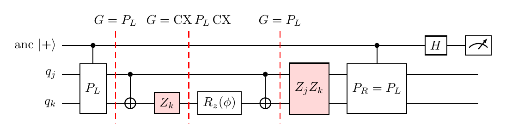

# Why the rotation-axis fault is invisible to every valid Pauli check

**Figure.** One bond of the ZZ layer, $U = CX(j,k)\,R_z^{(k)}(\phi)\,CX(j,k) = \exp(-i\tfrac\phi2 Z_jZ_k)$, bracketed by a coherent Pauli check: ancilla in $|+\rangle$, controlled-$P_L$ before, controlled-$P_R$ after, Hadamard and measurement. The dashed slices show the check image $G$ propagated to each time; the two shaded boxes are the faults that no valid flavor can see.

## 1. What the check measures

Split the window at a fault, $U = U_2\,E\,U_1$ with $E$ a Pauli fault. Before the final Hadamard the joint state is

$$
\tfrac1{\sqrt2}\Big(|0\rangle\otimes U_2EU_1|\psi\rangle \;+\; |1\rangle\otimes P_R\,U_2EU_1\,P_L|\psi\rangle\Big).
$$

Define the **check image at the fault location**, $G \equiv U_1 P_L U_1^\dagger$, so that $U_1P_L = GU_1$. With $P_R = UP_LU^\dagger$,

$$
P_R\,U_2EU_1\,P_L = U_2U_1P_LU_1^\dagger U_2^\dagger\,U_2EU_1P_L = U_2\,G\,E\,U_1P_L = U_2\,G\,E\,G\,U_1 = \pm\,U_2EU_1 ,
$$

with $+$ if $[G,E]=0$ and $-$ if $\{G,E\}=0$. The ancilla is therefore in $|+\rangle$ or $|-\rangle$ regardless of the data state, and the measurement after $H$ reads

$$
\boxed{\ \text{flag} = 1 \iff E \text{ anticommutes with } G = U_1P_LU_1^\dagger\ }
$$

Equivalently, back-propagate the fault instead of the check: flag $=1$ iff $U_1^\dagger E U_1$ anticommutes with $P_L$. Without a fault the outcome is $0$ with certainty, provided $P_R = UP_LU^\dagger$ exists as a Pauli.

## 2. Why the flavor must commute with the rotation

If the window contains a rotation $R_Q(\phi) = e^{-i\phi Q/2}$ and the check image $G$ at that point anticommutes with $Q$, then

$$
R_Q(\phi)\,G\,R_Q(\phi)^\dagger = \cos\phi\,G + i\sin\phi\,GQ ,
$$

which is not a Pauli: there is no Pauli $P_R$ with $P_R = UP_LU^\dagger$. If one uses the Clifford-propagated image anyway, the ancilla-$|1\rangle$ branch is rotated by $e^{i\phi Q}$ relative to the ancilla-$|0\rangle$ branch, the noiseless circuit flags with a state-dependent probability $\propto\sin^2\phi$, and post-selection becomes nonlinear in the input (the problem the anchor paper's Appendix A has to repair). The check is **valid** only if its image commutes with $Q$ at the rotation.

For the gadget above the rotation is $R_z$ on $q_k$ after the first CX, where the image is $G = CX\,P_L\,CX$. The validity condition is

$$
[\,CX\,P_LCX,\ Z_k\,]=0 \iff [\,P_L,\ CX\,Z_kCX\,] = [\,P_L,\ Z_jZ_k\,] = 0 ,
$$

i.e. $P_L$ must commute with the bond operator $Z_jZ_k$, exactly as expected from $U = \exp(-i\tfrac\phi2Z_jZ_k)$. On a ring where every bond is in the window this leaves two families: Z-strings on any subset, and strings with $X$ or $Y$ on every qubit (so that every bond sees an even number of $X/Y$). Then $P_R = UP_LU^\dagger = P_L$.

## 3. The two faults that are never flagged

Apply the flag rule to the two shaded faults.

**$Z_jZ_k$ after the second CX.** Here $U_1 = U$ and $G = UP_LU^\dagger = P_L$. By validity $[P_L, Z_jZ_k] = 0$, so the flag is $0$ for *every* valid $P_L$.

**$Z_k$ after the first CX.** Here $U_1 = CX$ and $G = CX\,P_LCX$. Then

$$
[\,CX\,P_LCX,\ Z_k\,] = CX\,[\,P_L,\ CX\,Z_kCX\,]\,CX = CX\,[\,P_L,\ Z_jZ_k\,]\,CX = 0 ,
$$

again for every valid $P_L$. The two conditions are the same condition: validity at the rotation *is* blindness to these two faults.

Physically, $Z_k$ between the CX gates is an angle error: $CX\,Z_kR_z^{(k)}(\phi)\,CX = CX\,R_z^{(k)}(\phi+\pi)\,CX \propto \exp(-i\tfrac{\phi+\pi}{2}Z_jZ_k)$, a $\pi$ over-rotation of the ZZ gate, and $Z_jZ_k$ after the gadget is the same over-rotation written at the output. A check that is transparent to $\exp(-i\tfrac\phi2 Z_jZ_k)$ for the programmed $\phi$ is transparent to it for every $\phi$, so it cannot tell $\phi$ from $\phi+\pi$. In code language: for the rotation to pass through the checks, its generator must be an undetectable (logical) operator of the detecting code, and errors along a logical operator are by definition undetectable.

## 4. Every other fault is a fair coin

Under the twirl (Z-string uniform over all $2^n$ with probability $\tfrac12$, XY-string uniform over all $2^n$ with probability $\tfrac12$) the flag probability of each of the 15 two-qubit Paulis after the first CX is, using the back-propagated image $Q = CX\,E\,CX$:

| fault $E$ after CX#1 | image $Q$ at window start | $\Pr[\text{flag}\mid$ Z-string$]$ | $\Pr[\text{flag}\mid$ XY-string$]$ | $\Pr[\text{flag}]$ |
|---|---|---|---|---|
| IX | IX | ½ | ½ | ½ |
| IY | ZY | ½ | ½ | ½ |
| **IZ** | **ZZ** | **0** | **0** | **0** |
| XI | XX | ½ | ½ | ½ |
| XX | XI | ½ | ½ | ½ |
| XY | YZ | ½ | ½ | ½ |
| XZ | YY | ½ | ½ | ½ |
| YI | YX | ½ | ½ | ½ |
| YX | YI | ½ | ½ | ½ |
| YY | XZ | ½ | ½ | ½ |
| YZ | XY | ½ | ½ | ½ |
| ZI | ZI | 0 | 1 | ½ |
| ZX | ZX | ½ | ½ | ½ |
| ZY | IY | ½ | ½ | ½ |
| ZZ | IZ | 0 | 1 | ½ |

(First letter on $q_j$, second on $q_k$.) Whenever $Q$ has an $X$ or $Y$ component, each family flags with probability exactly ½. When $Q$ is a Z-string, the Z-family never flags, and the XY-family flags iff the Z-weight is odd; the ½–½ mixture then gives ½ for odd Z-strings (ZI, IZ-type images) and $0$ for even Z-strings. The only even Z-string reachable from a single fault at this location is the image $ZZ$, i.e. the fault $Z_k$. After the second CX the back-propagation is the identity and the invisible fault is $Z_jZ_k$ itself. Hence 1 of 15 faults per CX location, 2 of 30 per bond gadget, is invisible; everything else is flagged with probability exactly ½, which is what makes the mixture law and the species analysis exact for the visible sector.

## 5. Could a different check see it?

- A check whose image anticommutes with $Z_jZ_k$ would see the fault but is invalid: it flags the ideal gate.
- A check whose window ends between the first CX and the $R_z$ (a window containing only the CX layer) is unconstrained and sees $Z_k$ there; but $Z_jZ_k$ after the second CX would then need a window starting after the $R_z$, so two check pairs per bond per step are needed, at a gadget cost that exceeds the payload.
- Cutting the check at the rotation with controlled-$V$ gates (Martiel–Javadi-Abhari, SI §V.B) is the same thing in different clothing: it makes the flavor free at the cost of two extra two-qubit gates per rotation crossed.
- A native $R_{ZZ}(\phi)$ gate with noise after it has the same single invisible Pauli, $Z_jZ_k$; the issue is the rotation, not the compilation.

So within one check per ZZ layer the rotation-axis sector is intrinsic. It is small (1/15 of the weight under depolarizing noise, possibly different under biased noise), it is exactly one Pauli per gate, and that is why first-order PEC on it is cheap.

## 6. Catching it anyway: the controlled-$V$ repair, tested

The constraint on the flavor, not the rotation, is what hides the fault. Martiel and Javadi-Abhari (SI §V.B) remove the constraint: allow any $P_L$, and for every bond whose $Z_jZ_k$ anticommutes with $P_L$ insert controlled-$X_k$ (from the same ancilla) immediately before and after the $R_z$. In the ancilla-$|1\rangle$ branch the sandwich reverses the rotation, $X_kR_z(\phi)X_k=R_z(-\phi)$, and since $P_L$ anticommutes with $Z_jZ_k$, $P_L\,ZZ(-\phi)=ZZ(\phi)\,P_L$: the branch equals $\pm$ the other one and $P_R=P_L$ stays valid.

Redo the flag rule. $Z_k$ after CX#1 now sits *before* the sandwich, where the image is $CX\,P_L\,CX$; for half of all flavors that anticommutes with $Z_k$. $Z_jZ_k$ after CX#2 meets the image $P_L$, which anticommutes for half of all flavors. Both faults become fair coins. With $P_L$ uniform over all $4^n$ Paulis every payload fault is flagged with probability exactly $\tfrac12$ (checked in `demo/repaired.py`: 0.49, 0.49, 0.49 for $Z_k$, $Z_jZ_k$, $X_j$ over 4000 draws). The one fault that remains invisible is a $Z_k$ *between* the two controlled-$X$ gates, i.e. an error of the $R_z$ itself; it is a virtual, noiseless gate here, and in general the axis fault at the rotation is unavoidable.

Cost: 2 extra two-qubit gates per anticommuting bond, on average $n=5$ per step, on top of the gadget's $2\cdot\tfrac34 n=7.5$; 12.5 gadget gates per step against 10 payload gates (the constrained family cost 7.5).

**Result on the TFIM demo** (same noise, same analysis, full sweep; species $f\le7$ are needed because the extra gadget noise raises the typical number of faulty steps; with $f\le5$ a truncation bias of $+0.02$ appears at depth 12). Code `demo/run_repaired_sweep.py`, data `demo/repaired_sweep.json`:

| depth | 2 | 4 | 6 | 8 | 10 | 12 | 14 | 16 |
|---|---|---|---|---|---|---|---|---|
| acceptance (no flags) | 0.79 | 0.62 | 0.49 | 0.39 | 0.30 | 0.24 | 0.19 | 0.15 |
| clean fraction $q_0$ | 0.63 | 0.39 | 0.25 | 0.15 | 0.10 | 0.06 | 0.04 | 0.02 |
| bias | 0.000 | 0.000 | −0.001 | −0.001 | 0.000 | −0.002 | −0.001 | +0.003 |
| std at 10k | 0.008 | 0.015 | 0.032 | 0.049 | 0.075 | 0.226 | 2.02 | 8.15 |
| shots for RMSE ≤ 0.02 | 2k | 6k | 26k | 61k | 140k | 1.3M | 10⁸ | 2·10⁹ |
| constrained + PEC(inv): bias | −0.001 | +0.001 | 0.000 | −0.003 | −0.001 | −0.009 | +0.002 | +0.013 |
| constrained + PEC(inv): shots | 1k | 3k | 11k | 26k | 51k | 277k | 556k | 1.2M |

Gadget cost 12.5 gates per step at every depth (7.5 controlled-Paulis + 5.0 controlled-$X$).

So the repaired full twirl is the least biased protocol we have and needs no noise model at all, including no rate for the rotation-axis faults. Its price is the extra gadget noise: the clean fraction is roughly the square of the constrained family's, the shot count is 2–3× that of the constrained family with PEC up to depth 10 and 5× at depth 12, and beyond that, where $q_0 < 0.04$, the species inversion amplifies the shot noise by two orders of magnitude and the protocol stops being usable at this noise level. The species cutoff is not the cause (depth 12: $f\le5,6,7$ give std 0.24, 0.22, 0.23; depth 14: $f\le6,7$ give 1.8, 2.0; `demo/fscan_repaired.py`). Which to prefer depends on whether the rotation-axis rate can be learned reliably: if it can, the constrained family plus a one-Pauli PEC is cheaper and reaches depth 16; if the ZZ-type error is dominant or poorly characterized, which is common for two-qubit gates, the repair is the safer choice up to the depth where $q_0$ falls to a few per cent. A biased flavor distribution that keeps the repair rate low (fewer anticommuting bonds) while preserving the ½ coin for the rotation-axis faults would move that crossover deeper and is worth designing.
