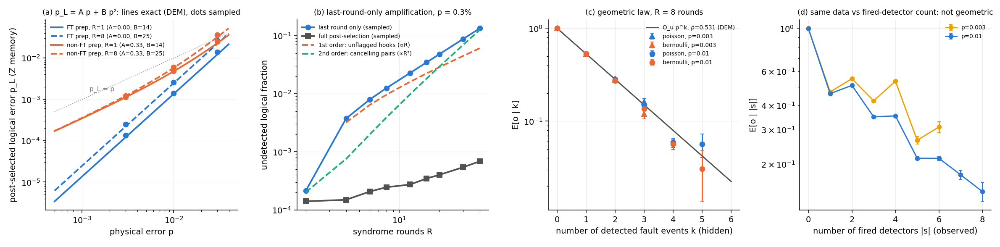

# Stage 0: one [[4,2,2]] block, memory, Clifford (stim)

Progress log for Stage 0 of the plan in `README.md` §4.3. Started and completed 8 October 2026.

Code (this folder):
- `iceberg.py`: block circuits, detectors, detector-error-model helpers.
- `search_extraction.py`: search for a 1-FT extraction gadget.
- `test_iceberg.py`: determinism and single-fault checks.
- `stage0_memory.py`: the Stage-0 experiments; results in `stage0_results.json`, logs in `stage0_run*.log`.
- `fig_stage0.py`: draws `fig_stage0.png` and writes `stage0_lastround_split.json`.

Run order:
```bash
python3 search_extraction.py
python3 test_iceberg.py
python3 stage0_memory.py
python3 fig_stage0.py
```

## Status

| check (README §4.3, Stage 0) | status | result |
|---|---|---|
| block circuits: GHZ preparation (non-FT and FT), flagged S_X/S_Z extraction, terminal readout | done | §1 |
| detectors with and without ancilla reset | done | deterministic in every variant; the paper's no-reset rule $D_r=s_r\oplus s_{r-2}$ reproduced |
| (i) 1-FT by exhaustive single-fault enumeration | **passed** | no first-order undetected logical error with FT or perfect preparation; non-FT GHZ preparation has one, 0.33 p |
| (ii) post-selected $p_L=Ap+Bp^2$ | **passed** | exact A, B from the DEM agree with sampling to ≤ 8% at p ≤ 1% |
| (iii) last-round-only amplification ([R1] App. B) | **reproduced with a caveat** | super-linear growth, but in our gadget it is linear + quadratic, not R²: post-selecting on the last round only drops the mutual-flag information, so hook errors become first order |
| (iv) geometric law $E[o\mid k]=O_u\bar\rho^k$ | **passed in the hidden k; fails in the observed detector count** | exact for Poisson faults, small deficit for Bernoulli; in the fired-detector count $\lvert s\rvert$ the law is not even monotone, so a fault-count estimator is needed (Stage 1, item 1) |



**Figure.** (a) Post-selected logical error rate of Z memory; lines are the exact $Ap+Bp^2$ from the detector error model, dots are stim samples (4×10⁶ shots). (b) Last-round-only amplification at p = 0.3%, with the first-order (unflagged hooks) and second-order (cancelling pairs) contributions computed exactly. (c) $E[o\mid k]$ against the hidden number of detected fault events, R = 8, with the prediction $O_u\bar\rho^k$ from the DEM. (d) The same shots binned by the number of fired detectors.

## 1. Circuits

- **Block.** Data $d_0..d_3$, $a_z$ (measures $S_Z$, prepared $\lvert0\rangle$, read in Z), $a_x$ (measures $S_X$, prepared $\lvert+\rangle$, read in X). Logical $\bar Z_i=Z_0Z_{i+1}$ and $\bar X_i=X_{i+1}X_3$, as in [R1].
- **Preparation.** Non-FT GHZ chain H, CX(0,1), CX(1,2), CX(2,3). The FT variant adds a $Z_0Z_3$ parity check onto $a_z$ as an extra detector; it catches the weight-2 X spread of the chain. X-basis memory prepares $H^{\otimes4}$GHZ = logical $\lvert{+}{+}\rangle$.
- **Syndrome extraction.** Eight CX in the order CX(d0→a_z), CX(a_x→d0), CX(a_x→d1), CX(d1→a_z), CX(d2→a_z), CX(a_x→d2), CX(a_x→d3), CX(d3→a_z). The search over 24 X-orders × 70 interleavings × up to two extra $a_x$–$a_z$ couplings returned 354 passing gadgets, many with 8 CX and no extra coupling. Interleaving the two halves makes each ancilla flag the other's hook through the data:
  - an X hook from $a_x$ onto $d_2,d_3$ flips $a_z$ via CX(d3→a_z);
  - a Z hook from $a_z$ onto data is kicked back into $a_x$.

  This is the "mutual flag" structure [R1] describes. Their exact gate order and the heavy-hex compute/syndrome switching are only in a figure and are **not** modelled here: no SWAPs, no idle noise, all-to-all within the block.
- **Noise.** DEPOLARIZE2(p) after every CX, DEPOLARIZE1(p/10) after single-qubit gates and resets, readout flip q = p.
- **Detectors** (σ_r is the instantaneous stabilizer value):
  - with reset: $s_r=\sigma_r$, $D_r=s_r\oplus s_{r-1}$;
  - without reset: $s_r=s_{r-1}\oplus\sigma_r$, $D_r=s_r\oplus s_{r-2}$, the "two rounds apart" rule of [R1] Methods A, derived rather than assumed;
  - padding $s_0=s_{-1}=0$;
  - terminal $D_T=\sigma_T\oplus\sigma_R$.

  stim confirms every detector and observable is deterministic for R = 0–4, both bases, both reset modes and all three preparations (`test_iceberg.py`, check 1).

## 2. (i) 1-FT

From the detector error model, every single fault (2q depolarizing after each CX, 1q after each gate and reset, measurement flips) either fires a detector or leaves both logical observables unchanged. This holds for R = 1–4, Z and X memory, reset and no-reset, and perfect or FT preparation. The non-FT preparation has exactly one first-order undetected mechanism: the weight-2 X (Z in X memory) spread after CX(1,2), of total probability 0.33 p. That is this preparation's share of the $Ap$ term of [R1].

## 3. (ii) Post-selected logical error rate

A is the exact sum of first-order undetected probabilities. B is the sum over pairs of detected mechanisms with identical syndromes and a non-trivial combined logical effect. Sampled values use 4×10⁶ shots of Z memory.

| prep | R | A | B (Z / X memory) | sampled $p_L$ at p = 0.3% / 1% / 3% | $Ap+Bp^2$ | acceptance at 1% |
|---|---|---|---|---|---|---|
| FT | 1 | 0 | 13.6 / 15.0 | 1.36e-4 / 1.40e-3 / 1.41e-2 | 1.22e-4 / 1.36e-3 / 1.22e-2 | 0.83 |
| FT | 2 | 0 | 15.2 / 16.6 | 1.38e-4 / 1.61e-3 / 1.62e-2 | 1.37e-4 / 1.52e-3 / 1.37e-2 | 0.75 |
| FT | 4 | 0 | 18.4 / 19.8 | 1.67e-4 / 1.94e-3 / 2.02e-2 | 1.65e-4 / 1.84e-3 / 1.65e-2 | 0.62 |
| FT | 8 | 0 | 24.7 / 26.1 | 2.47e-4 / 2.59e-3 / 2.68e-2 | 2.22e-4 / 2.47e-3 / 2.22e-2 | 0.41 |
| non-FT | 1 | 0.33 | 14.4 / 15.7 | 1.14e-3 / 4.85e-3 / 2.48e-2 | 1.13e-3 / 4.78e-3 / 2.30e-2 | 0.85 |
| non-FT | 8 | 0.33 | 24.8 / 26.3 | 1.22e-3 / 5.98e-3 / 3.67e-2 | 1.22e-3 / 5.81e-3 / 3.23e-2 | 0.43 |

- The two-term form holds to ≤ 8% at p ≤ 1%; the shortfall at 3% is third order.
- B grows by about 1.4 per round (13.6 → 24.7 from R = 1 to 8).
- The non-FT preparation dominates below p ≈ A/B ≈ 2%, which is [R1]'s crossover $p^\ast\approx A/B$.
- Pseudothreshold of this memory ($p_L<p$): about 7% with FT preparation, about 5% with non-FT (R = 1). These are idealized: no routing SWAPs, no idle errors.

## 4. (iii) Last-round-only amplification

Following [R1] App. B, post-select only on the first round plus the *absolute* stabilizer values at the end: the last round's $\sigma_R$ and the terminal parity $\sigma_T$, both against the +1 preparation. (Using the last round's *difference* detectors instead leaves every single data error in the middle undetected, giving first-order growth of 1.5×10⁻² already at R = 4. That was our first, wrong implementation.)

Undetected fraction at p = 0.3% (2×10⁶ shots): 2.1e-4 (R = 2), 3.8e-3 (4), 1.25e-2 (8), 3.5e-2 (16), 8.8e-2 (30), 0.13 (40). Full post-selection gives 1.4e-4 to 6.9e-4. The local log–log slope is 1.5–1.6, not 2. The exact decomposition explains why:

| R | 1st order (unflagged hooks) | 2nd order (cancelling pairs) | sum | sampled |
|---|---|---|---|---|
| 4 | 3.2e-3 | 7.6e-4 | 4.0e-3 | 3.8e-3 |
| 8 | 9.6e-3 | 3.9e-3 | 1.35e-2 | 1.25e-2 |
| 16 | 2.2e-2 | 1.8e-2 | 4.1e-2 | 3.5e-2 |
| 30 | 4.5e-2 | 7.0e-2 | 1.1e-1 | 8.8e-2 |

The first-order mechanisms are all X/Y faults on $a_x$ in a middle round (`stim.explain_detector_error_model_errors`). The hook spreads X onto two data qubits, which is a logical operator. The fault does fire that round's $a_z$ detectors (the mutual flag), but "last round only" ignores them. **The amplification therefore removes exactly the flag information that makes the gadget 1-FT, and the amplified error is $aR+bR^2$, not $bR^2$.** Whether [R1]'s gate order also leaves hooks flagged only within the round cannot be checked without their circuit. Their R² window (rounds 8–30) is consistent with a smaller $a/b$.

Consequence for the plan: amplifying noise by *ignoring detectors* is not a clean $p\to Gp$ scaling for flagged gadgets. Stage 1 will use explicit rate scaling (and folding later), with the detection rate as the gain meter.

## 5. (iv) Geometric law

Z memory, R = 8, no reset, FT preparation, observable $\bar Z_0$. I sampled the detector-error-model mechanisms directly, so that the true number k of detected fault events is known. Statistics are Poisson ($n_m\sim{\rm Pois}(\lambda_m)$, $\lambda_m=-\tfrac12\ln(1-2p_m)$; this is the Pauli–Lindblad model of Theorem 1) and Bernoulli ($n_m\sim{\rm Bern}(p_m)$; circuit level), with 2×10⁶ shots each.

- Prediction from the DEM: $\bar\rho=0.531$, so a detected fault flips $\bar Z_0$ with probability $\kappa_d=0.235$. $O_u=1$ to five digits, because there is no first-order undetected logical fault.
- **Poisson:** $E[o\mid k]$ agrees with $O_u\bar\rho^k$ within one standard error for k = 0–5 at p = 0.3% (e.g. k = 2: 0.286 vs 0.282 ± 0.004). At p = 1% it agrees within about 3σ (k = 4: 0.059 vs 0.079 ± 0.007, a 3σ low point).
- **Bernoulli:** small systematic deficit at k ≥ 2 (p = 1%: −0.009 ± 0.002 at k = 2, −0.014 ± 0.003 at k = 3). This is the expected correction from merged mechanisms with finite p; the law is exact only for Poisson faults, as `theory/qed_extrapolation.md` states.
- **Observed counts:** $E[o\mid s=0]$ = 0.9997 (p = 0.3%) and 0.9967 (p = 1%). The difference from $O_u=1$ is the even-k cancellations inside the s = 0 bin (qed note §4).
- **What an experiment sees** (panel d): binned by the number of fired detectors $\lvert s\rvert$, $E[o\mid\lvert s\rvert]$ is 1.00, 0.47, 0.55, 0.42, 0.55, 0.27 for $\lvert s\rvert$ = 0–5 at p = 0.3%. That is **not geometric and not monotone**. A measurement fault fires a detector pair ($D_r$, $D_{r+2}$ without reset), while a data fault fires one or two detectors, so $\lvert s\rvert$ mixes fault counts. The law is usable only with a fault-count estimate $\hat k$ from the detector pattern, e.g. the minimum number of DEM mechanisms explaining $s$ (a small decoding problem per block). That is qed note §4's "number of clusters, not of detectors", confirmed numerically.

Effective-shot gain in this memory test: $N_{\rm eff}/N\alpha_0=\alpha_0^{-\bar\rho^2}$ = 1.08 (p = 0.3%) and 1.29 (p = 1%). It is small because a memory observable is sensitive to a large fraction of the detected faults ($\kappa_d=0.24$). The large gains predicted in the note need local observables in large circuits, with most detected faults outside the light cone ($\bar\rho\to1$). Stages 2–3 test that.

## 6. Conclusions for the next stages

1. The block, detector bookkeeping (reset and no-reset) and 1-FT verification are in place and tested. They are reusable for Stage 1 at non-Clifford angles, where the density-matrix simulator must reproduce the same detectors.
2. **The regression estimator needs $\hat k$, not $\lvert s\rvert$.** First Stage-1 item: implement $\hat k$ by minimum-weight explanation over the DEM (exhaustive for one block), and test $E[o\mid\hat k]$ for geometric behaviour.
3. **ZNE "from below" via detector-ignoring is not clean** for a flagged gadget (§4). Use explicit gain scaling. The fit form of the undetected remainder must allow a linear term (README §4.2); here the linear term comes from unflagged hooks, in Stage 1 it will come from the non-FT rotations.
4. **The non-FT GHZ preparation contributes A = 0.33.** For Stage 1, use the FT preparation so that the A term measured there belongs to the logical rotations alone, and keep the non-FT one as a variant matching [R1].

## Not done / caveats

- [R1]'s exact extraction gate order, heavy-hex embedding, configuration switching (depth ≈15 each way), idle noise and dynamical decoupling are not modelled. The absolute numbers (B ≈ 14–25, pseudothreshold 5–7%) are therefore optimistic relative to hardware.
- The geometric-law check uses DEM-level sampling (exact for the Clifford memory). The circuit-level stim sampler agrees on the observed statistics ($E[o\mid s=0]$, acceptance) but does not expose k.
