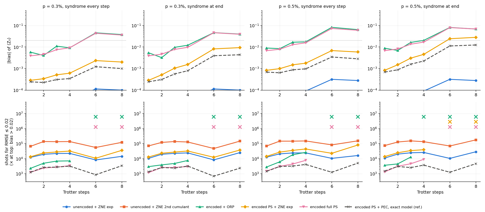

# Stage 1: one [[4,2,2]] block, two logical qubits, non-Clifford dynamics

Progress log for Stage 1 of the plan in `README.md` §4.3. Run 8–9 October 2026.

Code (this folder):
- `circuits.py`: encoded and unencoded MFIM circuits, detectors, stim skeleton, fault classification.
- `sim_mc.py`: batched Pauli-fault trajectory simulator.
- `dm_exact.py`: exact density-matrix values for the estimators that need no per-detector resolution.
- `estimators.py`: k̂, ORP, soft weights, geometric fit, two-point extrapolation, ZNE fits.
- `stage1_block.py`: the sweep; results in `stage1_p0.003.json` and `stage1_p0.005.json`, logs in `stage1_run_p*.log`.
- `make_stage1_report.py`: writes `stage1_tables.md` (every protocol, both observables, all schedules) and `fig_stage1.png`.
- `test_stage1.py`: the checks of §2.

## Verdict

In this setting **encoding does not beat the unencoded circuit with conventional ZNE**:

| | unencoded + ZNE exp | encoded, detection only (PS / ORP / soft / k̂-fit / two-point) | encoded PS + ZNE exp | encoded PS + PEC (exact model) |
|---|---|---|---|---|
| bias, ≤ 4 Trotter steps | < 10⁻³ | −0.004 to −0.02 | ≤ 0.005 | ≤ 0.002 |
| bias, 6–8 Trotter steps | < 10⁻³ | **−0.03 to −0.09 (over target)** | 0.002–0.03 | 0.001–0.013 |
| shots for RMSE ≤ 0.02 | 6k–29k | 1k–9k up to 4 steps, ∞ beyond | 10k–82k (∞ at 6–8 steps, p = 0.5%, end-only rounds) | 0.4k–5k |
| needs | amplified copies | nothing | amplified copies | rates of ~45 Paulis per step |

- **Up to 4 Trotter steps**, detection-only estimators reach the target 3–10× cheaper than unencoded ZNE.
- **From 6 steps on**, their undetected bias exceeds 0.02 at both noise levels, for both observables and every syndrome schedule.
- **Encoded PS + ZNE** stays unbiased (except p = 0.5% with end-only rounds) but costs 1–5× more than unencoded ZNE.
- **Only the exact-model PEC reference is both unbiased and cheap**, and it needs a learned rate for every undetected Pauli of the logical gadgets.

There are two reasons, both structural rather than numerical:
1. **The undetected weight of the encoded circuit equals the whole noise budget of the unencoded one.** The non-fault-tolerant logical rotations (fan-in, physical rotation, uncompute) carry about 45 first-order undetected, harmful Pauli faults per Trotter step. These are the rotation-axis faults and the X faults on fan-in controls that the later CXs spread to weight 2: the $Ap$ term of [R1]. With [R1]'s noise model, $\Lambda_u$ = 0.066 at 8 steps and p = 0.3%, while the *entire* unencoded circuit (16 CX) has $\Lambda\approx0.05$. The fully post-selected encoded value is therefore as biased as the *raw* unencoded value: −0.043 vs −0.041 at 6 steps, −0.036 vs −0.036 at 8 steps (p = 0.3%, ⟨Z̄₀⟩).
2. **A two-qubit unencoded circuit is too shallow for ZNE to fail.** It has 2 CX per Trotter step, against 10 for the encoded logical gadgets plus 8 per syndrome round (23–149 CX encoded vs 2–16 unencoded). The unencoded decay is a single small exponential, so exponential ZNE with exact gain scaling is unbiased to < 10⁻³ at every point.

Neither reason is specific to the estimators. All detection-based estimators converge to the same fully post-selected value $O_0$, and $O_0$ carries the undetected bias. [R1]'s encoding advantage came from regimes absent here: the 2D logical lattice, whose unencoded embedding on heavy-hex costs 1.5× the depth in SWAPs, and many blocks, where most detected faults lie outside a local observable's light cone. Stage 2 has to include those to be a fair test.

**Figure.** Infinite-shot |bias| of ⟨Z̄₀⟩ (top) and shots for RMSE ≤ 0.02 (bottom) against Trotter steps, at p = 0.3% and 0.5%, with syndrome rounds every step or once at the end. × at the top marks a bias above the target. Unencoded ZNE exp (blue) is unbiased below 10⁻³ throughout; the detection-only estimators (pink, green) fail from 6 steps on.

## 1. Setup

- **Logical model.** Two-site MFIM on the two logical qubits of one block: $H=-J\bar Z_0\bar Z_1-\sum_i(g_x\bar X_i+g_z\bar Z_i)$ with $J=1$, $g_x=0.75$, $g_z=0.5$ (the melting regime of [R1]), first-order Trotter, $\delta t=0.5$, 1–8 steps, starting from logical $\lvert00\rangle$. Observables are ⟨Z̄₀⟩ and ⟨Z̄₀Z̄₁⟩. Their ideal values oscillate (Z̄₀: 0.73, 0.45, 0.43, 0.38, 0.90, 0.60 for 1, 2, 3, 4, 6, 8 steps).
- **Encoded circuit.** FT GHZ preparation (Stage 0). All three Z-type terms ($\bar Z_0=Z_0Z_1$, $\bar Z_1=Z_0Z_2$, $\bar Z_0\bar Z_1=Z_1Z_2$) share one CX fan-in with one physical RZ each (6 CX). $\bar X_0=X_1X_3$ and $\bar X_1=X_2X_3$ each use CX, RX, CX (4 CX). The Stage-0 syndrome extraction (8 CX, no ancilla reset) runs after every step, every 2 steps, or once at the end ([R1]'s R = 1). Terminal Z readout of the data, with blockwise parity always enforced.
- **Unencoded circuit.** The same Trotter circuit on 2 qubits: one CX–RZ–CX for the ZZ term plus single-qubit rotations. Readout error is mitigated exactly by dividing by $(1-2q)^w$.
- **Noise.** As in Stage 0: two-qubit depolarizing p after every CX, single-qubit p/10 after every gate and reset, *classical* readout flip q = p on every measurement. The qubit is not flipped, which matters without reset. p = 0.3% and 0.5%.
- **ZNE gains.** G = 1, 2, 3 scale p and p/10 exactly (readout not scaled), the best case for ZNE.
- **Shots.** $N=10^4$ per protocol (split over gains), 200 subsamples of a $10^6$-shot trajectory pool; $N_{\rm req}=N\,{\rm Var}/(0.02^2-{\rm bias}^2)$.
- **Infinite-shot values** are **exact** from a 6-qubit density matrix for U-*, E-raw, E-par, E-PS, E-ext, E-PS+ZNE and E-PS+PEC. Post-selection keeps every ancilla record at 0, so the accepted state stays a single density matrix. E-ORP, E-soft and E-geo use the $10^6$-shot pool (statistical error ≈ 10⁻³).

**Protocols.** U-raw, U-ZNE exp/cum2 (unencoded). E-raw (no filtering), E-par (terminal parity only), E-PS (every detector), E-ORP ([R1]'s ranking and plateau finder on held-out halves, with our reading of their Methods A 2), E-soft (per-detector log-linear weights, qed note §8), E-geo (geometric fit of ln E[o|k̂] against the fault-count estimate k̂), E-ext (two-point detection extrapolation with structural $r=\Lambda_u/\Lambda_d$), E-PS+ZNE exp/cum2, and E-PS+PEC (harmful undetected Paulis removed exactly, standard deviation × $e^{2\Lambda_u}$).

## 2. Checks (`test_stage1.py`, all passed)

1. Noiseless trajectories reproduce the exact logical Trotter values (encoded, all three observables; unencoded) within 5σ at 10⁵ shots, for every schedule.
2. Noiseless encoded runs fire no detector and no terminal parity.
3. **Skeleton claim.** A logical rotation commutes with the stabilizers, and a Pauli fault inside a rotation gadget passes the physical rotation as $E\,R(\theta)=R(\pm\theta)\,E$. So every fault's detector pattern should be that of the Clifford skeleton with the rotations removed. Detector firing rates and all pairwise co-firing rates of the non-Clifford trajectories agree with the stim skeleton at p = 1% (max |z| = 2.4 single, 3.6 pairs, 4×10⁵ shots). The skeleton's detector error model therefore gives k̂ and the fault classification exactly.
4. k̂ (minimum number of mechanisms explaining the detector pattern, by exhaustive search over all syndromes) equals 1 for every single mechanism.
5. The exact density matrix agrees with the trajectories for PS value, acceptance, raw value, PEC and unencoded values (5σ, 6×10⁵ shots).

Two bugs were found and fixed on the way, both in the fault classification:
- stim's detector sampler reports flips *relative to a noiseless reference that includes every gate*, so an inserted test fault must be an error instruction (`CORRELATED_ERROR(1)`), not a gate;
- "harmful" must be judged in both logical bases (|00⟩ for X-type, |++⟩ for Z-type logical errors).

## 3. Results

### 3.1 The undetected sector

Per Trotter step, the logical gadgets have about 45 first-order undetected harmful Paulis:
- the rotation-axis Z on the parity-holding qubit (after each fan-in CX and each RZ/RX);
- X/Y faults on a fan-in control, which the remaining CXs spread to a weight-2 logical X;
- with end-only rounds, Z faults on the data after the last round (invisible to the Z readout).

Weights at p = 0.3%, every-step rounds: $\Lambda_u$ = 0.010, 0.018, 0.026, 0.034, 0.050, 0.066 against $\Lambda_d$ = 0.06–0.39 for 1–8 steps, so $\Lambda_u/\Lambda_d$ ≈ 0.17. That is large for a distance-2 code, and it is the $Ap$ term of [R1] made explicit: $A\approx45/15\approx3$ per step in units of p.

### 3.2 Bias (⟨Z̄₀⟩, every-step rounds; full tables in `stage1_tables.md`)

| p | steps | U-raw | U-ZNE exp | E-par | E-PS | E-ORP | E-soft | E-ext | E-PS+ZNE exp | E-PS+PEC |
|---|---|---|---|---|---|---|---|---|---|---|
| 0.3% | 2 | −0.007 | 0.000 | −0.008 | −0.005 | −0.004 | −0.002 | −0.004 | 0.000 | 0.000 |
| 0.3% | 4 | −0.011 | 0.000 | −0.023 | −0.009 | −0.009 | −0.005 | −0.007 | +0.001 | 0.000 |
| 0.3% | 6 | −0.041 | 0.000 | −0.110 | **−0.043** | −0.046 | −0.039 | −0.032 | +0.002 | −0.001 |
| 0.3% | 8 | −0.036 | 0.000 | −0.090 | **−0.036** | −0.038 | −0.031 | −0.026 | +0.002 | −0.001 |
| 0.5% | 4 | −0.019 | 0.000 | −0.042 | −0.016 | −0.017 | −0.010 | −0.011 | +0.002 | −0.001 |
| 0.5% | 8 | −0.059 | 0.000 | −0.157 | **−0.060** | −0.064 | −0.052 | −0.041 | +0.006 | −0.003 |

- **E-PS ≈ U-raw from 6 steps on.** Detection removes exactly as much as the gadgets add.
- **E-par is 2–3× worse than U-raw.** The encoded circuit is 9× more CX-heavy, and terminal parity alone removes only part of the extra noise.
- **The model-free detection estimators all converge to $O_0$:**
  - E-ORP is no better than E-PS (slightly worse: it halves the data for its held-out selection);
  - E-soft and E-geo gain little, because the weights only help the *detected* sector;
  - E-ext extrapolates past $O_0$ with the structural ratio and recovers about 30% of the undetected bias, but not more. This mirrors the heavy-hex finding: the detected and undetected faults affect $\bar Z_0$ differently, so a structural r is the wrong slope.

### 3.3 Cost (shots for RMSE ≤ 0.02, ⟨Z̄₀⟩, every-step rounds)

| p | steps | U-ZNE exp | U-ZNE cum2 | E-PS | E-soft | E-ext | E-PS+ZNE exp | E-PS+ZNE cum2 | E-PS+PEC |
|---|---|---|---|---|---|---|---|---|---|
| 0.3% | 1 | 12k | 67k | 1k | 1k | 1k | 14k | 60k | 1k |
| 0.3% | 4 | 23k | 138k | 3k | 3k | 4k | 32k | 210k | 3k |
| 0.3% | 8 | 14k | 123k | ∞ | ∞ | ∞ | 36k | 327k | 3k |
| 0.5% | 4 | 24k | 152k | 8k | 4k | 6k | 44k | 390k | 4k |
| 0.5% | 8 | 16k | 154k | ∞ | ∞ | ∞ | 82k | 688k | 5k |

- **Syndrome schedule.** Every step, every 2 steps and end-only give the same ordering. End-only has the highest acceptance (0.79 vs 0.64 at 8 steps, p = 0.3%) but leaves the last-round Z faults undetected. It is the only schedule where E-PS+ZNE exp fails (+0.024/+0.028 at p = 0.5%, 6/8 steps), because the undetected decay is then far from exponential in G.
- **⟨Z̄₀Z̄₁⟩** behaves the same, with an earlier failure: at 3 steps its ideal value is 0.88 and E-PS is biased by −0.021 to −0.048.

## 4. What this means for the plan

1. **Ingredients of an encoded advantage.** The single-block test had none of them:
   - an unencoded circuit that is *deeper* than its logical content (connectivity/SWAP overhead, as in [R1]'s 2D runs);
   - many blocks with a local observable, so that most detected faults lie outside the light cone (ρ̄ → 1, large $N_{\rm eff}$ gain);
   - a smaller A term.
2. **The A term is the bottleneck.** It is set by the non-FT gadget design, not by the estimator. Options to test cheaply in Stage 1 before scaling:
   - (a) [R1]'s ancilla-assisted rotation G₂′ (2–3× smaller A for intra-block RZZ, their App. B);
   - (b) folding the X rotations into the fan-ins as [R1] does across blocks;
   - (c) flag-verified fan-ins.

   Each lowers $\Lambda_u$ and moves the break-even depth proportionally.
3. **Stage 2** (two blocks, four logical qubits) should compare against an unencoded baseline *with* heavy-hex routing (bridge-qubit SWAPs), not an idealized all-to-all one, and should track how $\Lambda_u$ per logical gate scales with inter-block fan-ins.
4. **Keep E-PS+PEC as the reference.** It shows that once the ~45 undetected Pauli rates per step are known, encoding + detection is the cheapest unbiased route (0.4k–5k shots, 3–10× below unencoded ZNE). The open question is whether those rates can be learned from the detector record (qed note §3(c)) rather than assumed.

## Caveats

- **Idealized idle and routing.** No idle noise, all-to-all within the block, no compute/syndrome configuration switching. All of these would penalize the encoded circuit further.
- **Best case for ZNE.** Exact gain scaling; with folding, unencoded ZNE would carry some model error, but the unencoded circuit is so shallow that this is unlikely to change the ordering.
- **ORP is our reading of [R1]'s plateau finder.** The exact reference-level rule is paraphrased in the paper.
- **One parameter point.** One model ($g_z=0.5$), one block, two observables.
